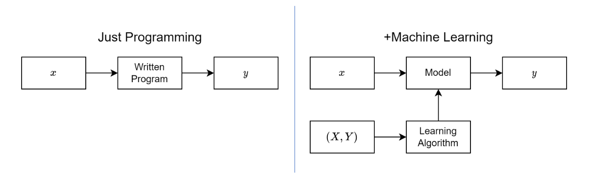
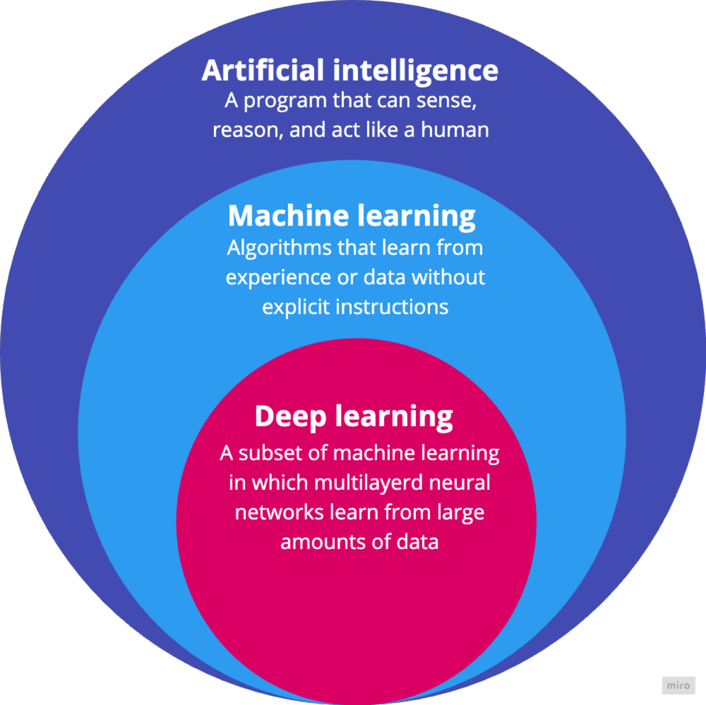
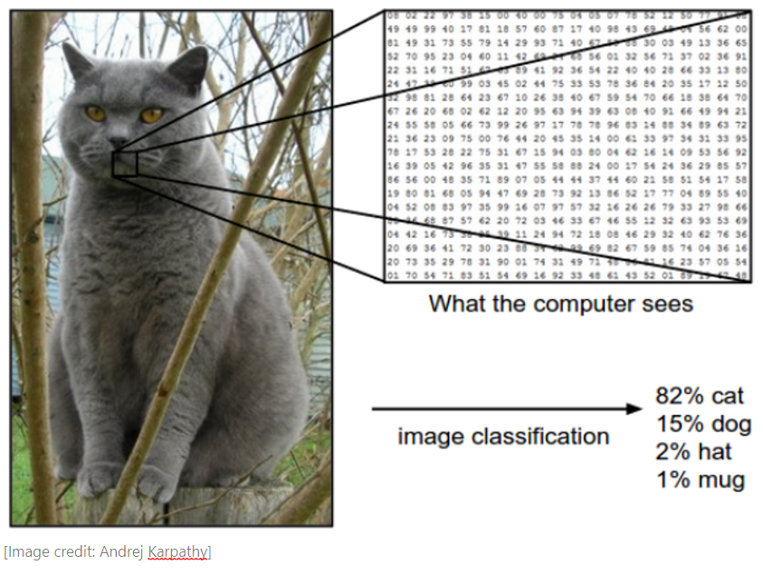
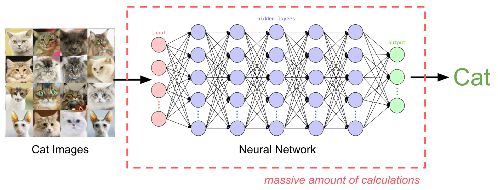
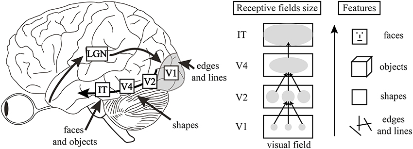
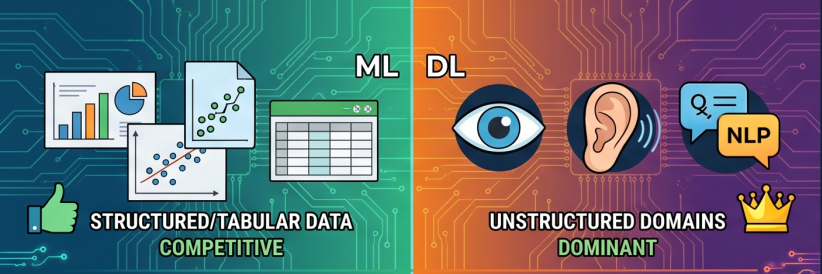
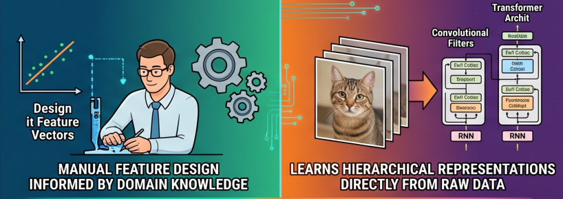
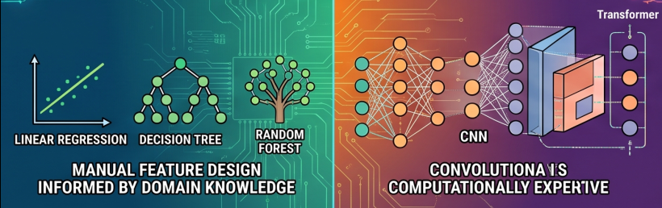
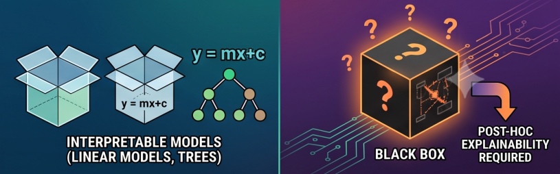

# Deep Learning

## Machine Learning vs Programming

- Traditional programming: You write explicit rules to map inputs to outputs. Real-world edge cases require many exception rules.
- Machine learning: You provide examples of inputs and outputs. The system learns the rules from data.

::: {.notes}
To understand why we need neural networks, we need to understand how machine learning differs from traditional programming.

In traditional programming, you write rules that transform inputs to outputs. If the customer buys a camera, recommend lenses. But what if it was a gift? What if they already have five lenses? You'd need thousands of rules for every exception.

In machine learning, you give the system examples of inputs and outputs, and it learns the rules for you. Deep learning takes this further using neural networks - they can learn complex patterns from data that would be impossible to encode as rules.
:::

## Deep Learning is Machine Learning

Deep learning takes ML further using neural networks - they can **learn complex patterns from massive amounts of unstructured noisy data**.

::: {.notes}
Deep learning is a subset of machine learning based on artificial neural networks with multiple layers - hence "deep." While a basic neural network might have one or two hidden layers, deep learning models often contain dozens or even hundreds of layers.
:::

## Challenge: Unstructured Data

- **224 × 224 image = 50,176 pixels**
- **1080p image = 2,073,600 pixels**

::: {.notes}
Here's why we need deep learning. Traditional machine learning works well with structured data - clean tables with columns and rows. But much of the world's data is unstructured: images, videos, audio, text.

A single image can have millions of pixels. You can't represent this as columns in a DataFrame and use classical ML models - it would be completely impractical. Neural networks can learn to recognize patterns in this high-dimensional data directly from the raw pixels.
:::

## ML Algorithm: Multi-layer Neural Networks

- **Deep** as in the number of layers in a neural network (20 to +1000 layers).
- **Representation Learning** from raw data (very low signal-to-noise ratio).

::: {.notes}
Instead of manually engineering features (like "does this image have edges?" or "are there circular shapes?"), neural networks learn to spot patterns formed by pixels and represent them as progressively more abstract and meaningful features. The final layer uses these learned features to make predictions.
:::

## Analogy: Visual Cortex

Hierarchical Feature Extraction: From Retinal Input to Complex Object Recognition in the Ventral Stream goes through a **layered system in the brain**.

::: {.notes}
Deep neural networks are like the visual cortex of the brain. They start with simple features like edges and shapes, and build up to more complex features like objects and scenes.
:::

## Supervised Deep Learning Datasets

{fig-align="center"}

- $X$: Pixels.
- $Y$: Classification (Whole image, or each pixel, or boxes).

## Many Deep Learning Applications

Specialized Vision-only Models:

- [LandingAI](https://landing.ai/)
- [Ultralytics](https://www.ultralytics.com/solutions)

Multi-modal Models (language + voice + vision):

- [OpenAI](https://openai.com/solutions/)
- [Gemini](https://cloud.google.com/transform/top-five-gen-ai-tuning-use-cases-gemini-hundreds-of-orgs)

## Tradeoffs Between DL and ML

We'll compare ML and DL across six characteristics:

1. Data Structure
2. Feature Engineering
3. Modeling
4. Interpretability
5. Data Scale
6. Computational Cost

Let's look at each one, one by one.

## 1. Data Structure

{fig-align="center"}

- **ML:** Competitive on structured/tabular data
- **DL:** Dominant in unstructured domains like vision, speech, and NLP

## 2. Feature Engineering

{fig-align="center"}

- **ML:** Relies heavily on manual feature design
- **DL:** Learns hierarchical representations directly from raw data

## 3. Modeling

{fig-align="center"}

- **ML:** Linear models, Decision Trees, Random Forests, Gradient Boosting
- **DL:** Multi-layer Neural Networks, CNNs, RNNs, Transformers

## 4. Interpretability

{fig-align="center"}

- **ML:** Many models are relatively interpretable
- **DL:** Often behaves like a black box and needs post-hoc explanation

## 5. Data Scale

{fig-align="center"}

- **ML:** Performs well with small to medium datasets
- **DL:** Typically needs large-scale datasets to generalize well

## 6. Computational Cost

{fig-align="center"}

- **ML:** Often CPU-friendly with faster training
- **DL:** Usually GPU/TPU-dependent and more computationally expensive

## Choose the right tool for the task?

- ML often requires manual feature engineering and works well on structured/tabular data
- DL excels at unstructured data (images, speech, text) and learns hierarchical representations directly from raw data

**Not a good fit for DL:**

1. When simple rules already work well (go for ML models)
2. When you need to explain decisions clearly (interpretability)
3. When errors cannot be tolerated (noisy models)
4. When you have limited data (needs massive amounts of data)
