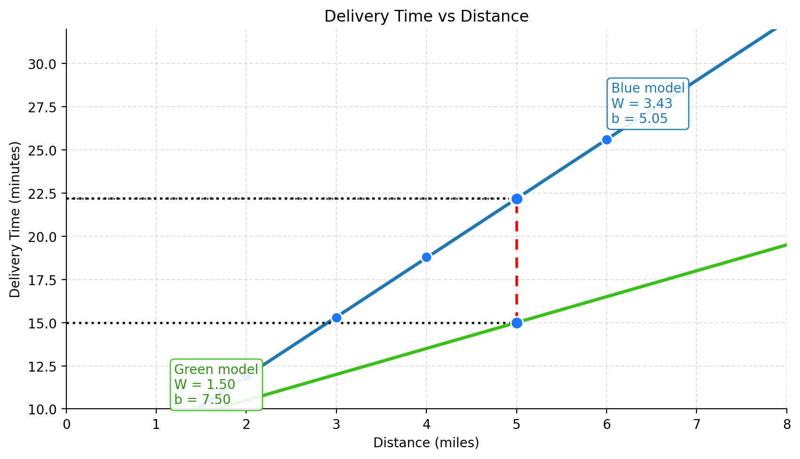
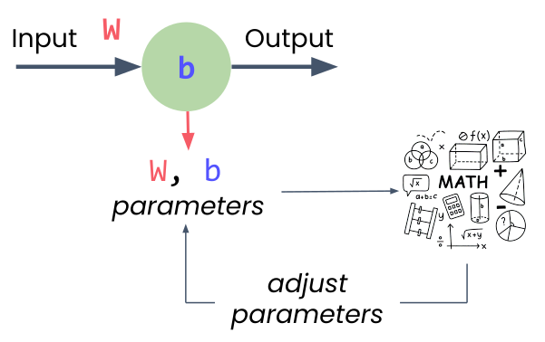

# Neural Networks

Neural networks are known as **universal approximators** because they can approximate any function given enough data and computational power.

## Use Case: Delivery Time Estimate

**Scenario:** Local delivery company, 30-minute promise

**New order:** 7 miles away

**Question:** Can you get there in under 30 minutes?

{fig-align="center"}

::: {.notes}
Now let's ground these concepts with a concrete problem. You work for a local delivery company that promises 30-minute delivery. You've been late three times, and one more late delivery could cost you your job. A new order comes in - 7 miles away. Do you take it?

This is a perfect problem for a neural network to solve, if we have historical data. And we'll use the simplest possible neural network - just one neuron - to tackle it.
:::

## Historical Delivery Data

:::: {.columns}
::: {.column width="45%"}
| Distance (miles) | Time (minutes) |
|-----------------|----------------|
| 2.0              | 11.9           |
| 3.0              | 15.3           |
| 4.0              | 18.8           |
| 5.0              | 22.2           |
| 6.0              | 25.6           |
| 7.0              | ?              |
:::

::: {.column width="55%"}
{fig-align="center" width="100%"}
:::
::::

**Can we extrapolate the pattern?**

::: {.notes}
Here's some historical delivery data. Can you see the pattern? As distance increases from 2 to 6 miles, delivery time rises in a nearly straight-line pattern. If we plot this data, we'd see the points follow a straight line. A good predictive model would be... a line!

If we know the equation for that line, we can predict new values. And here's the key insight: a single neuron is just a linear equation with two parameters - the weight and the bias.
:::

## A Single Neuron = A Linear Equation

$y = Wx + b$

- $W$: weight (slope)
- $b$: bias (y-intercept)
- $x$: input (distance)
- $y$: output (predicted time)

::: {.notes}
A single neuron is just a linear equation. That's the equation for a straight line. The neuron needs to find the right values for W (weight) and b (bias) to create the best-fitting line through all the data points.

That search for the best values - that's the learning in machine learning. The neuron starts with random values, measures how wrong its predictions are, and gradually adjusts W and b to improve.
:::

## Model

{fig-align="center" width="85%"}

The **blue model** stays closer to the observed data points, so its prediction error is smaller.
The **green model** misses the data by a larger margin, which means it is a worse fit.

## How Does a Neuron Learn?

{fig-align="center"}

:::: {.columns}
::: {.column width="50%"}
1. Start with random weight and bias
2. Make predictions
3. Measure error (how far off?)
:::
::: {.column width="50%"}
4. Use calculus to find adjustment direction
5. Take small step toward better values
6. Repeat hundreds/thousands of times
:::
::::

::: {.notes}
Here's how the learning process works. The neuron starts with random values for weight and bias. It makes predictions and measures how far off each prediction is from the actual data. The further off, the bigger the total error.

Then it uses calculus (specifically, gradient descent) to figure out which direction to adjust the weight and bias. It's essentially asking: "If I increase the weight just a little, does the error go up or down?" Once it figures that out, it takes a small step in the right direction, measures the error again, and repeats.

This process happens hundreds or thousands of times until the neuron finds values close to the best possible ones.
:::

## More Variables

{fig-align="center"}

Each input $x_i$ has a weight $w_i$:

$$
y = w_1 x_1 + w_2 x_2 + w_3 x_3 + b
$$

::: {.notes}

**Single input:**

- $x_1$ (`distance`)
- → $y$ (`delivery_time`)

**Multiple inputs:**

- $x_1$ (`distance`)
- $x_2$ (`time_of_day`)
- $x_3$ (`weather`)
- → $y$ (`delivery_time`)

So far we've seen a neuron with one input (distance). But what if you want to consider multiple factors - distance, time of day, and weather?

A neuron with multiple inputs just extends the same pattern. It's still a linear equation, just with more terms. Each input gets its own unique weight, they all add up, plus the single bias value. That's really all a neural network is - neurons connected to neurons.
:::

## More Layers

- **Layer:** group of neurons with same inputs
  - Note: _first layer is not counted (it is just the input)_
- **Hidden layers:** layers between input and output (added to learn higher complexity patterns)
- **Network:** connected layers

::: {.notes}
When you connect neurons together, you get layers. A layer is simply a group of neurons that all take the same inputs. When you connect one layer's outputs to the next layer's inputs, you've built a network.

The first layer takes in your raw data (distance, time of day, weather). The last layer gives your prediction (delivery time). All those layers in between are called hidden layers because you never directly set or see their values.

Soon, you'll see how easy it is to stack these layers together in PyTorch. But for now, we'll continue with just one neuron to build the foundation.
:::
