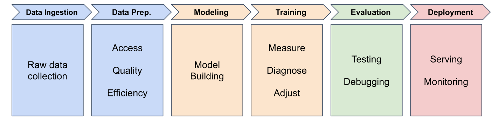

# Deep Learning Data Pipelines

## The Machine Learning Pipeline

**Six stages from data to deployed model**

::: {.notes}
Last session, we saw how neural networks learn using the delivery time problem. Now, before we jump into code, we need a systematic approach. This framework will be used throughout the entire Professional Certificate, whether you're training a delivery predictor or building image classifiers later.

The pipeline ensures we don't skip critical steps and helps us understand where we are in the process at any given time.
:::

## Stage 1: Data Ingestion

**Gathering and organizing raw data**

- Load huge datasets from data sources
- Messy data: inconsistent formats, missing values, errors
- Arrange to work efficiently with PyTorch

::: {.notes}
It all starts with data. Before you can train any model, you need to gather your raw information and organize it so PyTorch can work with each data point efficiently.

For the delivery predictor, that data comes from the company's delivery records. But here's where things get tricky - real-world data is messy. Earlier records might list delivery times as free-text entries like "22 minutes," while newer ones use numeric values like 22.0. There are always issues: missing values, negative delivery times, or records suggesting you were biking at 200 miles per hour.

This kind of messy data is the norm, not the exception. In your first lab, we'll keep things simple with clean data, but understanding these steps helps you appreciate what goes into real-world projects.
:::

## Stage 2: Data Preparation

**Cleaning, transforming, and organizing**

- Missing values
- Erroneous values (invalid ranges, formates, and duplicates)
- Engineer features (addresses → distances)

**Most time-consuming stage in real projects**

::: {.notes}
Getting the data was just the beginning. Whether you're working with delivery records, customer images, or email text, the next challenge is the same: you have to clean, transform, and organize that data into a form your model can actually learn from.

For delivery data, that might mean fixing errors like removing impossible delivery times or duplicate entries. It could mean handling missing values when timestamps weren't recorded. Or engineering new features by converting addresses like "123 Oak Street" into distances like 8.2 miles.

This stage often takes the most time and the most code in a real project. That's normal. Most models don't fail because the math was wrong - they fail because the data was messy.
:::

## Stage 3: Model Building

**Designing the architecture**

- How many neurons?
- How are they connected?
- What types of layers?

::: {.notes}
Now that your data is cleaned and ready, it's time to design the model that's going to learn from it. Whether you're predicting delivery times, classifying images, or analyzing text, this step is about choosing the right architecture for your problem.

Architecture means structure: How many neurons are you going to use? How are they connected? What types of layers does the model need?
:::

## Stage 4: Training

**Teaching the model to make predictions**

- Feed examples (8.2 miles → 22 minutes)
- Measure prediction errors
- Adjust parameters to improve
- Repeat for many epochs

::: {.notes}
Having a good model design is just the blueprint. Next, you actually have to teach it to make good predictions. Here's where your model starts learning.

You'll feed in examples like "this delivery was 8.2 miles and took 22 minutes" or "this one was 12.5 miles and took 31 minutes." The model will gradually start to figure out the pattern.

In the training stage, you'll learn how to configure the key pieces that make this process work: How do you measure prediction errors? How do you guide the model to improve? How do you control how fast it learns? Then you'll run the training loop, where PyTorch does the heavy lifting and your model learns from the data.
:::

## Stage 5: Evaluation

**Testing on unseen data**

- Use test set (held back during training)
- Measure performance (accuracy, error)
- Detect issues and debug

**Key question:** Does your model work well enough to trust it?

::: {.notes}
Even when training finishes successfully, you're not done yet. Now comes the real test: Can your model make a good prediction on new, unseen data?

To know if you have a really good model, you need to see how well it performs on new data - examples it wasn't trained on. You'll use a test set, a portion of the delivery data that you held back during training.

Maybe a model predicts 28 minutes for a 15-mile delivery, but in reality it took 32 minutes. How often is your model close? How often is it way off? As you move through the course, you'll learn how to detect deeper issues and debug models when things go wrong. But for now, the key question is simple: Does your model work well enough for you to trust it?
:::

## Stage 6: Deployment

**Getting your model into the real world**

*(We'll cover this later in the course)*

::: {.notes}
Stage 6 is deployment - getting your model out into the real world for people to use. We'll leave this one out of the pipeline for now and come back to it when the time comes.

Now that you've seen the full picture, you're ready to dive right in. In the rest of this session, you'll see how even our simple delivery model follows these exact stages in PyTorch code.
:::
