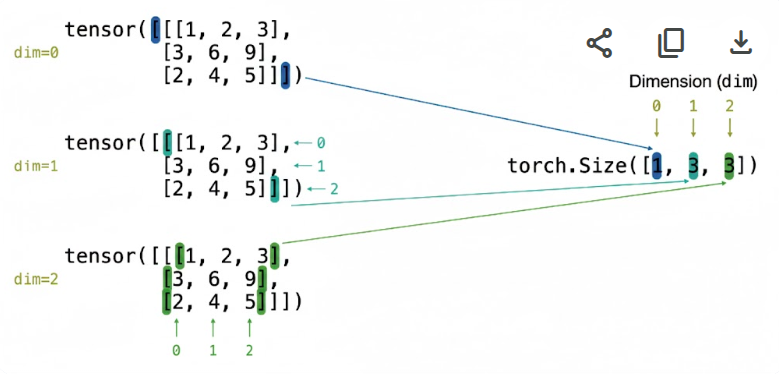
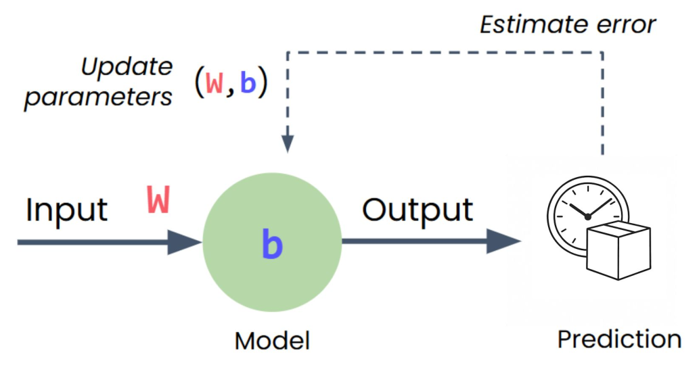
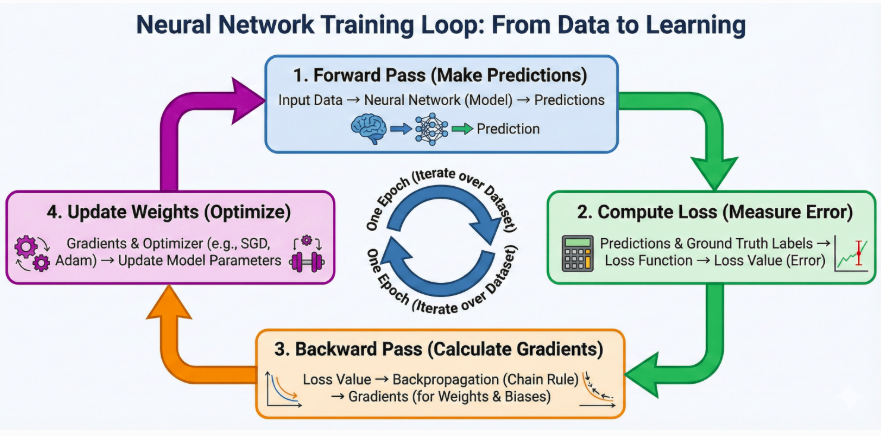

# The PyTorch Framework

{fig-align="center" height=100}

**PyTorch** is an open-source deep learning framework designed to accelerate the path from research prototyping to production deployment. Originally developed by Meta’s AI Research lab (FAIR) and released in 2016, it is now governed by the PyTorch Foundation under the Linux Foundation.

## Who uses PyTorch?

{fig-align="center"}

- **Meta, Tesla, Microsoft, OpenAI** — research and production ML
- Tesla's self-driving vision models run on PyTorch
- Also used beyond tech — e.g. computer vision on tractors in agriculture

::: {.notes}
Many of the world's largest technology companies — Meta, Tesla, Microsoft — and AI labs like OpenAI use PyTorch to power research and ship ML into products.

Andrej Karpathy (formerly head of AI at Tesla) has talked about how Tesla uses PyTorch for self-driving computer vision. It's not just Big Tech either — industries like agriculture use it for computer vision on tractors. If it's trusted at that scale, it's a solid framework to learn.
:::

## Why they use it?

- Researchers love it — long the [most-used framework on Papers With Code](https://paperswithcode.com/trends)
- **GPU acceleration** handled behind the scenes
- You focus on data and algorithms; PyTorch makes it run fast
- Proven in production — Tesla, Meta, and more ship real products on it

::: {.notes}
Machine learning researchers love PyTorch. For years it has been the most used deep learning framework on Papers With Code, which tracks research papers and their code.

PyTorch also takes care of GPU acceleration behind the scenes, so you can focus on manipulating data and writing algorithms while it keeps things fast.

And if companies like Tesla and Meta use it to power hundreds of applications, drive thousands of cars, and deliver content to billions of people, it's clearly capable on the production side too.
:::

## Simple. Pythonic. Powerful.

```python
import torch
a = torch.tensor([2.0])
b = torch.tensor([3.0])
result = a + b
print(result)  # tensor([5.])
```

::: {.notes}
Let me show you what makes PyTorch special with a simple example. Adding two numbers in PyTorch looks just like regular Python code. This simplicity wasn't always the case in deep learning frameworks.

The key insight here is that PyTorch makes deep learning feel like writing normal Python. This wasn't true of early frameworks, which required complex setup and compilation steps just to do simple operations.
:::


## Early Frameworks vs. PyTorch

::::: {.columns}
:::: {.column width="50%"}
**Static Computational Graphs**

- Must define and compile everything upfront
- No flexibility to change
- Cryptic error messages
- No standard Python debugging
::::

:::: {.column width="50%"}
**Dynamic Computation**

- Write clean Pythonic code
- Use normal loops and if statements
- Change anything, anytime
- Error messages point to your code
- Standard Python debugging
::::
:::::

::: {.notes}
Early deep learning frameworks used something called static computational graphs. Think of it like a factory assembly line - you had to design the entire production process before you could run anything. If you made a mistake or wanted to experiment, you had to stop everything, tear it down, and rebuild from scratch.

This made even simple operations complex. You couldn't use normal Python if statements or loops. Error messages pointed to internal system code, not your actual mistakes. People spent more time fighting their tools than doing actual work.

PyTorch emerged from researchers' frustration with these limitations. The core principle: deep learning should feel like normal Python. You write clean code, and PyTorch handles the computational complexity behind the scenes.

This approach made PyTorch incredibly popular, especially in research where experimentation and flexibility are crucial. Today, it's backed by a massive community and has become the go-to choice for everyone from students to cutting-edge AI researchers.
:::

# Building Your First Neural Network

You've seen the machine learning pipeline and understand how neural networks learn. Now let's take a look at how it all maps to actual PyTorch code. We'll start with the imports, then move through data preparation, model building, training, and making predictions.

**Let's see it in PyTorch code.**

## Imports

```python
import torch                # core functionality
import torch.nn as nn       # neural network components
import torch.optim as optim # training tools
```

::: {.notes}
These imports give you PyTorch's core functionality. `torch` provides the fundamental operations, `nn` (neural networks) gives you components for building models, and `optim` provides tools for training these networks. These three modules cover most of what you'll need for building and training models.
:::

## Preparing Data

```python
# x: inputs
distances = torch.tensor([[5.0], [6.0], [8.0], [10.0]], 
                         dtype=torch.float32)
# y: outputs
times = torch.tensor([[22.2], [25.6], [31.2], [38.5]], 
                     dtype=torch.float32)
```

**Tensors** are N-dimensional arrays.

::: {.notes}
In real projects, data ingestion and preparation are separate steps. First you gather messy data, then you clean and format it. But for this example, I've combined those stages and provided data that's already clean and ready to use.

You're creating tensors from Python lists, but they're more than just lists. Tensors are optimized for the math that neural networks need to do. You'll learn much more about them later, but for now, just think of them as containers that store and organize data in a way models understand.

Notice how each number is wrapped in its own set of brackets. These outer brackets represent a batch - a collection of individual data points. Each inner set of brackets is one sample in the batch. Since each delivery only has one feature (distance), each sample contains just one value.
:::


## A bit of Linear Algebra

Equation of a line:

$$
y = mx + b
$$

Where:

- $m$ is the **slope**
- $b$ is the **intercept**

::: {.notes}
We often jump straight into "tensors" and "matrix multiplication" in deep learning. But let's pause and build the bridge from high school math to deep learning math. If you understand this transition, the rest of the course is just implementation details.
:::

## The Neuron = The Linear Equation

How do we go from "Slope & Intercept" to Nerual Networks' **"Weights & Biases"**?

Recall our delivery problem:

$$
\text{Time} = \text{Weight} \times \text{Distance} + \text{Constant}
$$

In other words:

$$
y = w x + b
$$

- $w$ is **weight**
- $b$ is the **bias**

::: {.notes}
This is the building block. A single neuron is literally just a linear equation. It takes an input, scales it by a weight, adds a bias, and gives an output.
:::


## Creating the Model

```python
model = nn.Sequential(
    nn.Linear(1, 1)  # 1 input, 1 output
)
```

**Sequential:** container that passes data through layers in order

**Linear layer:** single neuron (weight × input + bias)

::: {.notes}
Remember those rigid assembly lines from early deep learning frameworks? Sequential is PyTorch's streamlined version. It's a container that passes data through layers in order, but makes it easy for you to swap components without all that messy rewiring.

Here, you're only using one layer - your single neuron. It's technically a linear layer. The first `1` means it takes one input (distance). The second `1` means it produces one output (predicted delivery time). It applies a linear transformation to the input - that's all the linear layer does.

This neuron will learn the best weight and bias to map distances to delivery times, just like finding the best-fitting line through all your data points.
:::

## Understanding Tensor Shapes

Use `Tensor.shape` to inspect:

```python
distances = torch.tensor([[5.0], [6.0], [8.0], [10.0]])

distances.shape  # torch.Size([4, 1])
```

What does it mean?

- First dimension: batch size (4 samples)
- Second dimension: features per sample (1 feature)

::: {.notes}
The shape tells you exactly how your data is organized. `[4, 1]` means 4 samples, each with 1 feature. This structure is crucial - PyTorch models expect input with a batch dimension. The first number tells the model how many samples it's getting. The rest describe what each sample looks like.

If you had multiple features (distance, time of day, weekend, rush hour), each sample would have multiple values, but the batch structure would remain the same.
:::

## Tensor Dimensions: 3 dimensions

{fig-align="center"}

::: {.notes}

:::

## Multiple Inputs

Predicting delivery time needs more than just `distance`.

In the labs, we use four features:

1. Distance ($x_1$)
2. Time of day ($x_2$)
3. Weekend flag ($x_3$)
4. Rush hour flag ($x_4$)

**The equation expands:**
$$
y = w_1 x_1 + w_2 x_2 + w_3 x_3 + w_4 x_4 + b
$$

::: {.notes}
As soon as we add more inputs, our simple equation gets longer. We have a weight for every input: $w_1$ for distance, $w_2$ for time of day, $w_3$ for weekend, $w_4$ for rush hour. This is still just ONE equation producing ONE output (delivery time).
:::


## Packing Inputs into Vectors

Writing $w_1 x_1 + w_2 x_2 + w_3 x_3 + w_4 x_4$ gets tired fast.

Let's pack our inputs into a **vector**:
$$
\mathbf{x} = \begin{bmatrix} x_1 \\ x_2 \\ x_3 \\ x_4 \end{bmatrix}
$$

And our weights into a **vector**:
$$
\mathbf{w} = \begin{bmatrix} w_1 & w_2 & w_3 & w_4 \end{bmatrix}
$$

## The Dot Product

$$
\begin{aligned}
\mathbf{w} \cdot \mathbf{x}
&= \begin{bmatrix} w_1 & w_2 & w_3 & w_4 \end{bmatrix}
\cdot
\begin{bmatrix} x_1 \\ x_2 \\ x_3 \\ x_4 \end{bmatrix} \\
&= w_1 x_1 + w_2 x_2 + w_3 x_3 + w_4 x_4
\end{aligned}
$$

Then add bias: $y = \mathbf{w} \cdot \mathbf{x} + b$

## In PyTorch Terms

$$
\mathbf{y} = \mathbf{W}\mathbf{x} + \mathbf{b}
$$

Matches this code exactly:
```python
layer = nn.Linear(in_features=4, out_features=1)
y = layer(x)
```

- `in_features=4`: Size of input vector $\mathbf{x}$ (columns of W — our four lab features)
- `out_features=1`: Size of output vector $\mathbf{y}$ (rows of W)
- The call `layer(x)` produces `y` the output of this layer.

Notice we don't need to know the names of the features, they are just numeric values.

## Loss Function

```python
loss_function = nn.MSELoss()
```

**Mean Squared Error:** measures how wrong predictions are

- Bigger errors → bigger loss
- Perfect predictions → loss = 0

::: {.notes}
Your model needs two tools to actually learn. The first is the loss function. We're using Mean Squared Error loss, which measures how wrong or how right your predictions are.

If you predict 45 minutes when it actually took 60, that's a bigger error than predicting 58 minutes. MSE captures this by squaring the differences, which makes bigger mistakes matter more. The goal is to minimize this loss - the lower the loss, the better your model.
:::

## Optimizer

```python
optimizer = optim.SGD(model.parameters(), lr=0.01)
```

**SGD (Stochastic Gradient Descent):**

- Figures out which direction to adjust the **parameters** (_weights_ and _biases_)
- `lr` (**learning rate**): a hyper-parameter of SGD that controls the step size

::: {.notes}
The optimizer is the algorithm that figures out which direction to adjust your weight and bias to reduce that error. `model.parameters()` is how you access those values in PyTorch - in this case, just the weight and bias from your single neuron.

`lr` is the learning rate. Smaller values mean you adjust parameters by smaller amounts. Larger values mean bigger adjustments. Both extremes can have challenges - too small and training is slow, too large and you might overshoot the best values.

If you're curious about the math behind loss functions or optimization, you'll get a much deeper introduction in Module 2.
:::

## The Training Loop

```python
for epoch in range(500):
    optimizer.zero_grad()      # Clear calculations from previous loop
    outputs = model(distances) # Make predictions
    loss = loss_function(outputs, times)  # Estimate error
    loss.backward()            # Calculate gradients
    optimizer.step()           # Update weights/bias
```

{fig-align="center"}

**Each epoch:** one full pass through training data

::: {.notes}
This is the training loop where the actual learning happens. Remember when I manually adjusted the weight and bias to get closer to the right line? This code is doing the same thing automatically, hundreds of times.

Each full pass through the training data is called an epoch. In each epoch, the model will: (1) make predictions, (2) measure how far off those predictions are, and (3) adjust its internal parameters to improve.

Let's break down each line: `optimizer.zero_grad()` clears out all calculated values from the previous training round. Without it, PyTorch would accumulate adjustments across rounds, which would mess up your learning.
:::

## Training Loop Breakdown {.smaller}

{fig-align="center"}

**`outputs = model(distances)`**
- Model uses distance as input

**`loss = loss_function(outputs, times)`**
- Compares predictions to real times

**`loss.backward()`**
- Figures out how to adjust weight/bias (backpropagation)

**`optimizer.step()`**
- Makes the adjustments

::: {.notes}
`outputs = model(distances)` tells the model to use the distance as inputs and make predictions.

`loss = loss_function(outputs, times)` compares the predictions to the real times and calculates how wrong they are.

`loss.backward()` figures out how to adjust the weight and bias to reduce that error. Just like when I said "I need a steeper slope," it's now done with calculus behind the scenes. The technical term is backpropagation.

`optimizer.step()` makes all those adjustments. The model is now slightly better at predicting delivery times.
:::

## Making Predictions (Inference)

```python
with torch.no_grad():
    new_distance = torch.tensor([[7.0]])
    prediction = model(new_distance)
    print(prediction)
```

The **`torch.no_grad()`** disables _gradient_ tracking (only relevant while training) for faster **inference** (_prediction_).

::: {.notes}
Now that the model is trained, let's try making a prediction. The line with `torch.no_grad()` tells PyTorch that you're not training anymore, just doing inference. Training takes extra work under the hood, but for inference, we can skip all that and run much more efficiently.

If the model learned what it was supposed to, it should give you a good answer. But you're going to have to try it out in the lab to see for yourself.

Speaking of building, that's exactly what's next. It's time to get hands-on and see if your delivery job is still safe.
:::

## Lab 1: Building a Simple Neural Network

> "What I hear, I forget. What I see, I remember. What I do, I understand."

<center>

START WITH LAB 1

</center>

## What's Next?

In [**Session 3: Activation Functions**](session3.qmd) we learn:

- Why linear models fail for complex patterns
- Introducing non-linearity with activation functions
- ReLU and other activation functions

::: {.notes}
In the next session, we'll discover what happens when your delivery company expands and the relationship between distance and time becomes non-linear. We'll learn how activation functions help neural networks model curves and complex patterns, not just straight lines.
:::
