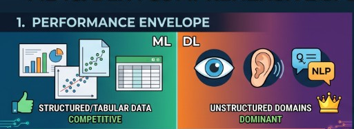
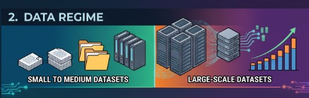
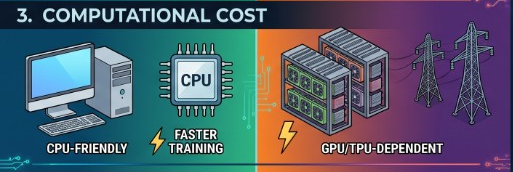
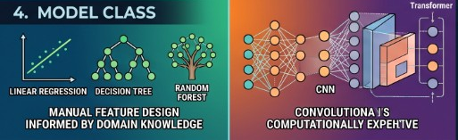
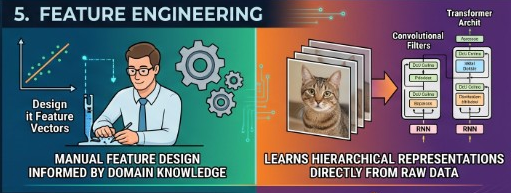
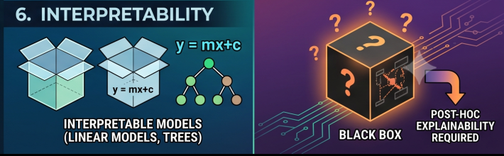
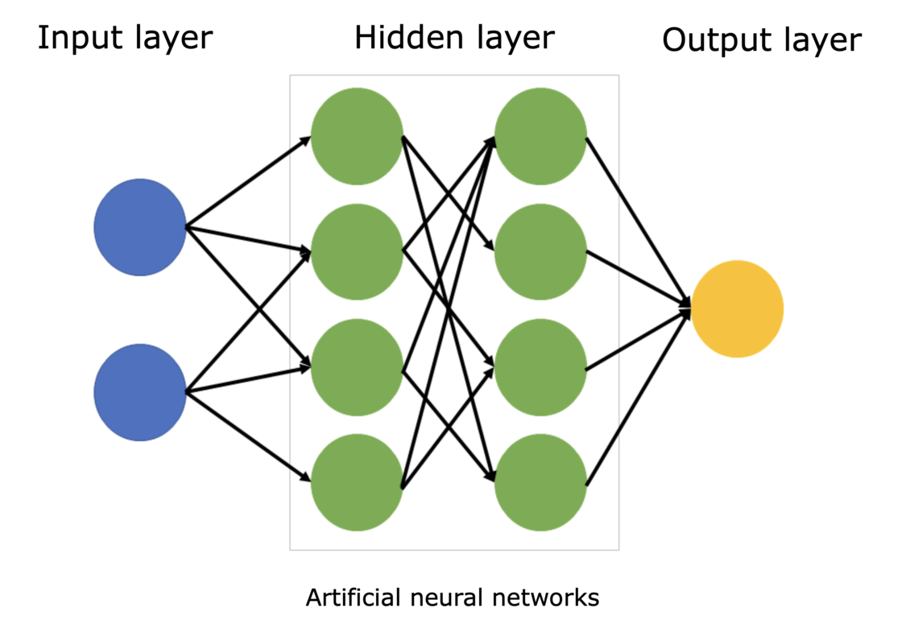

## Module 1 Overview

**What will we learn?**

- Distinguish Deep Learning from Machine Learning
- What are neurons and how do they learn?
- Why learn the PyTorch framework?
- The ML Pipeline
- Activation Functions
- Tensors (PyTorch's data structures)

::: {.notes}
Welcome to Module 1 of PyTorch Fundamentals. This module will take you from understanding why PyTorch exists to building and training your first neural network. We'll start with the motivation behind PyTorch, then dive into the fundamental building blocks, and end with hands-on implementation.

The question chain shows how each session builds on the previous one: understanding PyTorch's philosophy leads to understanding neural networks, which leads to understanding the pipeline, which leads to implementation.
:::

## Machine Learning vs Traditional Programming


::: {.notes}
To understand why we need PyTorch and neural networks, we need to understand how machine learning differs from traditional programming.

In traditional programming, you write rules that transform inputs to outputs. If the customer buys a camera, recommend lenses. But what if it was a gift? What if they already have five lenses? You'd need thousands of rules for every exception.

In machine learning, you give the system examples of inputs and outputs, and it learns the rules for you. Deep learning takes this further using neural networks - they can learn complex patterns from data that would be impossible to encode as rules.
:::

## The Challenge: Unstructured Data


- **224 × 224 image = 50,176 pixels**
- **1080p image = 2,073,600 pixels**

::: {.notes}
Here's why we need deep learning. Traditional machine learning works well with structured data - clean tables with columns and rows. But much of the world's data is unstructured: images, videos, audio, text.

A single image can have millions of pixels. You can't represent this as columns in a DataFrame and use classical ML models - it would be completely impractical. Neural networks can learn to recognize patterns in this high-dimensional data directly from the raw pixels.
:::

## Neural Networks: Universal Approximators


**Representation Learning** from raw data

::: {.notes}
Neural networks are known as universal approximators because they can approximate any function given enough data and computational power. They solve the problem of representation learning - automatically discovering meaningful features from raw data.

Instead of manually engineering features (like "does this image have edges?" or "are there circular shapes?"), neural networks learn to spot patterns formed by pixels and represent them as progressively more abstract and meaningful features. The final layer uses these learned features to make predictions.
:::

## Deep Learning vs Machine Learning


**Deep Learning = Neural Networks with multiple layers**

::: {.notes}
Deep learning is a subset of machine learning based on artificial neural networks with multiple layers - hence "deep." While a basic neural network might have one or two hidden layers, deep learning models often contain dozens or even hundreds of layers.

The key difference: deep learning excels at unstructured data (images, speech, text) and learns hierarchical representations directly from raw data, while traditional ML often requires manual feature engineering and works well on structured/tabular data.
:::

## ML vs DL {.smaller}

We'll compare ML and DL across six characteristics:

1. Performance Envelope
2. Data Regime
3. Computational Cost
4. Model Class
5. Feature Engineering
6. Interpretability

Let's look at each one, one by one.

::: {.notes}
Deep learning isn't always the right solution. It's great when traditional rule-based approaches fail, when environments change continuously, or when you need to discover patterns in massive datasets.

But it's not good when you need to explain decisions, when simple rules work fine, when errors can't be tolerated, or when you have limited data. The key is choosing the right tool for the job.
:::

## 1. Performance Envelope

{fig-align="center"}

- **ML:** Competitive on structured/tabular data
- **DL:** Dominant in unstructured domains like vision, speech, and NLP

## 2. Data Regime

{fig-align="center"}

- **ML:** Performs well with small to medium datasets
- **DL:** Typically needs large-scale datasets to generalize well

## 3. Computational Cost

{fig-align="center"}

- **ML:** Often CPU-friendly with faster training
- **DL:** Usually GPU/TPU-dependent and more computationally expensive

## 4. Model Class

{fig-align="center"}

- **ML:** Linear models, Decision Trees, Random Forests, Gradient Boosting
- **DL:** Multi-layer Neural Networks, CNNs, RNNs, Transformers

## 5. Feature Engineering

{fig-align="center"}

- **ML:** Relies heavily on manual feature design
- **DL:** Learns hierarchical representations directly from raw data

## 6. Interpretability

{fig-align="center"}

- **ML:** Many models are relatively interpretable
- **DL:** Often behaves like a black box and needs post-hoc explanation

## Many Deep Learning Applications

Vision:

- [LandingAI](https://landing.ai/)
- [Ultralytics](https://www.ultralytics.com/solutions)

Language:

- [OpenAI](https://openai.com/solutions/)
- [Gemini](https://cloud.google.com/transform/top-five-gen-ai-tuning-use-cases-gemini-hundreds-of-orgs)

## Data Annotation

{fig-align="center"}

## Start Simple: The Delivery Problem

**Scenario:** Local delivery company, 30-minute promise

**New order:** 7 miles away

**Question:** Can you get there in under 30 minutes?

{fig-align="center"}

::: {.notes}
Now let's ground these concepts with a concrete problem. You work for a local delivery company that promises 30-minute delivery. You've been late three times, and one more late delivery could cost you your job. A new order comes in - 7 miles away. Do you take it?

This is a perfect problem for a neural network to solve, if we have historical data. And we'll use the simplest possible neural network - just one neuron - to tackle it.
:::

## Historical Delivery Data

| Distance (miles) | Time (minutes) |
|-----------------|----------------|
| 5.0              | 22.2           |
| 6.0              | 25.6           |
| 7.0              | ?              |

**Can you see the pattern?**

::: {.notes}
Here's some historical delivery data. Can you see the pattern? 5 miles took 22.2 minutes, 6 miles took 25.6 minutes. If we plot this data, we'd see the points follow a straight line. A good predictive model would be... a line!

If we know the equation for that line, we can predict new values. And here's the key insight: a single neuron is just a linear equation with two parameters - the weight and the bias.
:::

## A Single Neuron = A Linear Equation


$y = Wx + b$

- **W** = weight (slope)
- **b** = bias (y-intercept)
- **x** = input (distance)
- **y** = output (predicted time)

::: {.notes}
A single neuron is just a linear equation. That's the equation for a straight line. The neuron needs to find the right values for W (weight) and b (bias) to create the best-fitting line through all the data points.

That search for the best values - that's the learning in machine learning. The neuron starts with random values, measures how wrong its predictions are, and gradually adjusts W and b to improve.
:::

## How Does a Neuron Learn?

1. Start with random weight and bias
2. Make predictions
3. Measure error (how far off?)
4. Use calculus to find adjustment direction
5. Take small step toward better values
6. Repeat hundreds/thousands of times

::: {.notes}
Here's how the learning process works. The neuron starts with random values for weight and bias. It makes predictions and measures how far off each prediction is from the actual data. The further off, the bigger the total error.

Then it uses calculus (specifically, gradient descent) to figure out which direction to adjust the weight and bias. It's essentially asking: "If I increase the weight just a little, does the error go up or down?" Once it figures that out, it takes a small step in the right direction, measures the error again, and repeats.

This process happens hundreds or thousands of times until the neuron finds values close to the best possible ones.
:::

## Multiple Inputs

**Single input:** `distance` → `delivery_time`

**Multiple inputs:** `distance` + `time_of_day` + `weather` → `delivery_time`

$$
y = w_1 x_1 + w_2 x_2 + w_3 x_3 + b
$$

::: {.notes}
So far we've seen a neuron with one input (distance). But what if you want to consider multiple factors - distance, time of day, and weather?

A neuron with multiple inputs just extends the same pattern. It's still a linear equation, just with more terms. Each input gets its own unique weight, they all add up, plus the single bias value. That's really all a neural network is - neurons connected to neurons.
:::

## Layers and Networks



- **Layer:** group of neurons with same inputs
- **Hidden layers:** layers between input and output
- **Network:** connected layers

::: {.notes}
When you connect neurons together, you get layers. A layer is simply a group of neurons that all take the same inputs. When you connect one layer's outputs to the next layer's inputs, you've built a network.

The first layer takes in your raw data (distance, time of day, weather). The last layer gives your prediction (delivery time). All those layers in between are called hidden layers because you never directly set or see their values.

Soon, you'll see how easy it is to stack these layers together in PyTorch. But for now, we'll continue with just one neuron to build the foundation.
:::

## Analogy: Visual Cortex {.smaller}

Hierarchical Feature Extraction: From Retinal Input to Complex Object Recognition in the Ventral Stream.


::: {.notes}
Deep neural networks are like the visual cortex of the brain. They start with simple features like edges and shapes, and build up to more complex features like objects and scenes.
:::

## PyTorch

> PyTorch is an open-source deep learning framework designed to accelerate the path from research prototyping to production deployment. Originally developed by Meta’s AI Research lab (FAIR) and released in 2016, it is now governed by the PyTorch Foundation under the Linux Foundation.

{fig-align="center" height=100}

## Who uses PyTorch?

{fig-align="center"}

- **Meta, Tesla, Microsoft, OpenAI** — research and production ML
- Tesla's self-driving vision models run on PyTorch
- Also used beyond tech — e.g. computer vision on tractors in agriculture

::: {.notes}
Many of the world's largest technology companies — Meta, Tesla, Microsoft — and AI labs like OpenAI use PyTorch to power research and ship ML into products.

Andrej Karpathy (formerly head of AI at Tesla) has talked about how Tesla uses PyTorch for self-driving computer vision. It's not just Big Tech either — industries like agriculture use it for computer vision on tractors. If it's trusted at that scale, it's a solid framework to learn.
:::

## Why PyTorch?

- Researchers love it — long the [most-used framework on Papers With Code](https://paperswithcode.com/trends)
- **GPU acceleration** handled behind the scenes
- You focus on data and algorithms; PyTorch makes it run fast
- Proven in production — Tesla, Meta, and more ship real products on it

::: {.notes}
Machine learning researchers love PyTorch. For years it has been the most used deep learning framework on Papers With Code, which tracks research papers and their code.

PyTorch also takes care of GPU acceleration behind the scenes, so you can focus on manipulating data and writing algorithms while it keeps things fast.

And if companies like Tesla and Meta use it to power hundreds of applications, drive thousands of cars, and deliver content to billions of people, it's clearly capable on the production side too.
:::

## Simple. Pythonic. Powerful.

```python
import torch
a = torch.tensor([2.0])
b = torch.tensor([3.0])
result = a + b
print(result)  # tensor([5.])
```

::: {.notes}
Let me show you what makes PyTorch special with a simple example. Adding two numbers in PyTorch looks just like regular Python code. This simplicity wasn't always the case in deep learning frameworks.

The key insight here is that PyTorch makes deep learning feel like writing normal Python. This wasn't true of early frameworks, which required complex setup and compilation steps just to do simple operations.
:::

## The Problem with Early Frameworks

**Static Computational Graphs**

- Must define and compile everything upfront
- No flexibility to change
- Cryptic error messages
- No standard Python debugging

::: {.notes}
Early deep learning frameworks used something called static computational graphs. Think of it like a factory assembly line - you had to design the entire production process before you could run anything. If you made a mistake or wanted to experiment, you had to stop everything, tear it down, and rebuild from scratch.

This made even simple operations complex. You couldn't use normal Python if statements or loops. Error messages pointed to internal system code, not your actual mistakes. People spent more time fighting their tools than doing actual work.
:::

## PyTorch's Solution

**Dynamic Computation**

- Write clean Pythonic code
- Use normal loops and if statements
- Change anything, anytime
- Error messages point to your code
- Standard Python debugging

::: {.notes}
PyTorch emerged from researchers' frustration with these limitations. The core principle: deep learning should feel like normal Python. You write clean code, and PyTorch handles the computational complexity behind the scenes.

This approach made PyTorch incredibly popular, especially in research where experimentation and flexibility are crucial. Today, it's backed by a massive community and has become the go-to choice for everyone from students to cutting-edge AI researchers.
:::


## What's Next?

- The 6-stage ML pipeline
- Building a neural network in PyTorch
- Training your first model

[**Click here to go to Session 2: The ML Pipeline and Building Your First Model**](session2.qmd)

::: {.notes}
In the next session, we'll see the complete machine learning pipeline - the systematic process that every PyTorch project follows. Then you'll build your first neural network and train it on this exact delivery problem. Just a few lines of PyTorch code will bring all these concepts to life.
:::