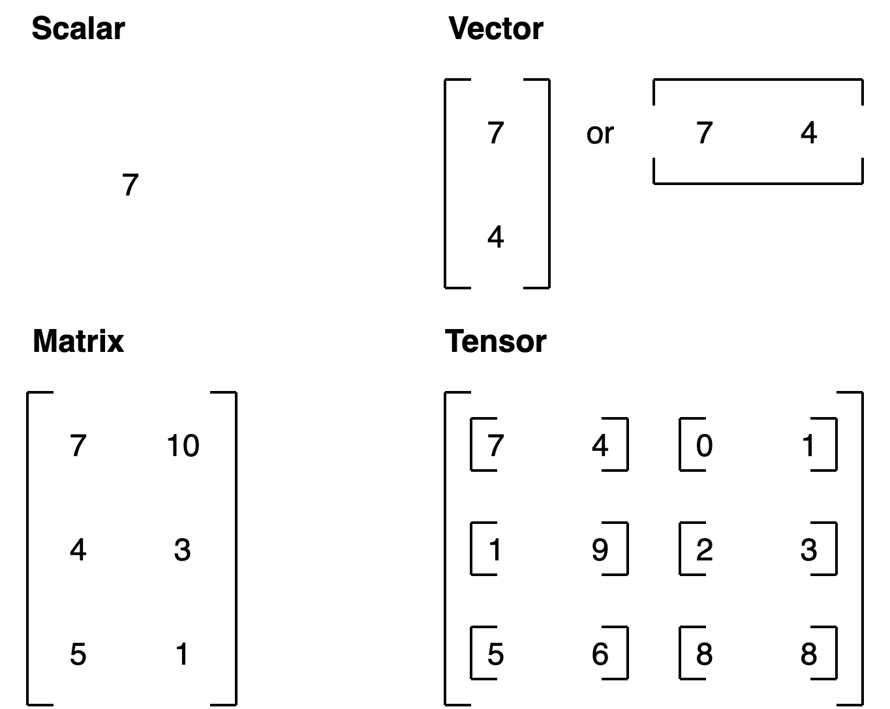
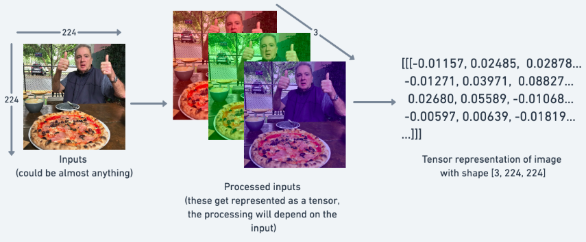
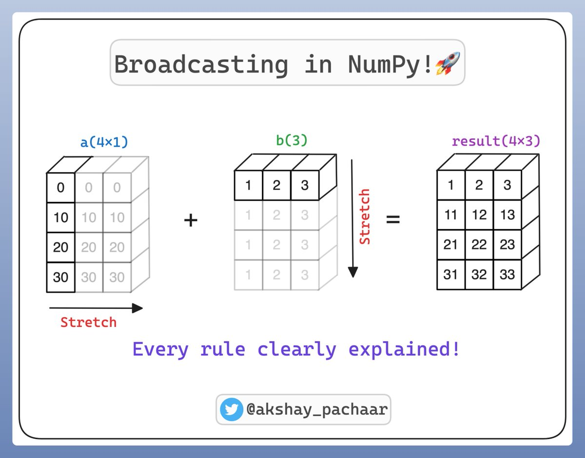

# Session 4

## What are Tensors?

**Tensors are the core Data Structure in PyTorch**

{fig-align="center"}

::: {.notes}
**Analogy:** Think of a Tensor as a container. If a Scalar is a single grape, a Vector is a row of grapes, and a Matrix is a crate of grapes, a Tensor is a shipping container full of those crates.

Similar to NumPy arrays, but with support for GPU acceleration and automatic differentiation.
:::

## Images as Tensors

{fig-align="center"}

PyTorch convention ordering for images is: `(channels, height, width)`.

::: {.notes}
Images are just a special type of tensor. They are 3-dimensional tensors, with the first dimension being the height, the second dimension being the width, and the third dimension being the number of channels (RGB, RGBA, etc.).
:::

## Why Learn About Tensors?

**Many PyTorch errors come from tensor issues**

- Shape mismatches
- Data type problems
- Device mismatches

**Master tensors now, avoid frustration later**

::: {.notes}
In the last lab, you trained a model to predict delivery times. Along the way, you've been using tensors, maybe without thinking too much about them. And that's fine - until it isn't.

Many PyTorch errors come from tensor issues. So let's build up your tensor skills now before those errors might derail your projects. In this session, you'll learn how to read and understand tensor shapes, handle data types, create tensors in different ways, reshape and slice them to fit your models, and then pull out what you need.
:::

## Understanding Shapes

```python
distances.shape  # torch.Size([6, 1])
```

**`[6, 1]` means:**

- 6 samples (batch size)
- 1 feature per sample

**Shape mismatches = most common PyTorch errors**

::: {.notes}
Let's start with the most important tool in your tensor toolkit: checking shapes. When you print `distances.shape`, you'll get something like `torch.Size([6, 1])`. That tells you exactly how your data is organized.

There are 6 samples - that's your batch size. And there's 1 feature per sample - that's the distance of each delivery. Shape mismatches are one of the most common PyTorch errors, right alongside device and dtype issues.

So let's take a look at a shape that does work. Using the same single neuron model you trained earlier, pass in the distances, and it just works. Why? Because each sample has one feature, just as the model expects.
:::

## Why Batch Size Doesn't Cause Problems

**Model expects first dimension = batch size**

Think of it like a stack of papers:

- Model reads each page the same way
- Whether 6 pages or 600 pages
- First dimension = how many
- Rest = what each sample looks like

::: {.notes}
But what about that 6? Why doesn't the batch size cause a problem? Well, that's because the model expects the first dimension to be the batch size - the number of samples it will take at once.

Think of it a little bit like a stack of papers. The model reads each page the same way, whether there are 6 pages or 600 in the stack. The first dimension is how many, and the rest describe what each sample looks like.

So now try passing in multiple features like distance, hour, and weather. It fails. The model was only built for one input feature. When you hit a shape mismatch, PyTorch will tell you what's wrong, but not how to fix it. Once you see both shapes, usually the fix will be obvious.
:::

## Data Types

```python
# Defaults
torch.tensor([1, 2, 3])        # int64
torch.tensor([1.0, 2.0, 3.0])  # float32

# Explicit
torch.tensor([1, 2, 3], dtype=torch.float32)
tensor.float()  # convert to float32
```

**For neural networks:** `float32` is the sweet spot

::: {.notes}
Now you understand shapes, let's talk about data types. When you create a tensor, PyTorch can use defaults. Enter integers, you'll get int64. Include a decimal point, then you'll get float32.

If you want to be explicit, you can use the `dtype` argument. It guarantees float32 even if you forget the decimal point. Alternatively, you can use `.float()` to convert any tensor to float32.

What happens if you mix types? PyTorch will automatically handle mixed types through type promotion. For example, if you add an int tensor and a float tensor, PyTorch will automatically convert the int to float and then return a float result, just like regular Python.

There are other types too, like float64 for extra precision or int8 for memory savings. But for neural networks, float32 is the sweet spot - it's fast, accurate, and standard on modern hardware.
:::

## Creating Tensors

**From Python lists:**
```python
torch.tensor([[1, 2], [3, 4]])
```

**From NumPy:**
```python
torch.from_numpy(np_array)
```

**Built-in patterns:**
```python
torch.zeros(2, 3)
torch.ones(2, 3)
torch.randn(2, 3)  # random values
```

::: {.notes}
Now that you understand types, let's look at different ways to create tensors. The simplest way: use Python lists. And if you're coming from NumPy, PyTorch tensors behave almost exactly the same way. You can convert a NumPy array like this. Just remember, this shares memory - if you change one, the other changes too.

If you need quick test data, try these built-in patterns for zeros, ones, or random values. These are incredibly useful when you're prototyping or testing your models.
:::

## Reshaping Tensors

**Common error:** forgetting the batch dimension

```python
# Wrong: scalar
single_value = torch.tensor(25.0)  # shape: []

# Right: batch dimension
single_value = torch.tensor([[25.0]])  # shape: [1, 1]
```

::: {.notes}
Once you have tensors, you'll often need to reshape them to match what your model expects. Remember, PyTorch models expect input with a batch dimension, like `[6, 1]` that we saw earlier. That first number tells the model how many samples it's getting.

One of the most common shape errors is forgetting that batch dimension. Let's say you want to predict the delivery time for a single order, for example, 25 miles. This is a scalar, but your model expects a shape of batch size, features, which at a minimum is `[1, 1]`.
:::

## Adding Dimensions

```python
# Add dimension
tensor.unsqueeze(0)  # add at position 0

# Remove dimensions
tensor.squeeze()  # removes all size-1 dimensions
```

**Always check shape before using unsqueeze()**

::: {.notes}
You can also use `unsqueeze()` to add dimensions. So now it's ready for the model. Always check the shape before you use `unsqueeze()`.

And if you're going the other way, try just using `squeeze()`. `squeeze()` removes all dimensions of size one, and it's great for cleaning up after batching.

Always print `tensor.shape` when you're debugging. These tools are your first defense against shape errors.
:::

## Indexing and Slicing

```python
predictions[0]        # first prediction
predictions[0:3]      # first three
predictions[0].item() # convert to Python float
```

**`.item()` only works on tensors with exactly one element**

::: {.notes}
Sometimes you need specific values from your tensors, like checking predictions or grabbing a few samples. Indexing and slicing can be used for this, and they work just like Python lists.

This gives the first prediction, and this gives the first three. But even a single index value is still a tensor. So if you want the actual Python value, use `.item()` to convert it into a float.

But be careful - `.item()` only works on tensors with exactly one element. Call it on a bigger tensor, you'll get an error.
:::

## Multiple Features

```python
# Shape: [batch_size, num_features]
data = torch.tensor([[5.0, 14.0, 1.0],  # distance, hour, weather
                     [6.0, 15.0, 0.0]])

data[0, 1]  # first sample, second feature (hour = 14.0)
```

::: {.notes}
So far, we've looked at one feature per sample. With multiple features, you can index across both dimensions like so. You've now seen shapes, types, reshaping, and indexing. It's a lot, but don't worry - you don't need to memorize everything. These patterns will become second nature with practice, and even the pros check the docs.
:::

## Element-Wise Operations

```python
weight = 3.4
bias = 5.0
distances = torch.tensor([[5.0], [6.0], [8.0]])

# Element-wise: applies to each element independently
predictions = weight * distances + bias
```

**Same operation applied to all elements at once**

::: {.notes}
Now let's see how PyTorch actually computes with tensors. Let's start with a computation from your single neuron model: weight times distance plus bias.

PyTorch's tensor math works element-wise, so each element is operated on independently. Your computation applies the same weight to each distance, and then adds the same bias to each result. The math looks just like regular Python, but PyTorch runs these operations efficiently on all elements at once.

This works for scalars (single values) as well as tensors that have the same shape.
:::

## Broadcasting {.smaller}

> **Broadcasting** is a powerful mechanism in PyTorch and NumPy that allows you to perform arithmetic operations on tensors of different shapes without manually duplicating data in memory. It makes your code faster and more memory-efficient by vectorizing operations in C rather than Python loops.

{fig-align="center"}


## Broadcasting: Example

**Problem:** Want to apply different adjustments to different features

**Solution:** Broadcasting automatically expands dimensions

```python
# Instead of repeating [1.1, 1.0, 5.0] three times:
adjustments = torch.tensor([[1.1, 1.0, 5.0]])  # shape: [1, 3]
data = torch.tensor([[5.0, 14.0, 1.0],
                     [6.0, 15.0, 0.0],
                     [8.0, 16.0, 1.0]])  # shape: [3, 3]

result = data * adjustments  # Broadcasting!
```

::: {.notes}
But what if you have more complex data? Imagine three deliveries where each has three features: distance, hour, and weather. And now you want to apply adjustment factors: maybe 1.1x for distance, no change for time, and a 5x penalty for bad weather.

Creating that tensor with repeated rows works because the tensors have the same shape, but it's redundant. Wouldn't it be nice if you could just specify those adjustment values once? That's where broadcasting comes in.

When you add a scalar to a tensor, PyTorch automatically expands that single value to match every element. This automatic expansion is broadcasting in action.
:::

## How Broadcasting Works

**Rule:** When one dimension is 1 and the other is larger, PyTorch expands the smaller dimension

**Example:**

- `[1, 3]` × `[3, 1]` → both become `[3, 3]`
- `[1, 1]` × `[1, 3]` → first becomes `[1, 3]`

::: {.notes}
Let's look at a more complex example. What happens when you combine a `[1, 3]` tensor with a `[3, 1]` tensor?

PyTorch looks at each dimension. The first dimension: 1 versus 3. The 1 expands to 3. The second dimension: 3 versus 1. The 1 expands to 3. So both become `[3, 3]`.

How would you actually use this? Remember those delivery adjustments? Instead of repeating `[1.1, 1.0, 5.0]` three times, you can just write this. No loops. No manual repetition. PyTorch handles it all through broadcasting.

This pattern appears everywhere: adjusting multiple features across batches, combining different dimensions of data, applying transformations efficiently. Once you know to look for it, you're going to see broadcasting opportunities everywhere in deep learning.
:::

## Module 1 Summary

**You've learned:**

- Why PyTorch exists and what makes it special
- How neural networks learn from data
- The complete ML pipeline
- Building and training your first model
- Activation functions for non-linear patterns
- Working with tensors (shapes, types, operations)

::: {.notes}
Now you've covered essential tensor operations. The provided lab has additional examples that you can explore. Because like any tool, tensors will become intuitive through practice.

But most importantly, you're at the end of Module 1. Congratulations! We started by exploring what makes PyTorch special. And now you've learned the fundamentals. You've worked through the machine learning pipeline. You've trained your first neural network. You've mastered tensor operations. You've built the foundation.
:::

## Lab 3: Tensors: The Core of PyTorch

> "For the things we have to learn before we can do them, we learn by doing them."

<center>

CUE: START THE LAB HERE

</center>

## Assignment 1: Deeper Regression, Smarter Features

> "What I cannot create, I do not understand."

<center>

CUE: START THE ASSIGNMENT HERE

</center>

## What's Next?

In [**Module 2: Image Classification**](../C1_M2_PyTorch_Workflow/session1.qmd) we learn:

- Tackle classification problems
- Dive deeper into how neural networks learn
- Build your first image classifier
 
::: {.notes}
Up next is the tensor lab, where you'll practice these concepts. Followed by a graded assignment to test your skills. Then in Module 2, you're going to tackle classification problems and dive deeper into how neural networks really learn.

You've mastered PyTorch fundamentals. It's time to put them to work.
:::
