## Module 4 Overview

**What will we learn?**

- Convolutional layers: filters, patterns, and feature maps
- Complete CNN architecture: convolution, pooling, fully connected layers
- Training CNNs for image classification
- Dynamic computation graphs in PyTorch
- Modular architectures and code organization
- Model inspection and debugging techniques

::: {.notes}
Welcome to Module 4! You've mastered data pipelines and built models with linear layers. But now the butterfly house next door wants to expand your botanical garden app to classify insects and small animals. Linear layers treat every pixel independently - they can't see that neighboring pixels form features like wings, antennae, or eye spots.

This module introduces Convolutional Neural Networks (CNNs), the backbone of computer vision. We'll explore how CNNs learn to see patterns in images, build complete CNN architectures, and then dive into PyTorch's dynamic computation graphs and professional code organization.

The question chain: How do CNNs see patterns? → How do we build a complete CNN? → How do we train it? → How does PyTorch's flexibility help us? → How do we write professional, maintainable code? → How do we inspect and debug our models?
:::

## Session 1: Convolutional Neural Networks

**What you'll know by the end:**

- How convolutional filters detect patterns in images
- The complete architecture of a CNN
- How to train a CNN for multi-class image classification

::: {.notes}
By the end of this session, you'll understand how CNNs work fundamentally - from the pixel level to complete architectures. You'll see how filters learn to detect edges, textures, and patterns, and how these components combine into a powerful image classifier.
:::

## The New Challenge

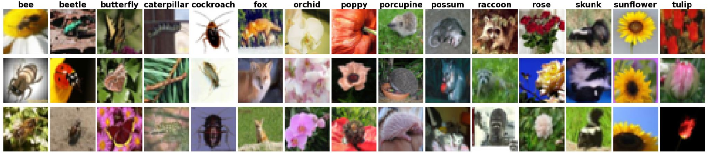{fig-align="center"}

**Butterfly house expansion**

- Classify flowers, insects, and small animals
- Need to detect edges, textures, and patterns
- Linear layers aren't enough

::: {.notes}
The botanical garden app is working great, but now the butterfly house next door wants in. They want to expand the app so visitors can classify insects and small animals too. This is a bigger challenge - you need something that can recognize more advanced visual features.

The problem with linear layers: they treat every pixel as independent. When your model looks at a flower or butterfly image, it sees thousands of separate numbers with no understanding that neighboring pixels can form features like wings, antennae, or eye spots.
:::

## Why Linear Layers Fall Short

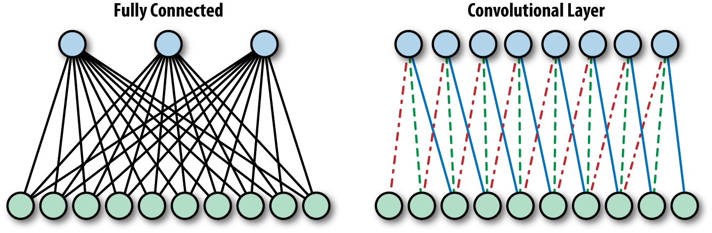{fig-align="center"}

**Every pixel is independent**

- No spatial understanding
- Can't recognize patterns formed by neighboring pixels
- Wings, antennae, eye spots are invisible

::: {.notes}
Think about how you identify a butterfly. You don't analyze every pixel. You notice wing shapes, vein patterns, those distinctive orange and black sections. Your brain uses these features to recognize that's a monarch.

Linear layers can't do this. They see pixels as isolated numbers. That's where convolutional neural networks come in.
:::

## Convolutional Neural Networks

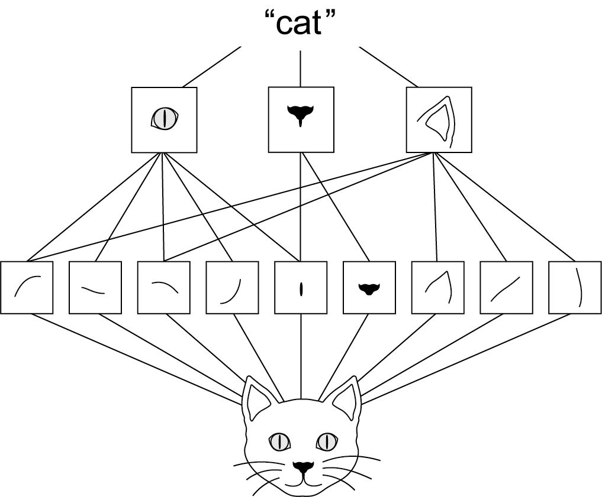{fig-align="center"}

**Inspired by biology**

- 1960s: Visual cortex neurons respond to specific patterns
- CNNs mimic this with learnable filters
- Filters scan images to extract features

::: {.notes}
CNNs are the backbone of computer vision, and they're inspired by biology. In the 1960s, neuroscientists found that certain neurons in the visual cortex respond only when they see particular patterns. CNNs mimic this by using filters to sort out features in images and learn from those.
:::

## How Filters Work {.smaller}


**A 3×3 grid of numbers**

- Slide over the image
- Multiply filter values with pixel values
- Sum the results
- This is convolution

See: [Convolution Arithmetic](https://github.com/vdumoulin/conv_arithmetic) for more details.

::: {.notes}
Let's see how this works with one of our nature photos. Here's a closeup in grayscale. If we zoom in, we see individual pixels. You've centered on a pixel with value 61. Think of the surrounding pixels in this three-by-three grid as its neighbors.

Now imagine a filter - a separate three-by-three grid of numbers. You'll slide this filter over the image. At each position, you'll multiply the filter values with the pixel values underneath, then add all of these together. That process is called a convolution.
:::

## What Do Filters Detect? {.smaller}

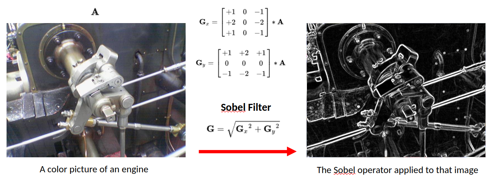{fig-align="center"}

- Vertical edges
- Horizontal edges
- Textures and shapes

::: {.notes}
Why would you do this? By assigning different weights in the filter, you actually highlight different kinds of patterns. Take this filter - can you guess what it might do? The values in the center start from a baseline of zero. But if you look to the left and right, adjacent pixel values that are similar will cancel each other out. But if there's a sharp contrast - say the left side is really dark and the right side is really bright - that creates a strong output. That's exactly what you'd expect for a vertical edge in an image.
:::

## Butteryfly Example

::: {.columns}
::: {.column width="50%"}
{fig-align="center"}
:::
::: {.column width="50%"}
{fig-align="center"}
:::
:::

Butterfly image passing through one filter of first layer.

:::{.notes}
Similarly, this filter detects horizontal edges. When you identify a butterfly, you notice wing shapes, vein patterns, those distinctive sections. Your brain uses these features. For our model, it's the same idea. Filters help highlight the patterns that distinguish a monarch from a swallowtail or between a butterfly and a beetle.
:::

## Learning vs. Hand-Designing Filters

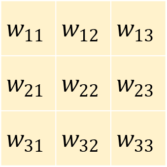{fig-align="center"}

**Different weights → different patterns**

::: {.notes}
Here's the interesting part. You could design those filters by hand, but how would you know which filters work best for butterflies versus flowers versus beetles? Or what if the model could learn which filters work best and tune them to find specific patterns that identify each class?

That's the key power of convolutional neural networks. They will figure out which visual features matter most for the specific task that you have in mind. Pretty cool, right?
:::

## The Power of Hierarhical Feature Extraction {.smaller}

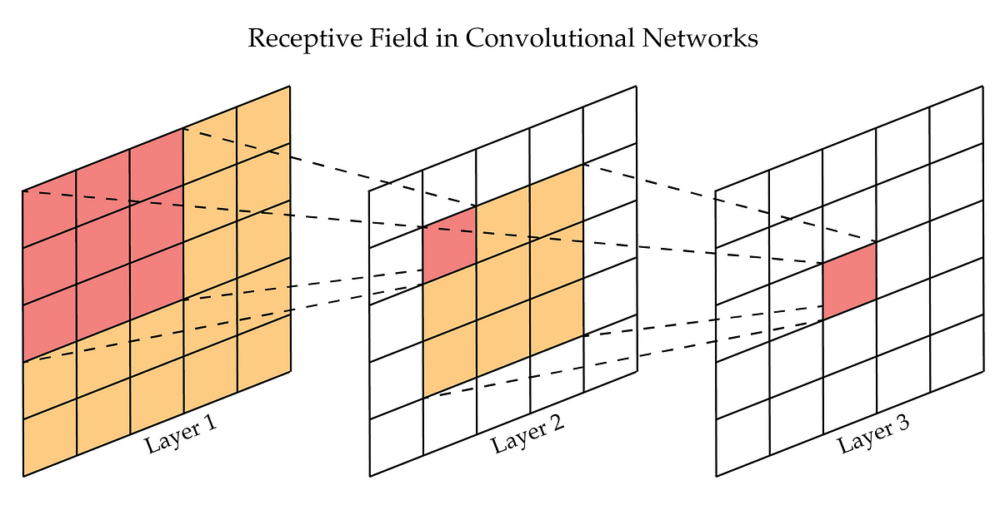{fig-align="center"}

The image illustrates how a single "pixel" in a deep layer of a neural network can "see" a much larger portion of the original input image. This concept is called the **Receptive Field**. Because the orange area in Layer 2 was already looking at a larger area in Layer 1, the single pixel in Layer 3 is effectively "aware" of a  area in the original input.

## Creating Convolutional Layers in PyTorch

```python
nn.Conv2d(
    in_channels=3,      # RGB color channels
    out_channels=32,    # Number of filters
    kernel_size=3,      # 3×3 filter size
    padding=1,          # Preserve image size
    stride=1            # Step size
)
```

Number of parameters for this layer:

$$
[(\text{kernel_size}^2 \times \text{in_channels})  + \underbrace{1}_{\text{bias}}] \times \text{out_channels}
$$

::: {.notes}
Now let's see how you can create convolutional layers in PyTorch using nn.Module. Earlier, you built networks using layers like nn.Linear. A convolutional layer works in exactly the same way. It's just another type of layer that you add to your model architecture. In PyTorch, you define one using nn.Conv2d. That name just means it's a two-dimensional convolution like you would use in a two-dimensional image.

Let's walk through each of these settings step-by-step.
:::

## Output: Activation/Feature Maps {.smaller}

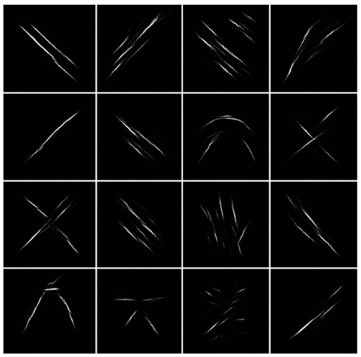{fig-align="center"}

Here we see a `out_channels=16` of convolution outputs showing high values where they activate (after `ReLU()`).

::: {.notes}
So that covers how filters work and how convolutional layers use them to find useful patterns in images. The output of a convolutional layer may look like 32 new images, but they're really just arrays of numerical values showing how strongly each filter reacted to different parts of the image. These are commonly known as feature maps or activation maps. They map where each feature appears in the input.
:::

## Pooling {.smaller}

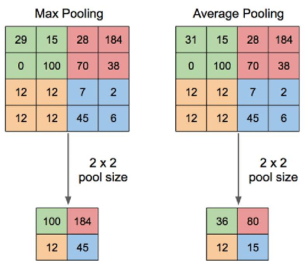{fig-align="center"}

**Example: 28×28 feature map**

- After first pool: 14×14
- After second pool: 7×7
- Each pooling layer halves the spatial dimensions

::: {.notes}
Then it's fed into something called MaxPool2d. What is that? Well, let's take a look. Pooling is a common technique in convolutional neural networks that's used to reduce the size of feature maps. It's effectively a way to throw away pixels after a filter has been applied, compressing the data while keeping the most important parts in a way that shouldn't affect the results.

The logic here is that your filters have already extracted the important features from the original image. So now by applying pooling, you're compressing each filtered image, keeping just the most significant information. As a result, less data needs to pass through the network, and the next layer sees images that were only a quarter of the original size.

This is important because after your first convolutional layer, you now have 32 different feature maps flowing into the second layer. For large images this quickly becomes a lot of data. Pooling reduces this volume of information, making your neural network much more efficient without losing valuable details and more robust to small changes.
:::

## Building a Complete CNN Architecture {.smaller}

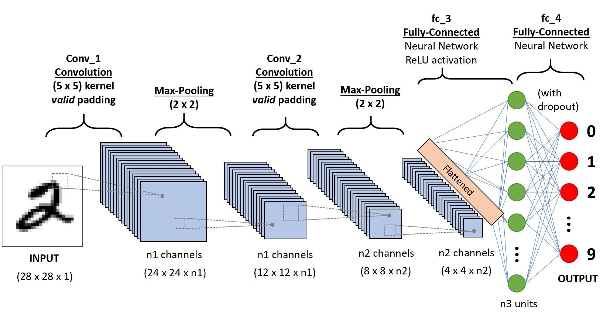{fig-align="center"}

::: {.notes}
In the last video, you explored how convolutional layers work and how CNNs can learn useful filters to extract features and patterns from images. Now we're going to put those pieces together into a full convolutional neural network architecture. It extends nn.Module just like you've done before.
:::

## CNN Architecture Overview

Three main components:

```python
class CNN(nn.Module):
    def __init__(self):
        # Convolutional layers → extract features
        # Pooling layers → reduce size
        # Fully connected layers → classify
```

Define the flow:

```python
    def forward(self, x):
        x = self.conv1(x)
        x = self.relu1(x)
        x = self.pool1(x)
        # ... more layers ...
        x = x.flatten()
        x = self.fc(x)
        return x
```

::: {.notes}
In the __init__ function, you'll define the structure of your network. It starts with convolutional layers and ends with a fully connected layer to classify your images. Fully connected just means that every neuron in the input is connected to every neuron in the output. It's just another name for linear layer.

Then you have the forward method to define the flow of data, which is pretty straightforward. You pass data through each of the convolutional layers and then recall that the linear layer expects a single row of values. So you need to flatten your tensor into a single vector and pass it through that final layer to produce a prediction. And that's your full CNN pipeline from raw pixels to learned features to classification.
:::

## The Snow Detector Problem

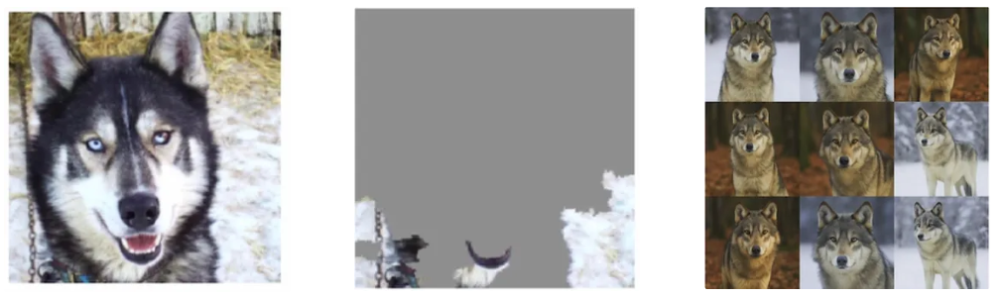{fig-align="center"}

**Husky misclassified as wolf**

- Model fixated on snow in background
- Some neurons became "snow detectors"
- Others relied on them (co-adaptation)

::: {.notes}
Imagine a model trained to classify dogs versus wolves. This husky image was misclassified as a wolf. Can you guess why? Well, it's not because the husky looks like a wolf. It's because the model was fixating on the snow in the background. In the training set, some wolf images had snowy backgrounds. And that was enough for the model to start learning that snow means wolf.

What's happening here is called co-adaptation. Some neurons become specialized snow detectors, and others start relying on them. The model then gets lazy. It leans on shortcuts instead of learning robust features like body shape or facial structure.
:::

## Regularization {.smaller}

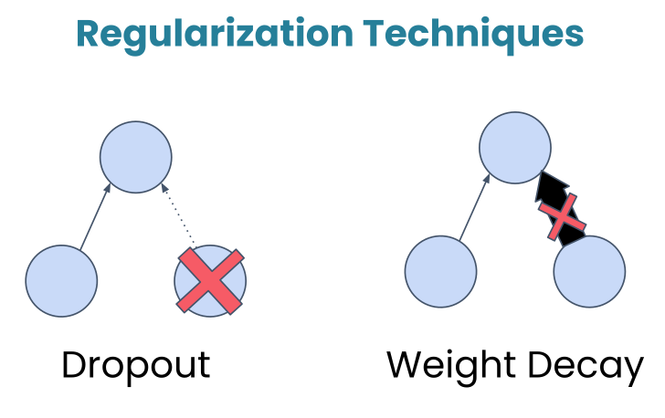{fig-align="center"}

> *Regularization* in deep learning refers to techniques used to prevent models from overfitting to the training data. Overfitting occurs when a model learns not only the underlying patterns but also the noise in the data, resulting in poor performance on unseen data. Regularization methods add a form of constraint or penalty to the learning process, encouraging simpler models that generalize better.

## Dropout {.smaller}

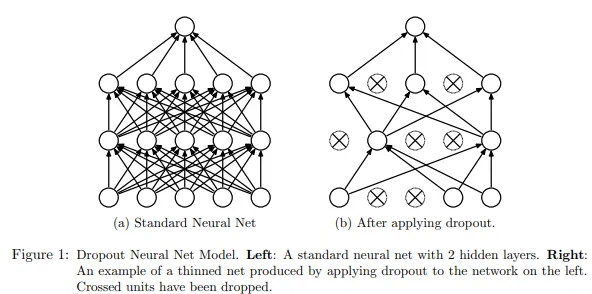{fig-align="center"}

**Dropout:** Randomly turns off a fraction of neurons during training, forcing the network to develop redundant representations and making it less likely to rely too heavily on any single feature.

::: {.notes}
During training, this layer randomly deactivates about 50% of the neurons. Now, this might sound counterintuitive. Why would we want to turn off parts of our network? Well, let's look at an example.

Dropout breaks those shortcuts. By randomly turning off neurons during training, dropout makes it risky to rely too much on any one pattern. If the snow detector neuron gets dropped out, the model then has to find other cues, the ones that actually matter.

In practice, dropout rates typically range from 0.2 to 0.5, and you'll place dropout after activation functions but before the final classification layer.
:::

## Weight Decay {.smaller}

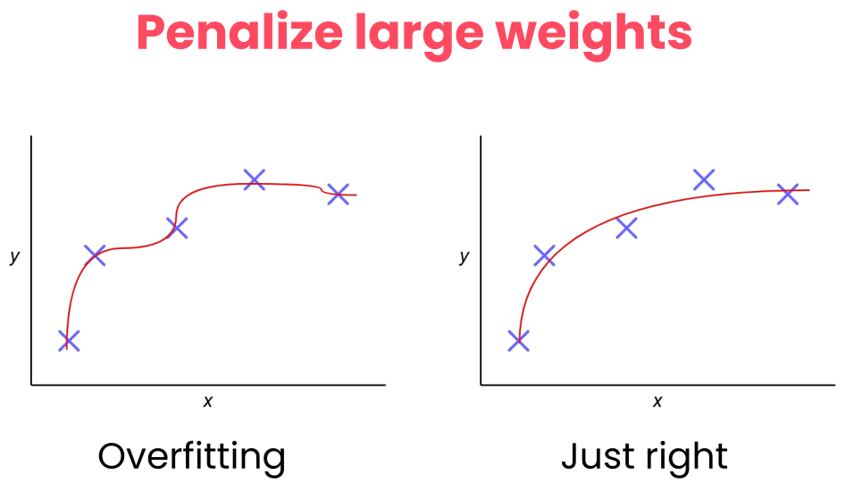{fig-align="center"}

**Weight Decay:** Add a penalty to the loss function based on the size of the weights, encouraging them to be smaller and discouraging complex models.

::: {.notes}
In the graded assignment, you'll also see weight decay applied to the Adam optimizer. Like dropout, it's a regularization technique that helps with generalization, but it works differently. Instead of turning neurons off, weight decay discourages the network from using very large weights.

Why would it do this? Well, it's because large weights can be a sign that the model is memorizing specific patterns in the training data rather than learning features that generalize. Weight decay adds a small penalty for large weights, nudging the model towards simpler and more robust solutions.
:::

## The two regularization techniques {.smaller}

| **Feature** | **Dropout** | **Weight Decay** |
| --- | --- | --- |
| **Mechanism** | Randomly deactivates neurons. | Penalizes large weight values. |
| **Goal** | Breaks co-dependency between neurons. | Keeps the model simple and less sensitive. |
| **Active When?** | Only during training. | During training (via the optimizer). |
| **Analogy** | A team where players are randomly benched so everyone learns to play every position. | A coach telling players not to over-commit to a single move so they stay balanced. |

{fig-align="center"}

## Dataset Issue {.smaller}

If most wolf images in your dataset have snow and dog images don't, that's a **dataset problem**.

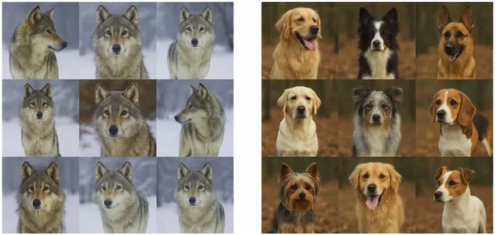{fig-align="center"}

## Solution

Get more representative data.

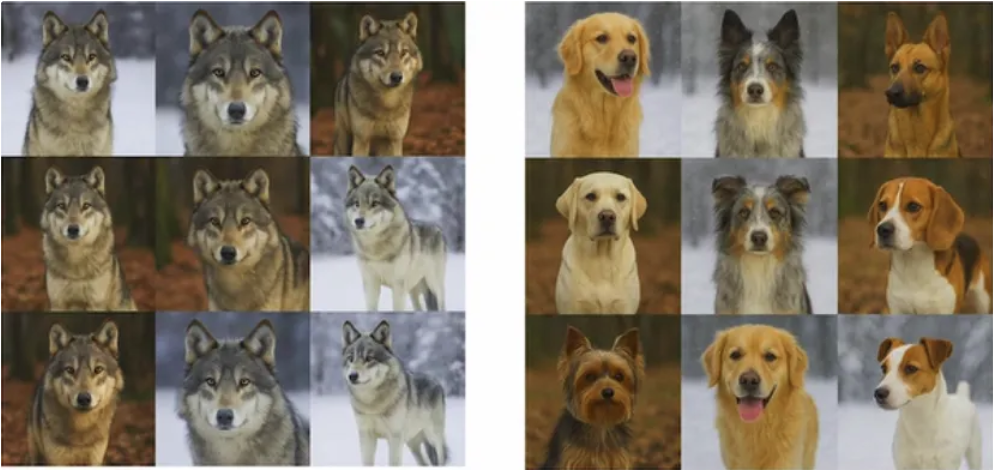{fig-align="center"}

## Lab 1: Building a CNN for Nature Classification

> "If we want machines to think, we need to teach them to see." — ImageNet Project launch

<center>

CUE: START THE LAB HERE

</center>

## What's Next?

In [Session 2: PyTorch Techniques and Model Inspection](session2.qmd) we learn:

- Dynamic computation graphs in PyTorch
- Building modular architectures
- Model inspection and debugging

::: {.notes}
So now it's your turn. Head to the notebook and explore how it all works in detail. In the next session, we'll explore PyTorch's dynamic computation graphs, learn how to build modular architectures, and discover tools for inspecting and debugging your models.
:::

