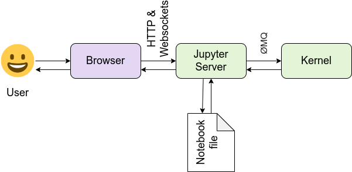

## Client-Server Architecture

Since CPUs are not enough for Deep Learning models; we'll need a GPU. For, that we'll need Google Colab. Understanding the client-server interaction is crucial for working with such remote code execution environments (here shown as Jupyter Server).

{fig-align="center"}

The image above shows how we interact with remote servers, such as Google Colab, to run our code:

1. We write code in the Browser Jupyter Notebooks or in VS Code
2. On save: the code is sent to the Juypter/Colab Server and stored there as `.ipynb` files
3. On run: the code is: 
   1. sent to the kernel for execution
   2. then back to the server to save the results
   3. which are then sent back to the browser

## Setup Instructions

Make sure you have a Google account. And can access [Google Colab](https://colab.research.google.com/notebooks/basic_features_overview.ipynb#scrollTo=KR921S_OQSHG). 

## Optional: Working from inside VS Code instead of the Colab Notebook

[Google Colab for VS Code](https://marketplace.visualstudio.com/items?itemName=google.colab) extension allows you to work in VS Code while the code is sent and executed in Colab servers. However, the steps above are still required.
