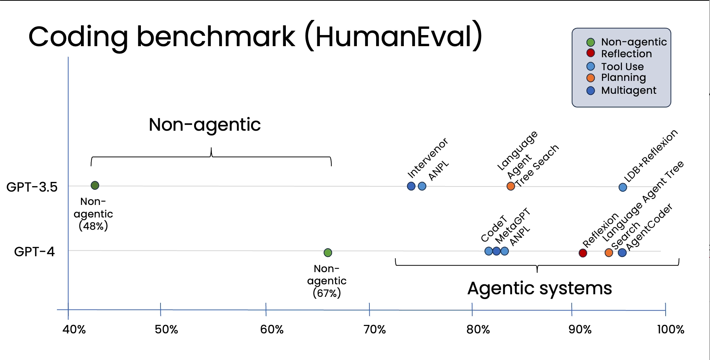
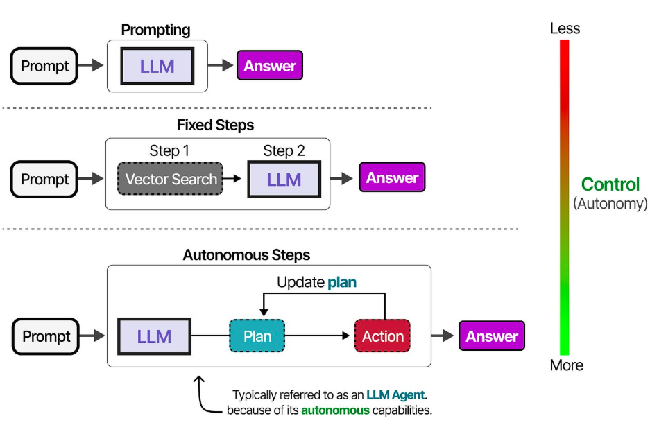
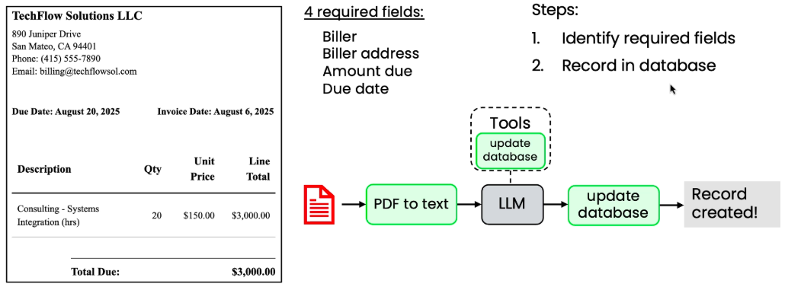

# Agentic AI Overview

## Current State of AI Agents

Reading the [State of Agent Engineering 2026](https://www.langchain.com/state-of-agent-engineering), "a survey of 1,300 professionals — from engineers and product managers to business leaders and executives — to uncover the state of AI agents." could give you an idea of what's going on in 2026 with Agentic AI. Notably:

1. It is being used in production by companies of different sizes:
   1. small
   2. medium
   3. large
2. Most usage is:
   1. "*Customer Service*" (26.5%)
   2. "*Research & Data Analysis*" (24.4%)
   3. "*Internal Productivity*" (17.7%)

## Case Studies

What does "Research & Data Analysis" and "Internal Productivity" mean? To answer this, we have summarized 30+ case Studies from companies of various backgrounds using the LangChain ecosystem. Five things stand out:

1. *Customer Support & Triage* (with a hand-off to human-in-the-loop)
   - _CH Robinson_ → parse emails (text, PDF paperwork, and images) requesting shipment and attatchments.
2. *Deep Research & Multi-Hop RAG* (highly structured intelligence report)
   - _Harmonica.ai_ → retrieve and summarize news and articles for startup investors
3. *Domain-Specific Copilots* (a simplification of an overly complex system)
   - _Definely_ → editor assisted with AI, extracting data from docs and pdfs, and shows them and highlights them side-by-side with the editor.

## Case Studies

1. *Developer Productivity* (high niche)
   - _GitLab_ → planner agent, developer agent, debugger agent, review agent (and security agent). Human-in-the-loop. PR merge.

For more, checkout [Case Studies | LangChain](https://docs.langchain.com/oss/python/langgraph/case-studies).

## Biggest Blockers?

In that same survey, the top 3 issues were:

1. "*Quality of Outputs*" (32.9%)
2. "*Latency / response time*" (20.1%)
3. "*Security and compliance*" (16.0%)

There's a world of difference between building an agent that works and one that doesn't. How can we build agents that fall into the former category? In this course, we're going to talk about best practices for building agents.

# Agentic Workflows

*Agentic workflow* means we make multiple LLM calls (prompting, reflection, iteration) to improve the performance of the system.

## HumanEval: Agentic vs Non-Agentic

# What's an Agent?

## Degree of Autonomy

Today's *AI Agents* are computer programs where LLM outputs control the workflow. The *influence* of the LLM on the code workflow is the level of agency in the system.

{fig-align="center"}

## Components

An agentic workflow usually consist of non-LLM components, to do API calls, run code, or use other specialized models:

| **Building block** | **Examples** | **Use cases** |
| --- | --- | --- |
| **Models** | LLMs | Text generation, tool use, information extraction |
| | Other AI models | PDF-to-text, text-to-speech, image analysis |
| **Tools** | API | Web search, get real-time data, send email, check calendar, ... |
| | Information retrieval | Databases, Retrieval Augmented Generation (RAG) |
| | Code execution | Basic calculator, data analysis |

## Example Agentic Workflow: Invoice Processing

1. Extract required financial entities (biller, amount, date, etc.) from parsed document text.
2. Update the corresponding database records with the extracted data (function/tool).

{fig-align="center"}

## Level of Detail in Workflows

A lot of effort in agent workflow design is *looking at the current human or business process*. The more we understand the process, the easier it is to specify:

| **Direct generation** | **3-step workflow** | **5-step workflow** |
| --- | --- | --- |
| 1. Write an essay on topic X | 1. Write an essay outline on topic X | 1. Write an essay outline on topic X |
| | 2. Search web | 2. Search web |
| | 3. Write the essay | 3. Write the first draft |
| | | 4. Consider what parts need revision |
| | | 5. Revise your draft |

Flexibility is not always a good thing. The more defined the process is, the less room for error. However, some processes are not well-defined.

# Large and Small Language Models

## Lanuage Models

Current Agentic workflows are driven by *LMs (Language Models)*. So we'll need to understand how they work, to build systems, debug their issues, and optimize their performance.

Remember that *Artificial Intelligence* is a field of Computer Science, studying how to automate decision making; whether we're using language models or non-generative methods.

An *alternative path to autonomy* was proposed by Turing Award winner and former Meta chief scientist Yann LeCun—World Models (JEPA). See: [Yann LeCun's $1B Bet Against LMs, Part 1](https://youtu.be/kYkIdXwW2AE?si=Yx5U4p1Z3qux14j6) for more details.

## Language Models

**Language Model (LM)**; generate text, which were later then used to *perform tasks* by mimicing what people would write in response to a given textual input.

**Large Language Models (LMs)** are a powerful subset of deep neural NLP models characterized by:

1. massive size (billions of parameters)
2. expensive compute (thousands of flops)
3. extensive training data (trillions of tokens)

They have the ability to perform a wide range of language tasks.

# What You Will Learn

## What You Will Learn

1. How to **build** agentic workflows made of swappable, debuggable, and composable modules.
2. How to **evaluate** the performance of AI workflows in terms of latency, cost, and accuracy.
3. How to **optimize** workflows using training data; rather than manual prompt engineering.
4. How to **utilize** the results of tried and tested methods as evident by research on Agentic AI including: _Reasoning_, _Reflection_, _Planning_, and _CodeAct_.
