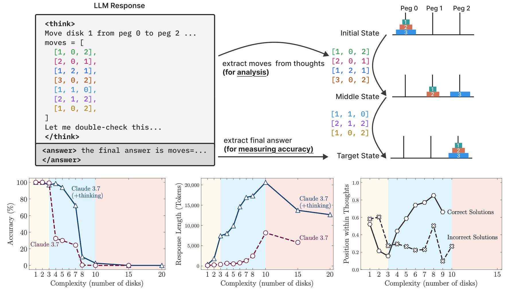
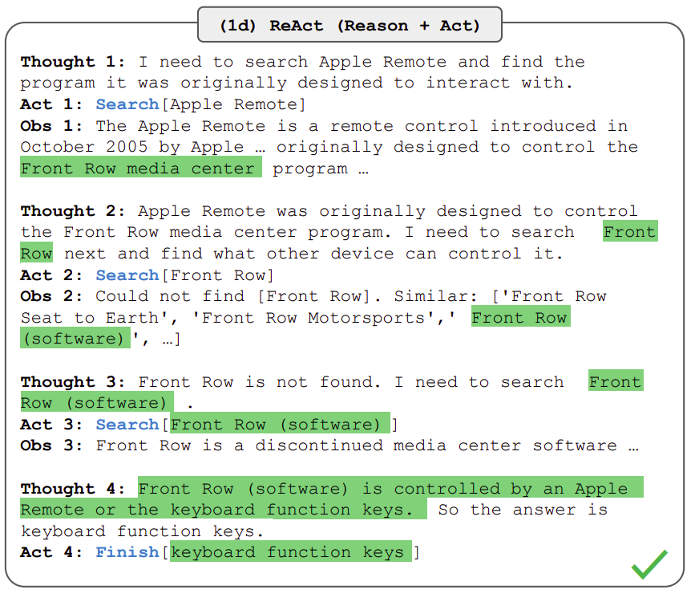
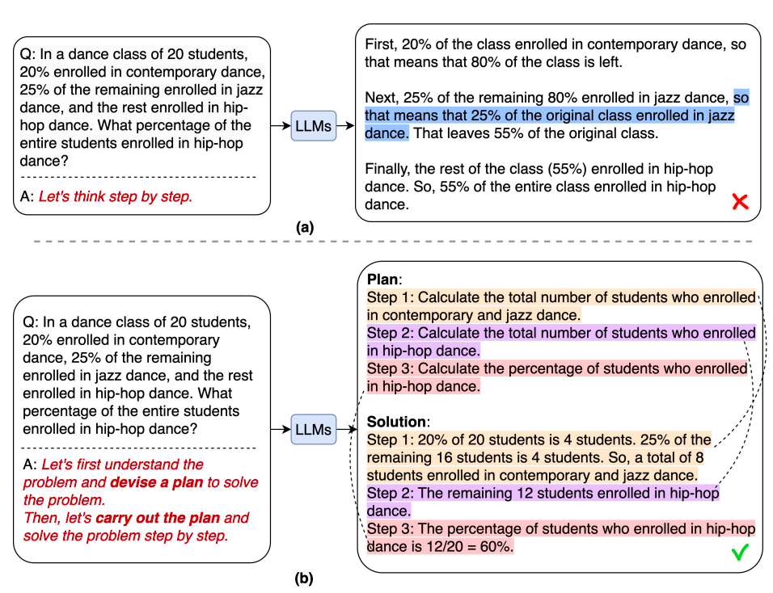
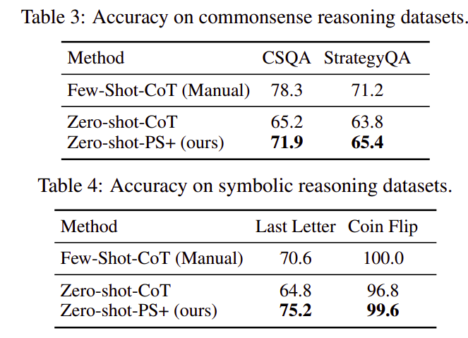
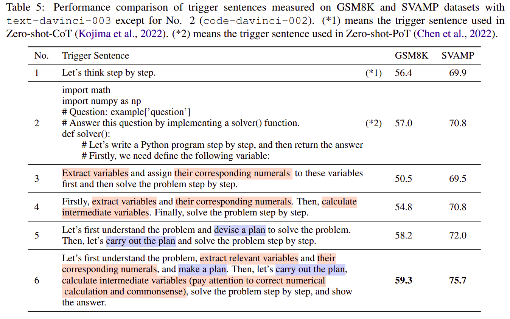
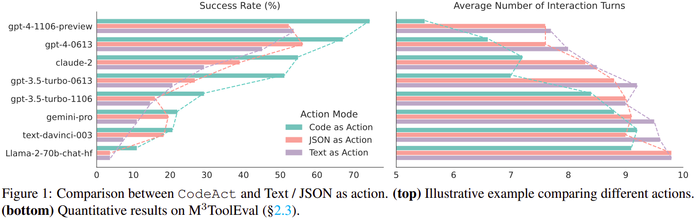
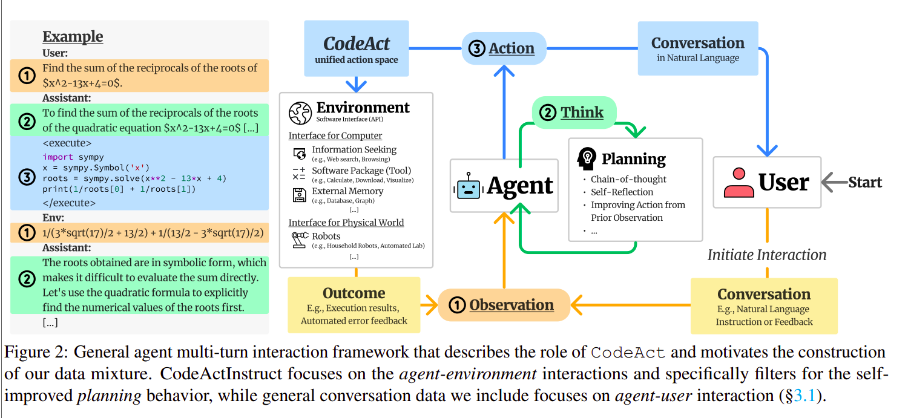
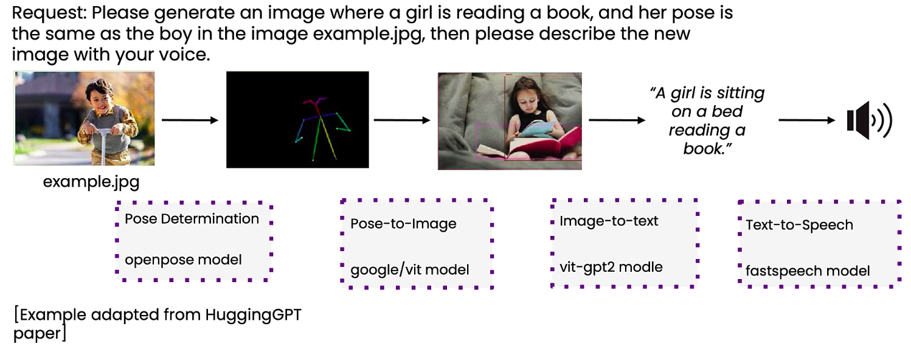

# Agentic Patterns

## Introduction

We summarize the latest research on Agentic AI, and how to apply it in practice.

- What **reasoning** and **planning** actually mean.
- How LLMs become Agents (**tool use** and **observation**).
- Why **code-writing agents** out-perform textual or JSON **tool-calling agents**.
- An interesting **HuggingGPT** case for planning in a higher-level of software *abstraction*.

We'll focus on what YOU can apply in your work today using the [DSPy framework](https://dspy.ai/).

## Pattern 1: Chain-of-Thought

Although it may not be obvious, but language models are also used to generate text that mimics the chain of thought that preceeds an answer. The way this is done is by training it on data that doesn't give the answer right away, but first, writes the steps towards doing that.

::: {.callout-tip}
Use [`dspy.ChainOfThought`](https://dspy.ai/getting-started/changing-modules/) to apply this pattern.
:::

Here are standard examples of reasoning traces used in instruction-tuning datasets:

## Example 1: Arithmetic Reasoning (from the GSM8K Benchmark)

1. *Input:* "A cafeteria has 23 apples. If they use 20 to make lunch and buy 6 more, how many apples do they have?"
2. *Reasoning Trace:* "The cafeteria originally had 23 apples. They used 20 to make lunch, leaving 23 - 20 = 3 apples. They then bought 6 more, resulting in 3 + 6 = 9 apples."
3. *Final Answer:* "9"

### Example 2: State Tracking (from the BIG-Bench Hard Benchmark)

1. *Input:* "A coin is heads up. Jason flips the coin. Seth flips the coin. Is the coin still heads up?"
2. *Reasoning Trace:* "The coin starts heads up. Jason flips the coin, changing its state to tails up. Seth flips the coin, changing its state back to heads up."
3. *Final Answer:* "Yes"

## Chain-of-Thought Results

Results from the paper [Chain-of-Thought Prompting Elicits Reasoning in Large Language Models](https://arxiv.org/abs/2201.11903):

:::: {.columns}
::: {.column width="50%"}
1. Chain-of-thought prompting enables large language models to solve challenging math problems.
2. Chain-of-thought benefits bigger models more.

Chain-of-thought prompting improves performance on challenging math problems, especially for larger models.
:::
::: {.column width="50%"}

:::
::::

## Why it Works: Thinking or Searching?

One theory says that reasoning traces work because models can better space their storage capacity; since there are more indexing routes available, i.e., tokens. This theory sits on the idea that the underlying technique, used by all Large Language Models today, the _Attention Mechanism_ (composed of Key, Value, Query), is essentially *a multi-step fuzzy search engine*.

The theory explains why such models have limited generalization capacity; i.e., performance drops suddenly for simpler tasks just because they were never seen during training. It also explains why more parameters and more data improves performance on benchmarks.

## The Illusion of Thinking

See: [The Illusion of Thinking Paper](https://machinelearning.apple.com/research/illusion-of-thinking) by Apple's Machine Learning Research.

{fig-align="center" width="60%"}

## Pattern 2: ReAct

Agents become such when they *interact with an envionment* and observe consequences of their actions.

## Pattern 2: ReAct

## Pattern 2: ReAct

The paper [ReAct: Synergizing Reasoning and Acting in Language Models](https://arxiv.org/abs/2210.03629) showed a sequence of chain of thoughts: *Reason*, *Act*, *Observe*. For example: "now that everything is cut, I should heat up the pot of water".

> "Reasoning traces help the model induce, track, and update action plans... while actions allow it to interface with external sources... to gather additional information."

::: {.callout-tip}
Use [`dspy.ReAct`](https://dspy.ai/getting-started/react-and-tools/) to implement this pattern.
:::

## Pattern 3: Reflection

The paper [Reflexion: Language Agents with Verbal Reinforcement Learning](https://arxiv.org/abs/2303.11366), shows AlfWorld performance across 134 tasks showing cumulative proportions of solved tasks using self-evaluation techniques of (Heuristic) and (GPT) for binary classification.

{fig-align="center"}

## Pattern 3: Reflection

::: {.callout-tip}
[In DSPy, do this systematically with GEPA which uses reflection to improve instructions](https://dspy.ai/getting-started/gepa-optimization/) for LLMs based on a specific set of metrics and external feedback.
:::

## Pattern 4: Planning

> "We propose Plan-and-Solve (PS) prompting... to first devise a useful plan to divide the entire task into smaller subtasks, and then carry out the subtasks according to the plan."

The paper [Plan-and-Solve Prompting: Improving Zero-Shot Chain-of-Thought Reasoning by Large Language Models](https://arxiv.org/abs/2305.04091) showed example inputs and outputs of GPT-3 with (a) Zero-shot-CoT prompting, (b) Plan-and-Solve (PS) prompting:

## Pattern 4: Planning

## Pattern 4: Planning

Results:

::: {.callout-tip}
In practice, use a multi-step workflow where the LLM first devises a plan, then carries out each subtask.
:::

## Manual Prompt Trail and Error

## Manual Prompt Trail and Error

::: {.callout-tip}
In practice, the GEPA optimizer (mentioned earlier) automatically refines prompts given training and testing data with clearly defined metrics and feedback.
:::

## Pattern 5: CodeAct Makes LLMs Better Agents

> "We propose to use executable Python code to consolidate LLM agents' actions into a unified space... LLM agents can leverage existing software packages and iteratively adjust their actions through code execution feedback."

The paper [Executable Code Actions Elicit Better LLM Agents](https://arxiv.org/abs/2402.01030) shows that planning, reasoning, and solving tasks through coding is actually way better than writing text, or spitting out JSON to call tools.

## Pattern 5: CodeAct

## Pattern 5: CodeAct

## Pattern 5: CodeAct

## Pattern 5: CodeAct

::: {.callout-tip}
Use [`dspy.CodeAct`](https://dspy.ai/diving-deeper/built-in-module-variants/#6-codeact-is-react-plus-a-code-sandbox) so the LM writes Python rather than outputting JSON-formatted tool calls to act.
:::

## Pattern 6: Higher Abstraction

The paper: [HuggingGPT: Solving AI Tasks with ChatGPT and its Friends in Hugging Face](https://arxiv.org/abs/2303.17580) showed the power of using higher-level abstraction.

> "We present HuggingGPT, an LLM-powered agent that leverages LLMs... as a controller to manage existing AI models to solve complicated AI tasks, with language serving as a generic interface to empower this."

## Pattern 6: Higher Abstraction

## Pattern 6: Higher Abstraction

The agent can automatically decide that to carry out this task, it first needs to:

1. Find a *pose determination model* to figure out the pose of the boy
2. Use a *pose-to-image model* to generate a picture of a girl
3. Run *image-to-text* to describe the image
4. Run *text-to-speech* to speak the description

Not all lines of code are equal. Not all tokens are equal.

::: {.callout-tip}
In practice, the power you give your agent is proportional to the level of code you write and give it access to.
:::

## Conclusion

In this course, you learn to actually apply these results from the body of research and make use of the fruits of knowledge.
