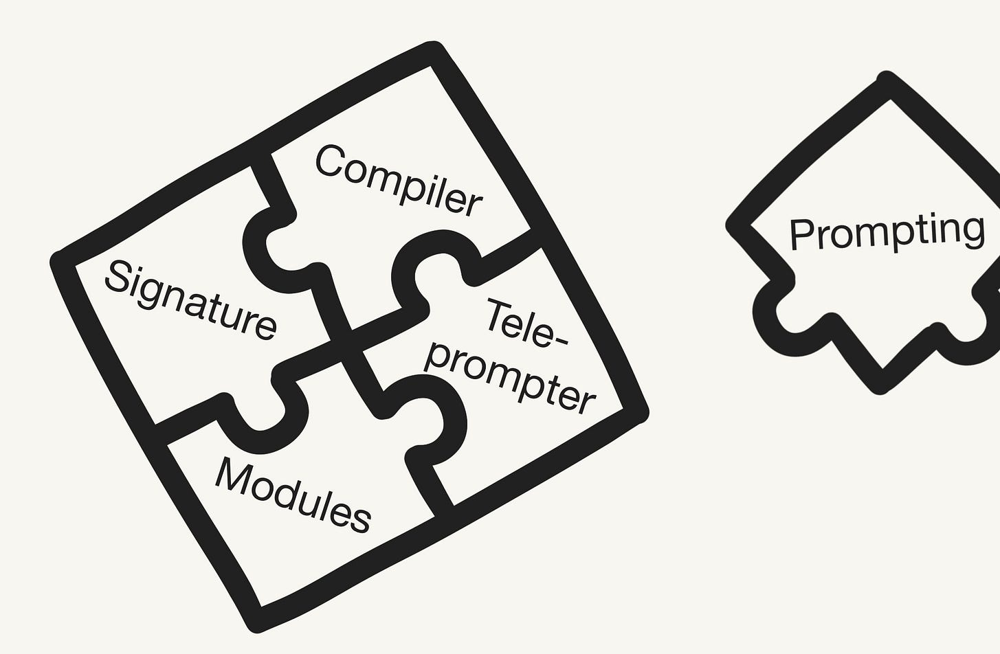
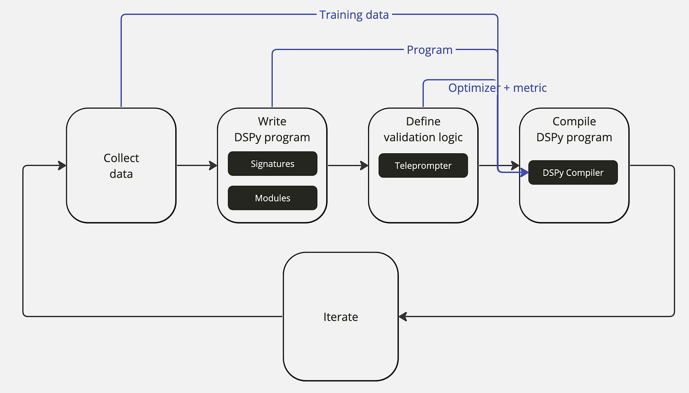
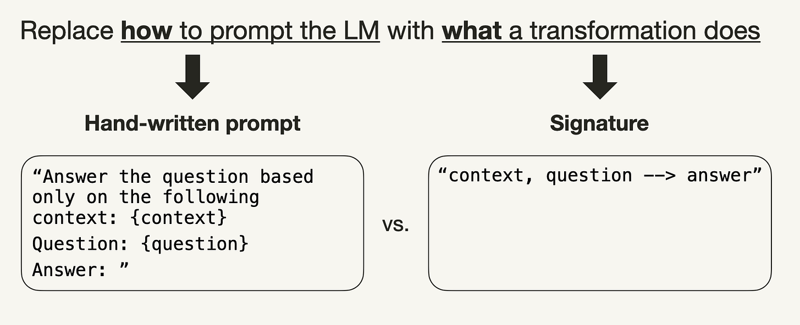
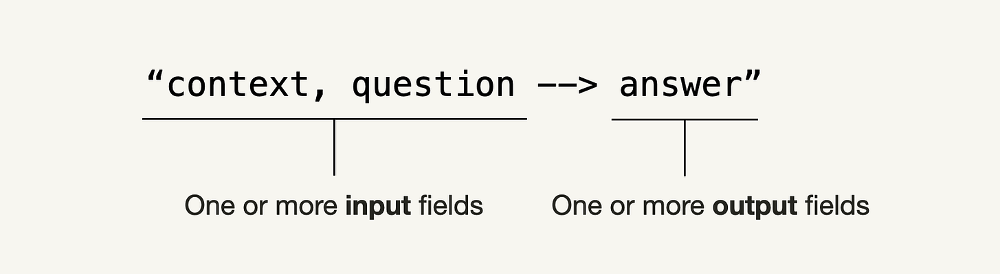
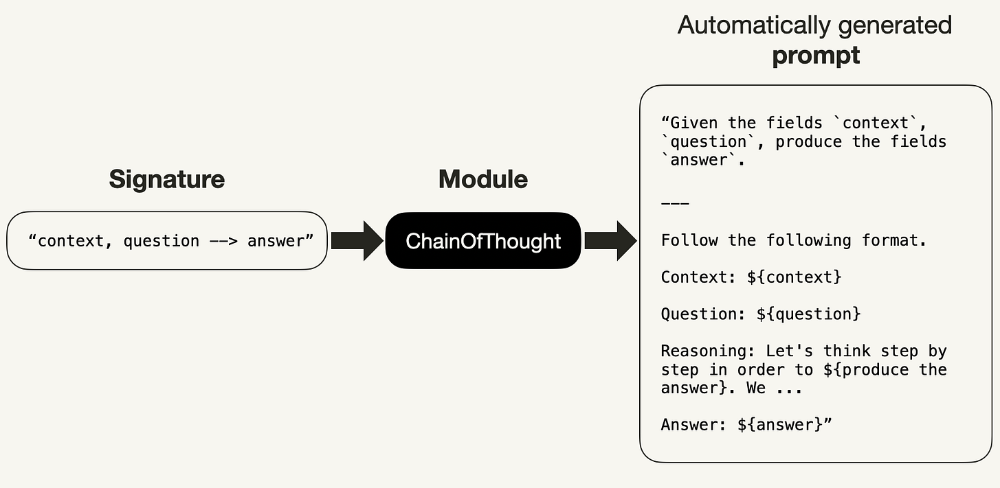
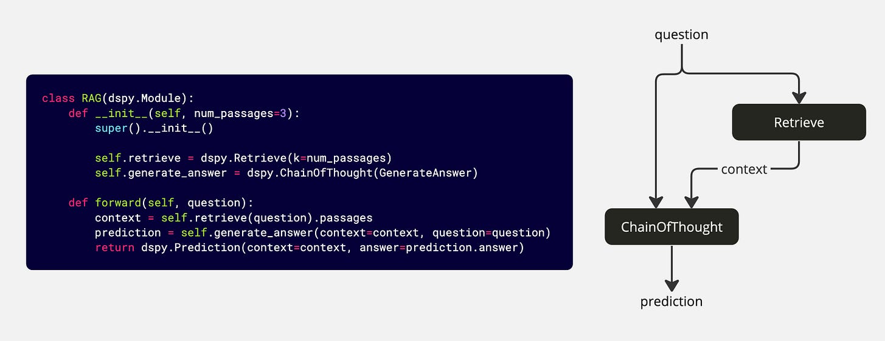
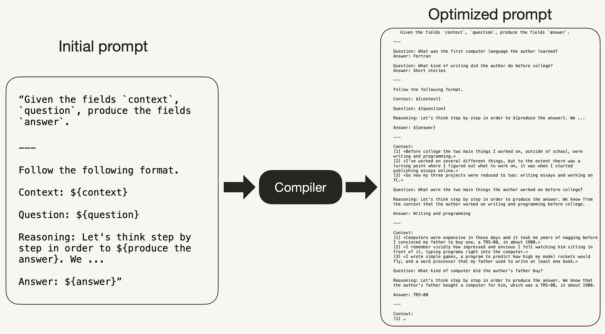
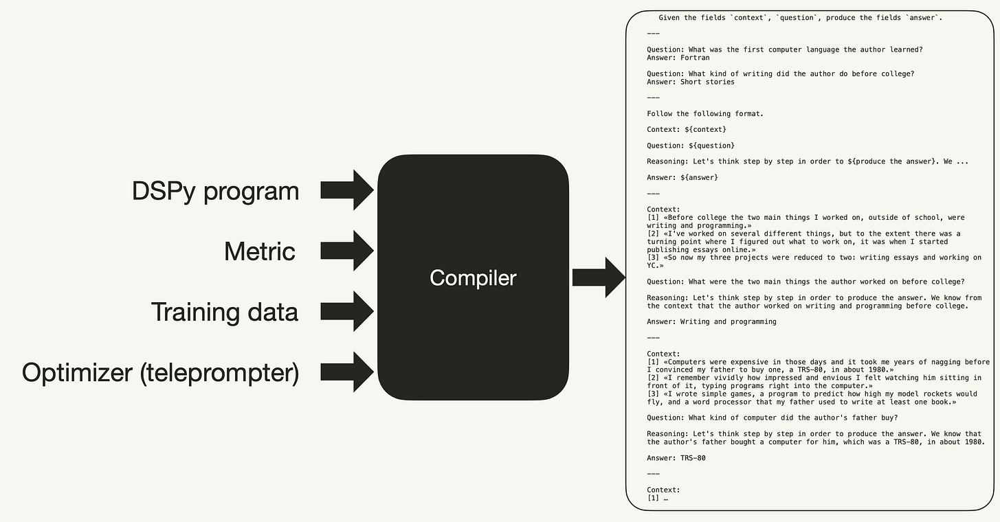

# DSPy Overview

## Introduction

Source: [DSPy: Compiling Declarative Language Model Calls into Self-Improving Pipelines](https://www.leoniemonigatti.com/papers/dspy.html) by Leonie Monigatti (February 27, 2024).

{fig-align="center"}

## Introduction

Currently, building applications using large language models (LLMs) can be not only *complex* but also *fragile*.

Typical pipelines are often implemented using prompts, which are hand-crafted through trial and error because *LLMs are sensitive to how they are prompted*. Thus, when you change a piece in your pipeline, such as the LLM or your data, you will likely weaken its performance – unless you adapt the *prompt* (or *fine-tuning steps*).

### Solution

[DSPy](https://arxiv.org/abs/2310.03714) is a framework that aims to solve the fragility problem in language model (LM)-based applications *by prioritizing programming over prompting*. It allows you to recompile the entire pipeline to optimize it to your specific task – instead of repeating manual rounds of prompt engineering – whenever you change a component.

## What is DSPy

*DSPy* ("**D**eclarative **S**elf-improving Language **P**rograms (in Python)", pronounced "dee-es-pie") [1](https://arxiv.org/abs/2310.03714) is a framework for _"programming with foundation models"_ developed by researchers at Stanford NLP.

DSPy also provides a more systematic approach to building LM-based applications by separating the information flow of your program from the parameters (prompts and LM weights) of each step. DSPy will then take your program and automatically optimize how to prompt (or finetune) LMs for your particular task.

---

For this purpose, DSPy introduces a set of the following concepts:

1. Hand-written prompts and fine-tuning are abstracted and replaced by *signatures*
2. Prompting techniques, such as Chain of Thought or ReAct, are abstracted and replaced by *modules*
3. Manual prompt engineering is automated with **optimizers** (teleprompters) and a DSPy *Compiler*

---

The workflow of building an LM-based application with DSPy, will remind you of the workflow for training a neural network:

{fig-align="center"}

---

::: {.incremental}
1. **Collect dataset**: Collect a few examples of the inputs and outputs of your program (e.g., question and answer pairs), which will be used to optimize your pipeline.
2. **Write DSPy program**: Define your program's logic with signatures and modules and the information flow among the components to solve your task.
3. **Define validation logic**: Define a logic to optimize your program for using a validation metric and an optimizer (teleprompter).
4. **Compile DSPy program**: The DSPy compiler takes the training data, program, optimizer, and validation metric into account to optimize your program (e.g., prompts or finetunes).
5. **Iterate**: Repeat the process by improving your data, program, or validation until you are happy with your pipeline's performance.
:::

---

Similarly to *PyTorch*, where general-purpose layers can be composed in any model architecture, in DSPy general-purpose modules can be composed in any LM-based application. Additionally, compiling a DSPy program, where the parameters in the DSPy modules are automatically optimized, is similar to training a neural network in PyTorch, where the model weights are trained using optimizers.

| **PyTorch** | **DSPy** |
| --- | --- |
| Model architecture with general-purpose layers (e.g., Dense, Conv, Pooling, Dropout) | DSPy Program with general.purpose modules (e.g., Predict, ChainOfThought) |
| Model training | Compiling |
| Training data (large dataset) | Training data (small dataset) |
| Loss function | Evaluation metric |
| Optimizer (e.g. SGD, Adam, RMSProp) | Teleprompter (e.g., BootstrapFewShot, Ensemble) |

# DSPy Programming Model

## Overview

This section discusses the following three core concepts introduced by DSPy:

1. **Signatures**: Abstracting prompting and fine-tuning
2. **Modules**: Abstracting prompting techniques
3. **Teleprompters**: Automating prompting for arbitrary pipelines

## Signatures

Every call to the LM in a DSPy program must have a natural language signature, which replaces the traditional hand-written prompt. A signature is a short function that specifies what a transformation does rather than how to prompt the LM to do it (e.g., "consume questions and context and return answers").

{fig-align="center"}

---

A signature is a tuple of input and output fields in its minimal form.

{fig-align="center"}

Below, you can see a few examples of shorthand syntax signatures:

```text
"question -> answer"
"long_document -> summary"
"context, question -> answer"
```

---

In many cases, these shorthand syntax signatures are sufficient. However, in cases where you need more control, you also define signatures with the following notation. In this case, a signature consists of three elements:

1. A minimal description of the *sub-task* the LM is supposed to solve,
2. a description of the *input fields* and
3. a description of the *output fields*.

---

Below, you can see the complete notation for the signature: `context, question -> answer`:

```python
class GenerateAnswer(dspy.Signature):
    """Answer questions with short factoid answers."""
    context = dspy.InputField(desc="may contain relevant facts")
    question = dspy.InputField()
    answer = dspy.OutputField(desc="often between 1 and 5 words")
```

In contrast to hand-written prompts, signatures can be compiled into self-improving and pipeline-adaptive prompts or finetunes by bootstrapping examples for each signature.

## Modules

You are probably familiar with a few different prompting techniques, such as adding sentences like `"Your task is to ..."` or `"You are a ..."` at the beginning of a prompt, Chain of Thought (`"Let's think step by step"`), or adding sentences like `"Don't make anything up"` or `"Only use the provided context"` at the end of the prompt.

*Modules* in DSPy are templated and parameterized to abstract these prompting techniques. This means that they are used to adapt DSPy signatures to a task by applying prompting, fine-tuning, augmentation, and reasoning techniques.

---

Below, you can see how a signature can be passed to a `ChainOfThought` module and then called with values for the input fields `context` and `question`.

```python
# Option 1: Pass minimal signature to ChainOfThought module
generate_answer = dspy.ChainOfThought("context, question -> answer")

# Option 2: Or pass full notation signature to ChainOfThought module
generate_answer = dspy.ChainOfThought(GenerateAnswer)

# Call the module on a particular input.
pred = generate_answer(context = "Which meant learning Lisp, since in those days Lisp was regarded as the language of AI.",
                       question = "What programming language did the author learn in college?")
```

---

Below, you can see how the `ChainOfThought` module initially implements the signature `"context, question -> answer"`. If you want to try it yourself, you can use `lm.inspect_history(n=1)` to print the last prompt.

{fig-align="center"}

---

At the time of writing, DSPy implements the following modules (see [API reference](https://dspy.ai/api/modules/)):

1. [dspy.Module](https://dspy.ai/api/modules/Module/): Base class for all DSPy modules (programs).
2. [dspy.Predict](https://dspy.ai/api/modules/Predict/): Basic module that maps inputs to outputs using a language model.
3. [dspy.ChainOfThought](https://dspy.ai/api/modules/ChainOfThought/): Reasons step by step in order to predict the output of a task.
4. [dspy.BestOfN](https://dspy.ai/api/modules/BestOfN/): Runs a module up to `N` times and returns the best prediction or the first that passes a reward threshold.
5. [dspy.MultiChainComparison](https://dspy.ai/api/modules/MultiChainComparison/): Generates multiple reasoning chains and compares them to select an answer.
6. [dspy.Refine](https://dspy.ai/api/modules/Refine/): Runs a module up to `N` times and returns the best prediction, using feedback when no threshold is met.
7. [dspy.ReAct](https://dspy.ai/api/modules/ReAct/): Builds tool-using agents through interleaved reasoning, acting, and observation.

---

8. [dspy.Parallel](https://dspy.ai/api/modules/Parallel/): Parallel, multi-threaded execution of (module, example) pairs.
9. [dspy.CodeAct](https://dspy.ai/api/modules/CodeAct/): Utilizes a code interpreter and predefined tools to solve the problem.
10. [dspy.ProgramOfThought](https://dspy.ai/api/modules/ProgramOfThought/): Runs Python programs to solve a problem.
11. [dspy.RLM](https://dspy.ai/api/modules/RLM/): Lets LLMs programmatically explore large contexts via a sandboxed Python REPL and recursive sub-LLM calls.

---

You can chain these modules together in classes that are inherited from `dspy.Module` and take two methods. You might already notice a syntactic similarity to PyTorch:

```python
class RAG(dspy.Module):
    # Declares the used submodules.
    def __init__(self, num_passages=3):
        super().__init__()

        self.retrieve = dspy.Retrieve(k=num_passages)
        self.generate_answer = dspy.ChainOfThought(GenerateAnswer)
```

---

```python
    # Describes the control flow among the defined sub-modules.
    def forward(self, question):
        context = self.retrieve(question).passages
        prediction = self.generate_answer(
          context=context, question=question)
        return dspy.Prediction(context=context, answer=prediction.answer)
```

---

The above piece of code creates the following information flow among the defined modules in the `RAG()` class:

{fig-align="center"}

## Optimizers

**Optimizers** automatically enhance the quality and performance of your applications. They take a metric and, together with the DSPy compiler, learn to bootstrap and select effective prompts for a DSPy program's modules.

```python
from dspy.optimizers import BootstrapFewShot

# Simple optimizer example
optimizer = BootstrapFewShot(metric=dspy.evaluate.answer_exact_match)
```

---

At the time of writing, DSPy implements the following optimizers (see [API reference](https://dspy.ai/api/optimizers/)):

1. [dspy.BetterTogether](https://dspy.ai/api/optimizers/BetterTogether/): Meta-optimizer that combines prompt and weight optimization in configurable sequences.
2. [dspy.BootstrapFewShot](https://dspy.ai/api/optimizers/BootstrapFewShot/): Composes demos/examples for a predictor's prompt from labeled and bootstrapped examples.
3. [dspy.BootstrapFewShotWithRandomSearch](https://dspy.ai/api/optimizers/BootstrapFewShotWithRandomSearch/): Bootstraps few-shot demos and runs random search over candidate programs.
4. [dspy.BootstrapFinetune](https://dspy.ai/api/optimizers/BootstrapFinetune/): Fine-tunes model weights using bootstrapped examples.
5. [dspy.BootstrapRS](https://dspy.ai/api/optimizers/BootstrapRS/): Alias for `BootstrapFewShotWithRandomSearch`.
6. [dspy.COPRO](https://dspy.ai/api/optimizers/COPRO/): Optimizes predictor signatures and instructions via coordinate ascent over prompt candidates.
7. [dspy.Ensemble](https://dspy.ai/api/optimizers/Ensemble/): Creates ensembled versions of multiple programs; a common `reduce_fn` is `dspy.majority`.

---

8. [dspy.GEPA](https://dspy.ai/api/optimizers/GEPA/): Reflective prompt optimizer that adaptively evolves textual components using metric scores and textual feedback.
9. [dspy.InferRules](https://dspy.ai/api/optimizers/InferRules/): Bootstraps few-shot examples and infers rules to improve predictor behavior.
10. [dspy.KNN](https://dspy.ai/api/optimizers/KNN/): k-nearest neighbors retriever that finds similar examples from a training set.
11. [dspy.KNNFewShot](https://dspy.ai/api/optimizers/KNNFewShot/): Attaches the `k` nearest neighbor training examples to the student model.
12. [dspy.LabeledFewShot](https://dspy.ai/api/optimizers/LabeledFewShot/): Uses `k` labeled training examples as few-shot demos for each predictor.
13. [dspy.MIPROv2](https://dspy.ai/api/optimizers/MIPROv2/): Jointly optimizes instructions and few-shot examples using Bayesian optimization.
14. [dspy.SIMBA](https://dspy.ai/api/optimizers/SIMBA/): Stochastic Introspective Mini-Batch Ascent; samples mini-batches and generates improvement rules or demos.

## DSPy Compiler

The DSPy compiler will internally trace your program and then optimize it using an optimizer (teleprompter) to maximize a given metric (e.g., improve quality or cost) for your task. The optimizations depend on the type of LM you are using:

1. *for LLMs*: construct high-quality few-shot prompts
2. *for smaller LMs*: train automatic finetunes

---

That means the DSPy compiler automatically maps the modules to high-quality compositions of prompting, finetuning, reasoning, and augmentation. [1](https://arxiv.org/abs/2310.03714) Internally, the compiler simulates various versions of the program on the inputs and bootstraps example traces of each module for self-improvement to optimize the pipeline to your task. This process is similar to the training process of a neural network.

For example, while the initial prompt, the `ChainOfThought` module created earlier, may be a good starting point for any LM to understand the task, it probably isn't the optimal prompt. As you can see in the following image, the DSPy compiler optimizes the initial prompt and thus eliminates the need for manual prompt tuning.

---



Inspired by [Erika's post](https://x.com/eshorten300/status/1754966790910726161).

---

The compiler takes the following inputs, as shown in the code and image below:

1. the program,
2. the teleprompter, including the defined validation metric, and
3. a few training samples.

{fig-align="center"}

---

```python
from dspy.teleprompt import BootstrapFewShot

# Small training set with question and answer pairs
trainset = [dspy.Example(question="What were the two main things the author worked on before college?",
                         answer="Writing and programming").with_inputs('question'),
            dspy.Example(question="What kind of writing did the author do before college?",
                         answer="Short stories").with_inputs('question'),
            ...
            ]
```

---

```python
# The teleprompter will bootstrap missing labels: reasoning chains and retrieval contexts
optimizer = BootstrapFewShot(metric=dspy.evaluate.answer_exact_match)

compiled_rag = optimizer.compile(RAG(), trainset=trainset)
```
