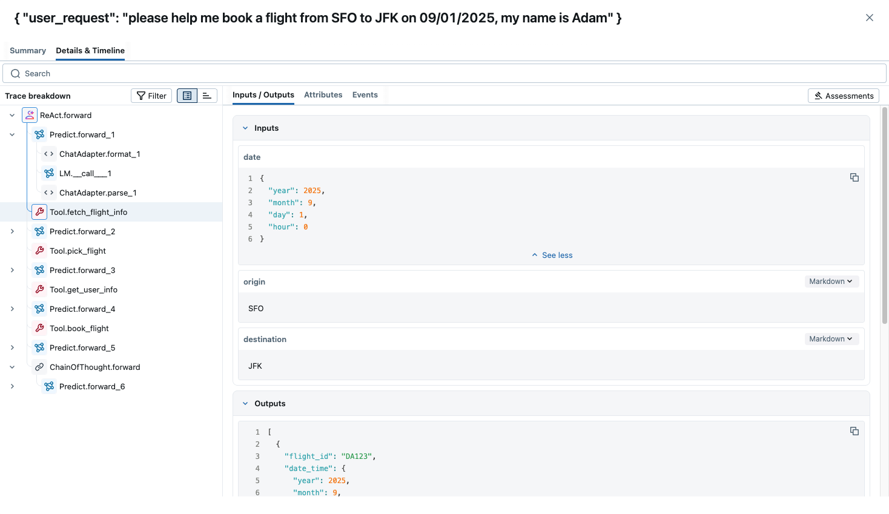

# MLflow DSPy Integration

Set up MLflow Tracing to understand what's happening under the hood.

<a href="https://mlflow.org/">MLflow</a> is an LLMOps tool that natively integrates with DSPy and offers explainability and experiment tracking. You can use MLflow to visualize prompts and optimization progress as traces to understand DSPy's behavior better.



1. Install MLflow

```bash
%pip install mlflow>=3.0.0
```

2. Start MLflow UI in a separate terminal

```bash
mlflow ui --port 5000 --backend-store-uri sqlite:///mlruns.db
```

3. Connect the notebook to MLflow

```python
import mlflow

mlflow.set_tracking_uri("http://localhost:5000")
mlflow.set_experiment("DSPy")
```

4. Enable tracing.

```python
mlflow.dspy.autolog()
```

To learn more, visit [MLflow DSPy Documentation](https://mlflow.org/docs/latest/llms/dspy/index.html).