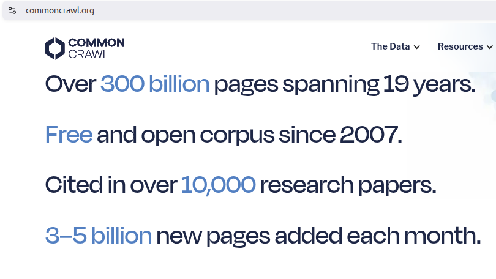
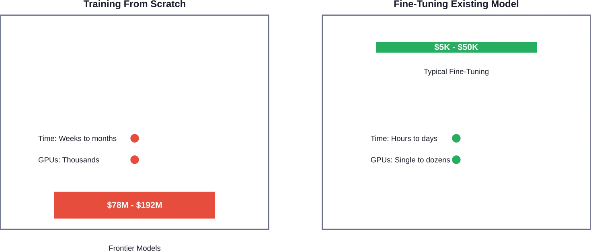

# Overview

## Goals

We want models that are:

- **Cheap**: feasible on a single GPU, local workstation, edge device, or phone.
- **Fast**: responsive enough for real applications, not just demos.
- **Customizable**: adaptable to a domain like law, medicine, support, or code.
- **Private and secure**: usable without shipping sensitive data to a third party.

## Core Questions

To get there, we need to answer four design questions:

. . .

::: {.incremental}

1. What makes language models **large** and expensive?
2. How do we customize them to **our** data?
3. What makes them slow, and how do we speed them up?
4. How do we preserve privacy and security while doing all of this?

:::

# What makes an LLM "large"?

## Three Scaling Factors

Large language models are defined by three kinds of scale:

1. **Parameter count**: often billions of learned weights.
2. **Training data**: often trillions of tokens.
3. **Task breadth**: the same model can summarize, classify, translate, code, and answer questions.

The interesting part is the third: one model family can transfer to many downstream tasks.

## Tom Mitchell's Definition

Tom Mitchell's definition is our framework for understanding LLMs:

**Machine learning:** A computer program is said to learn from experience $E$ with respect to some class of tasks $T$ and performance measure $P$, if its performance at tasks in $T$, as measured by $P$, improves with experience $E$.

For instance, in spam filtering, we have:

. . .

- **Task** $T$: classify an incoming email as spam or not spam.
- **Experience** $E$: previously labeled emails collected over time.
- **Performance** $P$: how accurately the filter handles new emails.

If more data improves quality, the system is **learning** (a.k.a. **training** or **fitting**).

# Training From Scratch

## The three-stage picture

Training a useful assistant model from scratch usually looks like:

1. **Pre-training**: learn language by next-token prediction.
2. **Supervised fine-tuning**: learn to follow instructions and task formats.
3. **Alignment**: push behavior toward helpfulness, honesty, and safety.

Each stage solves a different problem, so each creates a different kind of model.

## Stage 1: Pre-training (unsupervised)

- **Learning setup**: self-supervised next-token prediction.
- **Goal**: build a broad internal representation of language and world knowledge.
- **Scale**: enormous corpora plus enormous compute budgets.

{fig-align="center"}

## Pre-training outcome and limits

What do you get?

- A **base model**: essentially a highly performant text completion model. (**Same as the one in your smartphone's keyboard**)
- It has absorbed massive text patterns from the public internet.

What is still missing?

- It does not naturally behave like an assistant.
- It inherits both useful and harmful patterns from its data.
- It needs more training before "answer this question" becomes a reliable behavior.

## Stage 2: Supervised fine-tuning

- **Learning setup**: (prompt → target) response pairs.
- **Goal**: instruction following.
- **Scale**: much smaller curated datasets than pre-training.

Typical examples:

- summarize this article
- write Python to solve this task
- extract fields from this document
- answer this question in a specific format

## BIG-bench Dataset

[Google's BIG-bench](https://github.com/google/BIG-bench/blob/main/bigbench/benchmark_tasks/README.md) (contains 214 tasks) gives a sense of the diversity of instruction-style tasks.

Example task families include:

- **Narrative understanding**: choose the proverb that best matches a story.
- **Reasoning puzzles**: solve abstraction or visual reasoning tasks.
- **Common sense checks**: detect anachronisms or implausible claims.
- **Analogy and entailment**: classify relationships between statements.
- **Arithmetic**: return correct numerical answers.

## What SFT really changes

Mitchell's variables show up clearly here:

- We improve **performance** $P$
- on a set of tasks $T_1, T_2, ..., T_n$
- using curated supervised experience $E$

LLMs does not magically become better with more data. Instead, tasks need to be explicitly targeted, with some transfer to nearby tasks.

## SFT shortcomings

Even after instruction tuning, a model can still be:

- **Unhelpful**: code may fail to compile, or have low quality.
- **Unsafe**: high-stakes advice may still be wrong, or harmful to the user.
- **Over-agreeable**: the model may flatter the user instead of correcting them "you are absolutely right!".

This is because the internet contains everything, including harmful and unhelpful content. So instruction following is necessary, but not sufficient.

## Stage 3: Alignment

Alignment is often discussed as **RLHF** (Reinforcement Learning from Human Feedback):

- **Goal**: rank answers according to human preferences.
- **Learning setup**: human feedback on (prompt → answer) pairs. A/B testing of different answers.
  - Might use an LLM-as-a-judge to rank the answers.
- **Scale**: much smaller curated datasets than SFT.

**Outcome**: ChatGPT; a conversational assistant that learned what humans like.

# Why LLMs are Expensive?

## Training from scratch

Frontier training means months of large GPU clusters:

- tens of thousands of high-end accelerators
- large engineering teams
- massive power, networking, and storage requirements
- expensive data acquisition and filtering pipelines

The compute bill alone can reach the **tens or hundreds of millions of dollars**.

## Scratch training vs fine-tuning

{fig-align="center"}

## The practical conclusion

Most teams should **not** train foundation models from scratch.

Instead, they start from an existing pretrained model and adapt it:

- faster
- cheaper
- far less data hungry
- much easier to iterate on

# Transfer Learning

## Transfer learning

**Transfer learning** means reusing a trained foundation model for a new but related problem.

Why it matters:

- **Time**: days instead of months.
- **Cost**: far less compute.
- **Data**: hundreds or thousands of examples instead of trillions.

This is the default path for almost every applied team.

## Model selection comes first

Before adapting a model, choose the best starting point.

Different leaderboards answer different questions:

- [LM Arena](https://arena.ai/leaderboard): user preference for chat, code, image, video, and agent tasks.
- [Open Universal Arabic ASR Leaderboard](https://huggingface.co/spaces/elmresearchcenter/open_universal_arabic_asr_leaderboard), [Quranic ASR](https://huggingface.co/spaces/deepdml/open_universal_arabic_quranic_asr_leaderboard): compare speech models by word or character error rate.
- [SILMA AI Arabic TTS Benchmark](https://huggingface.co/spaces/silma-ai/arabic-tts-benchmark): compare generated speech quality using human judgment.
- [MTEB / MMTEB](https://huggingface.co/spaces/mteb/leaderboard): compare embedding models for retrieval and similarity tasks.

## Selection is benchmark-specific

There is no universal "best model". The right model depends on:

- the **task** you care about
- the **metric** you optimize
- the **language** or modality you support
- your **hardware** and latency budget
- whether you need **open weights** and local deployment

If you want a rough estimate of training time or budget, [LLM Training Time and Cost Calculator](https://huggingface.co/spaces/ghost613/LLM-Training-Time-and-Cost-Calculator) and [Spheron's training cost calculator](https://www.spheron.network/tools/training-cost-calculator/) are useful starting points.

# Adaptation Strategies

## Option A: Full fine-tuning

**SFT** continues training a pretrained model on a smaller task-specific dataset.

Use it when you want the model to:

- follow a specialized instruction format
- speak in a domain-specific style
- improve on a repeated task family

Typical cost:

- far below pre-training
- often less than $1\%$ of the original compute budget
- still requires a lot of compute!

If you want the standard API first, start with the [Transformers SFT guide](https://huggingface.co/docs/transformers/training).

## Option B: PEFT

**Parameter-efficient fine-tuning (PEFT)** updates only a small set of extra parameters.

The most common approach is **LoRA**:

- attach lightweight **adapters** to the base model
- train the adapters instead of the full model
- keep memory and compute costs much lower

This is why it is possible to fine-tune an $8B$ model on one strong GPU.

## Why PEFT is popular

PEFT changes the economics of customization:

- less VRAM required
- shorter training runs
- lighter artifacts to store and share
- easier experimentation across many domain variants

Operationally, **adapters** are easier to ship than fully retrained model weights.

For implementation details, see the [Transformers PEFT guide](https://huggingface.co/docs/transformers/peft).

## Reinforcement Learning

In reinforcement learning, an agent improves by acting, receiving feedback, and updating.

For language models:

- **Action**: the generated response
- **Reward**: a signal saying how good or bad that response was
- **Environment**: the task context or user prompt

The core design question becomes: **what reward are we optimizing?**

## Tiny example: reward over answers

Question: "What is 2 + 2?"

Possible sampled answers:

- `4`
- `3`
- `D`
- `four`

If the reward function scores only exact correctness, then some outputs get rewarded and others do not. The update step then shifts the model toward higher-reward behavior.

## Where the update happens

There are two broad ways to improve from feedback:

- **RLHF**: methods like **GRPO** (Gradient Reversal Policy Optimization) change model parameters/weights.
- **Teleprompting**: methods like **GEPA** treat the set of prompts in a connected sequence of LLM modules, as the parameters to optimize.

Both supported in [DSPy](https://dspy.ai/) as **optimizers**.

## Reward functions are the real bottleneck

The hardest part of RL is rarely "run the optimizer".

The hard part is writing a **reward function** or **rubric** that actually captures what good behavior means.

If the reward is wrong, the model will optimize the wrong thing very efficiently.

## Rule-based rewards

Verifiable tasks are easiest:

- **Math**: equations can be checked by symbolic engines automatically.
- **Code**: execution, tests, or exact outputs can be checked programmatically.

These are attractive because the feedback loop is cheap, fast, and objective.

## Rule-based rewards for messy tasks

Some tasks are harder, like drafting a reply email.

Possible rubric items:

- include a required keyword -> reward
- match the ideal response closely -> reward
- stay concise -> avoid penalty
- include the recipient's name -> reward
- include a signature block -> reward

Useful, but clearly more brittle than exact math verification.

## LLM judges and human feedback

When rules are too rigid, we can use richer signals:

- **LLM-as-a-judge**: a model scores outputs against a rubric.
- **Human feedback**: thumbs up / thumbs down or explicit pairwise preferences.

This is the core idea behind **RLHF**: use human preference data to train more aligned behavior.

## PPO, GRPO, and modern RL fine-tuning

Historically:

- [PPO](https://en.wikipedia.org/wiki/Proximal_policy_optimization) was the classic RLHF workhorse, but operationally heavy.
- [GRPO](https://unsloth.ai/blog/grpo) simplified some of that recipe for reasoning-style training.
- [RFT](https://platform.openai.com/docs/guides/reinforcement-fine-tuning) and related newer workflows keep making this space easier to use.

# Recipes and Tools

## Common training stacks

For open-weight model training, common toolchains include:

- [Transformers](https://huggingface.co/docs/transformers/trainer) for standard training and inference workflows
- [TRL](https://huggingface.co/docs/trl/index) for SFT, DPO, GRPO, reward modeling, and related methods
- [Unsloth](https://unsloth.ai/docs) for faster, more accessible fine-tuning recipes

Practical starting points:

- [Official Hugging Face notebooks](https://huggingface.co/docs/transformers/notebooks)
- [Community notebooks](https://huggingface.co/docs/transformers/community)
- [Unsloth notebooks](https://unsloth.ai/docs/get-started/unsloth-notebooks)

## SFT for Non-LLM Models

Some important models are **not** prompt-response assistants:

- **Embedding models**: trained for similarity and retrieval, not chat. See [Unsloth's embedding fine-tuning guide](https://unsloth.ai/docs/basics/embedding-finetuning).
- **Speech models** like Whisper: trained for transcription. See [Fine-tuning Whisper Large V3](https://colab.research.google.com/github/unslothai/notebooks/blob/main/nb/Whisper.ipynb).
- **TTS models**: optimized for speech generation, not instruction following. See [this TTS fine-tuning guide](https://unsloth.ai/docs/basics/text-to-speech-tts-fine-tuning).

So "fine-tuning" always means adapting the **right kind** of base model for the job.

## GPUs as an on-demand resource

Rented GPUs can be used to fine-tune models without owning a cluster.

Common pattern:

- prepare the dataset locally
- launch jobs on rented GPUs
- fine-tune, evaluate, and save artifacts remotely

This makes experimentation feasible even for small teams.

Examples:

- [Hugging Face Jobs](https://huggingface.co/docs/hub/jobs)
- [Unsloth Jobs](https://huggingface.co/datasets/unsloth/jobs)

## Fine-tune or Prompt-tune?

Given that the problem isn't solved with RAG.

> [Most teams start prompt-only and graduate to finetune only when prompt-only plateaus](https://dspy.ai/diving-deeper/choosing-an-optimizer/#8-most-teams-start-prompt-only-and-graduate-to-finetune-only-when-prompt-only-plateaus)
>
> Prompt-only optimization costs LM tokens. Finetune costs LM tokens plus training compute plus deployment of new weights. The marginal lift of finetune over [GEPA](https://dspy.ai/getting-started/gepa-optimization/) or MIPROv2 is usually small and sometimes negative, while the marginal cost is much larger. **Treat finetune as the last lever, not the first**.

# Summary

## Takeaways

- Model selection is about balancing **cost**, **speed**, and **quality**.
- Training from scratch is usually unrealistic outside frontier labs.
- Transfer learning makes specialization practical.
- SFT teaches task behavior; PEFT lowers the cost; RL for alignment with human preferences.
- Rented GPUs can be used to fine-tune models without owning a cluster.
- Prompting and retrieval should usually come **before** fine-tuning.
