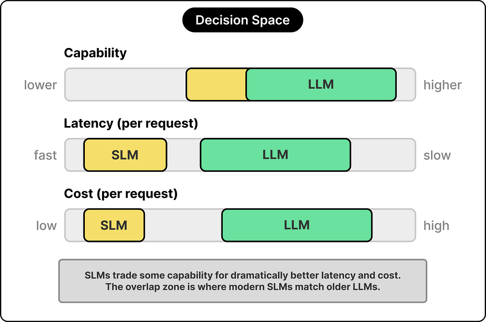
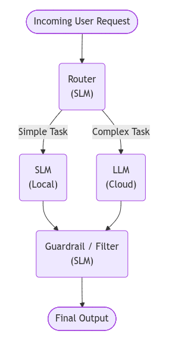
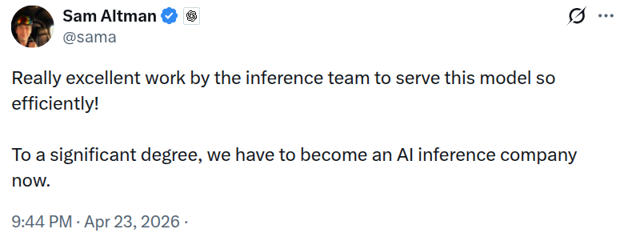
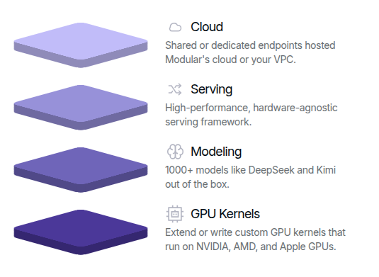

# Serving

## Why managed inference exists

[Hugging Face Inference Endpoints](https://huggingface.co/docs/inference-endpoints/index) give you a managed way to put a model behind a production API.

- You focus on the **model** and **user experience**.
- The platform handles the tedious parts of **deployment and scaling**.
- It is the fastest route from a trained model to a usable endpoint.

For alternatives across the stack, see the companion lesson on [cloud providers](cloud_providers.md).

## What the platform abstracts away

:::: {.columns}
::: {.column width="50%"}
**Before managed serving**

- Provision GPUs or CPUs
- Build and patch containers
- Expose secure endpoints
- Autoscale and monitor traffic
- Debug crashes under load
:::
::: {.column width="50%"}
**With managed serving**

- Pick a model
- Choose hardware
- Deploy an endpoint
- Send requests over HTTP
- Iterate on latency, quality, and cost
:::
::::

## LLM vs SLM

The main sizing choice is not just **can the model answer?** It is whether the answer is worth the **latency** and **cost** you pay per request.

- **SLM**: roughly `0.5B` to `14B` parameters.
- **LLM**: tens to hundreds of billions of parameters.
- In practice, there is an **overlap zone** where a good SLM is enough.

{fig-align="center"}

## Choosing the right model size

:::: {.columns}
::: {.column width="50%"}
**Three tradeoffs**

- **Capability**: harder tasks benefit from larger models.
- **Latency**: larger models process more data per request.
- **Cost**: larger models need more specialized hardware.
:::
::: {.column width="50%"}
**Rule of thumb**

- Do not use an expensive cloud LLM for a tiny routing or filtering task.
- Do not force a tiny local model to solve a reasoning-heavy problem.
- Match the model to the **burden** of the request.
:::
::::

## Best of both: compose models

:::: {.columns}
::: {.column width="50%"}
The best 2026 systems rarely choose one model for everything. They combine **small local models** and **larger cloud models** into one serving architecture.

- **Routing** sends easy work to cheaper models.
- **Guardrails** check inputs and outputs.
- **Speculative decoding** accelerates larger models with smaller draft models.
:::
::: {.column width="50%"}
{fig-align="center" height=800}
:::
::::

## Routing: spend the budget selectively

- A lightweight SLM acts as the **gatekeeper** for each request.
- Simple tasks stay local: classification, extraction, simple translation.
- Harder tasks escalate to a stronger cloud model.

**Why this matters**

- Lower **latency** on common requests.
- Lower **cost** because the large model is used less often.
- Better **specialization** when routers can dispatch to different expert models.

## Guardrails: use small models as filters

- Check prompts before they leave your system.
- Mask or remove **PII** before sending data to external providers.
- Validate outputs for **safety**, **format**, and **policy** compliance.
- Unmask or post-process the response before returning it to users.

Guardrails improve:

- **privacy and security**
- **output reliability**
- **structured-output success rate**

## Speculative decoding

**Speculative decoding** makes a large model faster by letting a smaller draft model propose likely next tokens, then having the larger model verify them in batches.

> "Our method can accelerate existing off-the-shelf models without retraining or architecture changes."

- Paper: [Fast Inference from Transformers via Speculative Decoding](https://arxiv.org/pdf/2211.17192)
- Example: [2x Faster Whisper Inference](https://huggingface.co/blog/whisper-speculative-decoding)
- Production reference: [vLLM draft models](https://docs.vllm.ai/en/latest/features/speculative_decoding/draft_model/)

## The rise of inference engineering

**Inference engineering** is the discipline of making live model serving:

- **fast**
- **reliable**
- **scalable**
- **cost-effective**

It covers much more than speculative decoding: batching, scheduling, memory management, concurrency, observability, and hardware-aware optimization.

## Inference Engineering at AI Companies

{fig-align="center"}

## Why inference engineering became its own field

Few years ago, this work mostly lived inside frontier labs. Now the tooling has matured enough that teams outside those labs can build efficient serving stacks.

- Open-source serving frameworks are production-grade.
- Model traffic is large enough that small efficiency wins matter.
- Hardware is expensive enough that utilization becomes a business problem.
- User expectations make latency an actual product feature.

## Three important serving stacks

:::: {.columns}
::: {.column width="33%"}
**vLLM**

Fast, accessible LLM serving with strong ecosystem adoption.
:::
::: {.column width="33%"}
**SGLang**

High-performance serving with strong support for complex generation workflows.
:::
::: {.column width="34%"}
**Modular**

A broader stack spanning kernels, runtimes, cloud deployment, and Mojo.
:::
::::

## vLLM and SGLang

:::: {.columns}
::: {.column width="50%"}
[vLLM](https://vllm.ai/)

- Originated at the **Sky Computing Lab at UC Berkeley**.
- Known for the **PagedAttention** line of work.
- Became a foundation for mainstream enterprise serving.
- Now stewarded through the **PyTorch Foundation**.
:::
::: {.column width="50%"}
[SGLang](https://www.sglang.io/)

- Introduced by **LMSYS Org** with strong Berkeley roots.
- Built for high-performance and agent-friendly generation.
- Closely associated with work around **RadixAttention**.
- Strong fit for complex multi-step LLM applications.
:::
::::

## Modular

[Modular](https://docs.modular.com/) offers fully-managed deployments for the latest open source models, or you can create a self-hosted endpoint with any model.

{fig-align="center"}

## Co-Founder: Chris Lattner

](../assets/chris_lattner.png){fig-align="center"}

> Distinguished Leader who founded and scaled critical infrastructure including LLVM, Clang, MLIR, Cloud TPUs and the Swift programming language. Chris built AI and core systems at multiple world leading technology companies including Apple, Google, SiFive and Tesla.

## Mission: [Building AI’s unified compute layer.](https://www.modular.com/company/about)

> "AI is powerful - but expensive, fragmented, and locked into a few hardware ecosystems. We believe everyone should have the freedom to build and run AI anywhere, without limits. Our mission: make AI’s compute layer unified, efficient, and accessible to all."

## Kernel development

The Mojo language allows you to write custom GPU kernels for MAX graphs that run on NVIDIA, AMD, and Apple GPUs.

[Mojo 🔥 GPU Puzzles](https://puzzles.modular.com/): A hands-on guide to mastering GPU programming with Mojo. Write like Python, run like C++.

## Takeaways

- Managed endpoints are the fastest way to serve a model in production.
- Model serving is really a **systems design** problem, not just a model-choice problem.
- Strong production architectures often combine **SLMs**, **LLMs**, and **guardrails**.
- Inference engineering is now a core software discipline for AI products.
