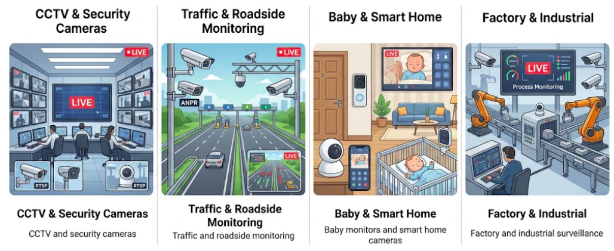
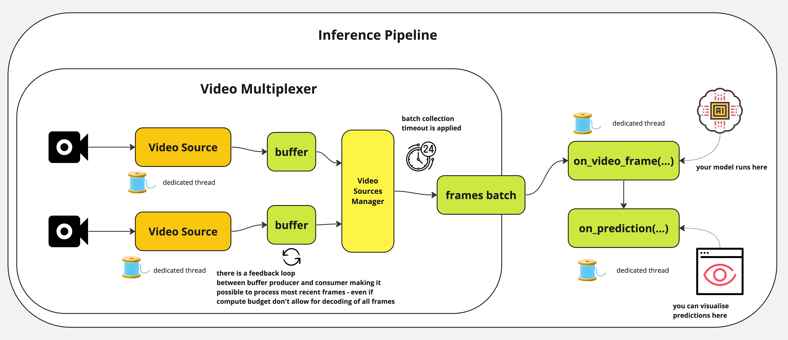
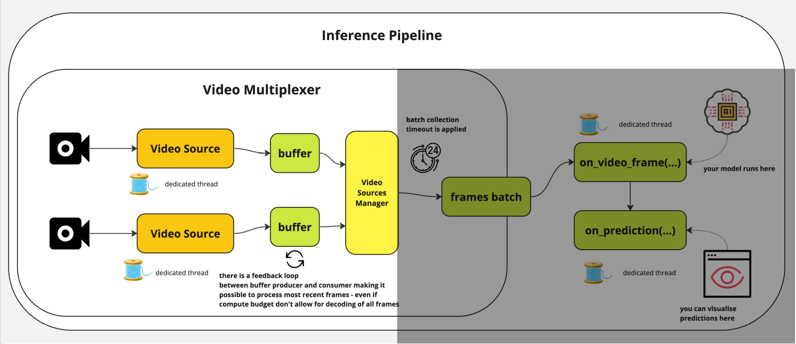
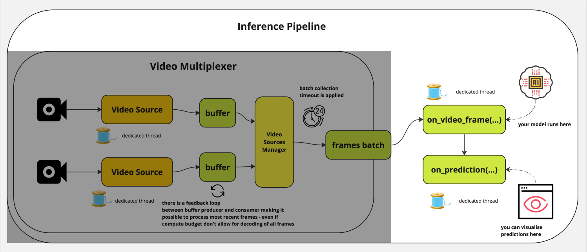

# Inference Pipeline

## Why video streaming is different

[**RTSP (Real-Time Streaming Protocol)**](https://en.wikipedia.org/wiki/Real-Time_Streaming_Protocol) is the standard control protocol for **live** IP camera feeds.

{fig-align="center"}

## Realtime Requirements

If the model is slower than the camera, old frames become stale. Processing every frame can be worse than skipping ahead. A useful pipeline keeps up with the **latest** state of the world.

This is why live inference needs:

1. buffering
2. frame dropping policy
3. and reconnect logic

## Inference Pipeline

The Roboflow [Inference Pipeline](https://inference.roboflow.com/using_inference/inference_pipeline/) is built for streaming sources and asynchronous execution.

1. It **accepts** webcams, files, hosted videos, and RTSP streams.
2. It separates **input**, **processing**, and **output** responsibilities.
3. It runs background workers so the stream and the model do not block each other.
4. It can **reconnect** to unstable live sources instead of failing outright.

# Three Building Blocks

## 1. Inputs: video references

You choose the source when creating the pipeline:

- **Video file**: process a local file frame by frame
- **Video URL**: stream a hosted video directly
- **Device ID**: e.g. `0` for a webcam
- **RTSP URL** (most common in production): consume a live camera stream

It also supports processing multiple streams simultaneously.

## 2. Processing: models or workflows

Decide what happens to each frame:

- preprocess frames before prediction
- Pass a `model_id` to run a pre-trained or fine-tuned Roboflow model
  - or run your own PyTorch model
- combine detection with OCR or tracking

## 3. Outputs: sinks

A **sink** decides what to do with each prediction after inference finishes.

- **Built-in sinks**: draw boxes, save annotated video, send UDP messages
- **Custom sinks**: store JSON, send alerts, update dashboards, write to databases

The sink is where "model output" becomes "application behavior."

## Summary

:::: {.columns}
::: {.column width="33%"}
**Input**

webcam, file, URL, RTSP, or many streams
:::
::: {.column width="33%"}
**Processing**

model, workflow, or custom callable
:::
::: {.column width="33%"}
**Output**

render, save, broadcast, alert, or log
:::
::::

# Custom Logic Example

## Custom model wrapper

```python
from inference.core.interfaces.camera.entities import VideoFrame

class MyModel:
    # loading a model at startup (happens once)
    def __init__(self, weights_path: str):
        self._model = your_model_loader(weights_path)

    # inference typically runs on a **batch** of frames
    def infer(self, video_frames: list[VideoFrame]):
        return self._model([v.image for v in video_frames])
```

## Custom sink: normalize the inputs

The sink may receive one prediction or many, depending on the mode.

```python
def on_prediction(predictions, video_frame) -> None:
    if not isinstance(predictions, list):
        predictions = [predictions]
        video_frame = [video_frame]
```

This small normalization step gives you one consistent loop:

- single-frame and batched cases share the same logic
- you avoid branching the rest of the sink code
- the function becomes easier to harden for production

## Custom sink: handle dropped frames safely

Live streams are messy, so the sink must tolerate missing items.

```python
for prediction, frame in zip(predictions, video_frame):
    if prediction is None:
        continue

    file_path = os.path.join(TARGET_DIR, f"{frame.frame_id}.json")
    with open(file_path, "w") as f:
        json.dump(prediction, f)
```

Key idea:

- `None` is not exceptional here
- skipped frames are part of normal live-stream behavior
- robustness in the sink prevents the whole app from crashing

## Putting it together

```python
pipeline = InferencePipeline.init_with_custom_logic(
    video_reference="./my_video.mp4",
    on_video_frame=my_model.infer,
    on_prediction=on_prediction,
)

pipeline.start()
pipeline.join()
```

- `start()` spins up the background workers
- `join()` keeps the script alive until processing is done
- the pipeline handles coordination; you provide the business logic

# Under the Hood

## Overview

The pipeline spins up a consumer thread for each video source, multiplexes frames, and handles synchronization.

{fig-align="center"}

## Stage 1: read and buffer

{fig-align="center"}

- The pipeline spawns a separate consumer thread per video source.
- Stored videos can be read frame by frame until completion.
- Live streams may build pressure if inference is slower than arrival rate.
- If connectivity drops, the pipeline attempts to reconnect automatically.

## Stage 1 continuation: live stream policy

For live sources, the buffer strategy matters more than raw throughput.

- **Process every frame** if you care about complete replay.
- **Drop old frames** if you care about current state and low latency.

In most real-time monitoring systems, the second option is the better trade-off:

**the newest frame is usually more valuable than the oldest unprocessed frame.**

## Stage 2: batch collection

{fig-align="center"}

- Incoming frames are grouped using `batch_collection_timeout`.
- If one source is late, the pipeline can emit a smaller batch.
- Missing frames are padded with `None` so later stages stay aligned.

This lets multi-source processing stay synchronized without waiting forever.

## Stage 3: execute inference and sinks

{fig-align="center"}

1. `on_video_frame(...)` runs the model on a dedicated processing thread.
2. `on_prediction(...)` performs downstream work on a separate thread.

The sink can run in:

- `SEQUENTIAL` mode: one item at a time
- `BATCH` mode: many items together

## Why this architecture matters

It solves the three big production problems from the start:

1. **Throughput**: reading, inference, and output are decoupled
2. **Latency**: the system can prefer fresh frames over stale backlog
3. **Reliability**: reconnects and `None` padding reduce hard failures

This is the difference between a demo script and a stream-ready pipeline.

# Practical Guidance

## Mental checklist

Before wiring a live video pipeline, ask:

1. Do I care about **every frame** or the **latest frame**?
2. What should happen when a stream disconnects?
3. What will my sink do with missing predictions?
4. Should downstream work be sequential or batched?

These design choices determine latency, resilience, and operator experience.

## Customg Logic

Choose `init_with_custom_logic()` when:

. . .

- your model is not a built-in Inference model
- you need custom preprocessing or batching behavior
- you want application-specific post-processing in the sink
