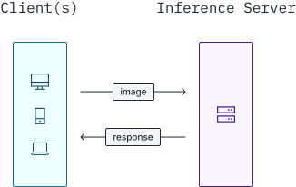
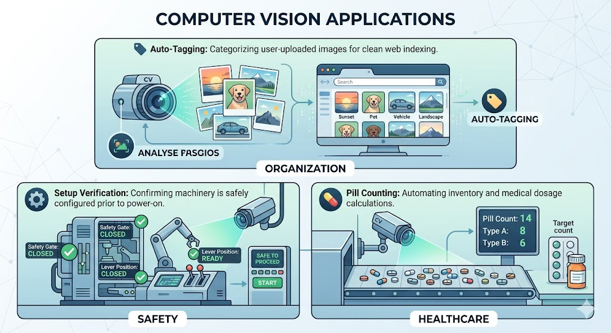
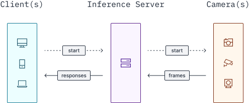
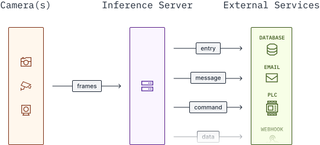
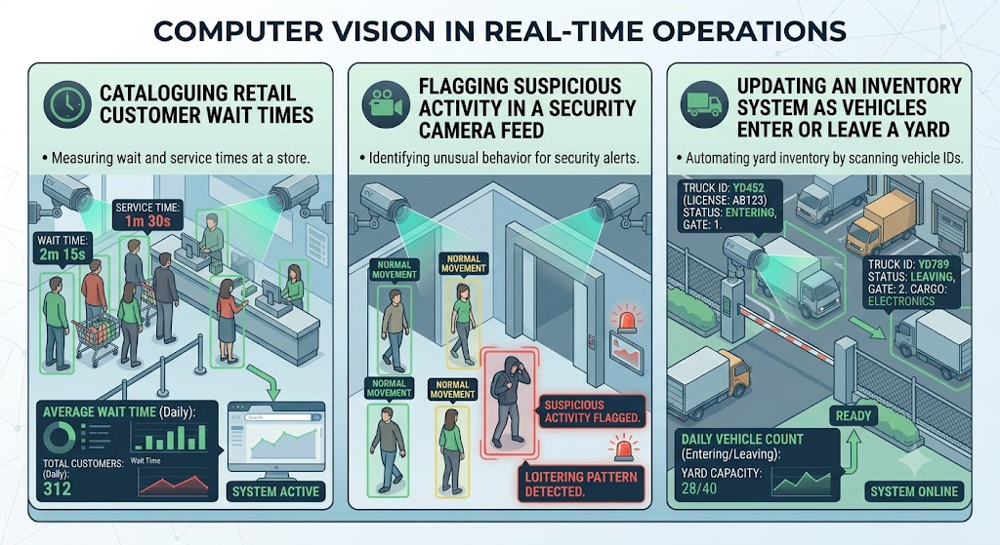

# Realtime Inference

## Overview

**Realtime** means the system processes input and reacts fast enough that the user experiences it as happening now.

:::: {.columns}
::: {.column width="50%"}
**Mental model**

A live camera feed feels interactive. A delayed batch job does not.
:::
::: {.column width="50%"}
**Design questions**

1. Where does inference run?
2. What kind of input arrives?
:::
::::

## Two Design Axes

Every realtime inference system is shaped by two choices:

- **Where it runs:** inside your application process or behind a server boundary.
- **What it consumes:** a one-off image snapshot or a continuous video stream.

:::: {.columns}
::: {.column width="50%"}
**Image snapshot**

Request in → prediction out
:::
::: {.column width="50%"}
**Video stream**

Long-running loop → events, visuals, or actions
:::
::::

## In-Process vs Server

[Running a model](https://inference.roboflow.com/quickstart/run_a_model/) may happen in one of two ways:

- **Server:** the [`inference-sdk`](https://inference.roboflow.com/inference_helpers/inference_sdk/) sends requests to an [Inference Server](https://inference.roboflow.com/quickstart/docker/) over HTTP.
- **In-process:** the [`inference` Python package](https://inference.roboflow.com/using_inference/about/) loads and runs models directly in your process.

| **Question** | **In-process** | **Server** |
| --- | --- | --- |
| Where does the model live? | Inside your Python app | In a separate service |
| How do you call it? | Function / package API | HTTP / SDK request |
| Best when... | You want tight local control | Inference is one piece of a bigger system |
| Trade-off | Simple | Complex integration |

## Inference as a Service

The most common production pattern is to treat inference as a **microservice**:

- the client sends input,
- the server returns a **response object**,
- downstream code decides what to do with that response.

That response might contain:

- detections or classifications,
- a pass/fail inspection result,
- an aggregate such as counts,
- or a visualization artifact.

Inference Workflows can be [deployed anywhere](https://inference.roboflow.com/start/overview/#features).

## Image Snapshots

For image workloads, the interaction is usually **synchronous**:

- pass the image as an argument,
- wait for the model to finish,
- receive one response for that image.

{fig-align="center"}

## Snapshot Use Cases

{fig-align="center"}

- tagging user-uploaded images,
- checking whether a machine is configured correctly before startup,
- counting pills or parts in a still image.

## Snapshot Use Cases (Continued)

{fig-align="center"}

- detecting wiring mismatches,
- inspecting manufactured goods against spec,
- validating that a surface is defect-free.

## Video Streams

Video changes the interface completely:

- you start a long-running visual agent,
- frames are processed in a loop until stopped,
- predictions are **polled** or **subscribed to** asynchronously.

This is why streaming systems are usually designed around **pipelines**, not single request/response calls.

{fig-align="center"}

## From Processing to Action

Inference can also behave like an **appliance**: a system that continuously watches video and triggers downstream behavior.

:::: {.columns}
::: {.column width="57%"}
{fig-align="center"}
:::
::: {.column width="43%"}
**Common actions:**

- 💾 update a database,
- 📤 send notifications,
- 🔔 fire webhooks,
- 🚨 signal machinery or alarms.
:::
::::

## Video Stream Use Cases

{fig-align="center"}

:::: {.columns}
::: {.column width="50%"}
- measuring retail wait times,
- flagging suspicious activity,
- updating yard or warehouse inventory,
:::
::: {.column width="50%"}
- collecting traffic analytics,
- stopping a conveyor belt on jams,
- sounding an alarm when a scrap heap overflows,
:::
::::

## Takeaway

Choose your inference setup based on use case:

- **Snapshot image**: synchronous request/response, ideal for HTTP/cloud serving.
- **Video stream**: `InferencePipeline` enables asynchronous, batched processing for real-time video.
- **Action system**: orchestrates automated workflows, integrating inference output with other systems.
