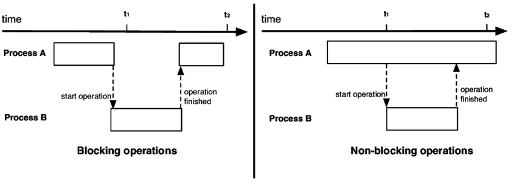

# Inference Pipeline

## Why video streaming is different

**RTSP** is the standard control protocol for live IP camera feeds.

You will usually meet it in:

- CCTV and security cameras
- Traffic and roadside monitoring
- Baby monitors and smart home cameras
- Factory and industrial surveillance

The important point for ML: live streams do **not** behave like a folder of images or a short local video file.

## The core problem

If you write a plain `while` loop with `cv2`, video reading and model inference block each other; decoding waits on inference, and inference waits on decoding.

{fig-align="center"}

- **Latency**: a 30 FPS camera plus a 10 FPS model creates backlog.
- **Fragility**: dropped packets or stream hiccups can crash naive loops.

## What "live" really means

In a real deployment, the goal is usually **freshness**, not perfect replay.

- If the model is slower than the camera, old frames become stale.
- Processing every frame can be worse than skipping ahead.
- A useful pipeline keeps up with the **latest** state of the world.

This is why live inference needs buffering, frame dropping policy, and reconnect logic.

## The right abstraction

The Roboflow [Inference Pipeline](https://inference.roboflow.com/using_inference/inference_pipeline/) is built for streaming sources and asynchronous execution.

- It **accepts** webcams, files, hosted videos, and RTSP streams.
- It separates **input**, **processing**, and **output** responsibilities.
- It runs background workers so the stream and the model do not block each other.
- It can **reconnect** to unstable live sources instead of failing outright.

# Three Building Blocks

## 1. Inputs: video references

You choose the source when creating the pipeline:

- **Device ID**: e.g. `0` for a webcam
- **Video file**: process a local file frame by frame
- **Video URL**: stream a hosted video directly
- **RTSP URL**: consume a live camera stream
- **List of inputs**: process multiple streams simultaneously

For a live camera use case, the RTSP input is the most common production setup.

## 2. Processing: models or workflows

The middle stage answers: **what should happen to each frame?**

- Pass a `model_id` to run a pre-trained or fine-tuned Roboflow model
- Use `init_with_workflow()` for multi-step pipelines
- Provide your own callable when you want custom inference logic

Examples of custom logic:

- run your own PyTorch model
- preprocess frames before prediction
- combine detection with OCR or tracking

## 3. Outputs: sinks

A **sink** decides what to do with each prediction after inference finishes.

- **Built-in sinks**: draw boxes, save annotated video, send UDP messages
- **Custom sinks**: store JSON, send alerts, update dashboards, write to databases

The sink is where "model output" becomes "application behavior."

## Mental model

:::: {.columns}
::: {.column width="33%"}
**Input**

webcam, file, URL, RTSP, or many streams
:::
::: {.column width="33%"}
**Processing**

model, workflow, or custom callable
:::
::: {.column width="33%"}
**Output**

render, save, broadcast, alert, or log
:::
::::

The Inference Pipeline works like this:

video source → frame batches → **inference** → sink

# Custom Logic Example

## Custom model wrapper

Your model object usually loads weights **once** and exposes one inference method.

```python
from inference.core.interfaces.camera.entities import VideoFrame

class MyModel:
    def __init__(self, weights_path: str):
        self._model = your_model_loader(weights_path)

    def infer(self, video_frames: list[VideoFrame]):
        return self._model([v.image for v in video_frames])
```

Why this shape works:

- startup cost happens once
- the pipeline passes `VideoFrame` objects, not bare arrays
- inference typically runs on a **batch** of frames

## Custom sink: normalize the inputs

The sink may receive one prediction or many, depending on the mode.

```python
def on_prediction(predictions, video_frame) -> None:
    if not isinstance(predictions, list):
        predictions = [predictions]
        video_frame = [video_frame]
```

This small normalization step gives you one consistent loop:

- single-frame and batched cases share the same logic
- you avoid branching the rest of the sink code
- the function becomes easier to harden for production

## Custom sink: handle dropped frames safely

Live streams are messy, so the sink must tolerate missing items.

```python
for prediction, frame in zip(predictions, video_frame):
    if prediction is None:
        continue

    file_path = os.path.join(TARGET_DIR, f"{frame.frame_id}.json")
    with open(file_path, "w") as f:
        json.dump(prediction, f)
```

Key idea:

- `None` is not exceptional here
- skipped frames are part of normal live-stream behavior
- robustness in the sink prevents the whole app from crashing

## Putting it together

```python
pipeline = InferencePipeline.init_with_custom_logic(
    video_reference="./my_video.mp4",
    on_video_frame=my_model.infer,
    on_prediction=on_prediction,
)

pipeline.start()
pipeline.join()
```

- `start()` spins up the background workers
- `join()` keeps the script alive until processing is done
- the pipeline handles coordination; you provide the business logic

# Under the Hood

## Overview

The pipeline spins up a consumer thread for each video source, multiplexes frames, and handles synchronization.

{fig-align="center"}

## Stage 1: read and buffer

{fig-align="center"}

- The pipeline spawns a separate consumer thread per video source.
- Stored videos can be read frame by frame until completion.
- Live streams may build pressure if inference is slower than arrival rate.
- If connectivity drops, the pipeline attempts to reconnect automatically.

## Stage 1 continuation: live stream policy

For live sources, the buffer strategy matters more than raw throughput.

- **Process every frame** if you care about complete replay.
- **Drop old frames** if you care about current state and low latency.

In most real-time monitoring systems, the second option is the better trade-off:

**the newest frame is usually more valuable than the oldest unprocessed frame.**

## Stage 2: batch collection

{fig-align="center"}

- Incoming frames are grouped using `batch_collection_timeout`.
- If one source is late, the pipeline can emit a smaller batch.
- Missing frames are padded with `None` so later stages stay aligned.

This lets multi-source processing stay synchronized without waiting forever.

## Stage 3: execute inference and sinks

{fig-align="center"}

1. `on_video_frame(...)` runs the model on a dedicated processing thread.
2. `on_prediction(...)` performs downstream work on a separate thread.

The sink can run in:

- `SEQUENTIAL` mode: one item at a time
- `BATCH` mode: many items together

## Why this architecture matters

It solves the three big production problems from the start:

1. **Throughput**: reading, inference, and output are decoupled
2. **Latency**: the system can prefer fresh frames over stale backlog
3. **Reliability**: reconnects and `None` padding reduce hard failures

This is the difference between a demo script and a stream-ready pipeline.

# Practical Guidance

## Mental checklist

Before wiring a live video pipeline, ask:

1. Do I care about **every frame** or the **latest frame**?
2. What should happen when a stream disconnects?
3. What will my sink do with missing predictions?
4. Should downstream work be sequential or batched?

These design choices determine latency, resilience, and operator experience.

Choose `init_with_custom_logic()` when:

. . .

- your model is not a built-in Inference model
- you need custom preprocessing or batching behavior
- you want application-specific post-processing in the sink

## Supervision

{fig-align="center"}

[Supervision](https://supervision.roboflow.com/latest/) is the library used for **post-processing**, which is done in the `on_prediction(...)` function.

See the links below for detailed tutorials:

- [detect and annotate objects](https://supervision.roboflow.com/latest/how_to/detect_and_annotate/) on images,
- [track objects](https://supervision.roboflow.com/latest/how_to/track_objects/) across video,
- [count objects in zones](https://supervision.roboflow.com/latest/how_to/count_in_zone/),
- [count line crossings](https://supervision.roboflow.com/latest/notebooks/count-objects-crossing-the-line/),
- [build task-specific analytics](https://supervision.roboflow.com/latest/notebooks/occupancy_analytics/) such as parking occupancy.
