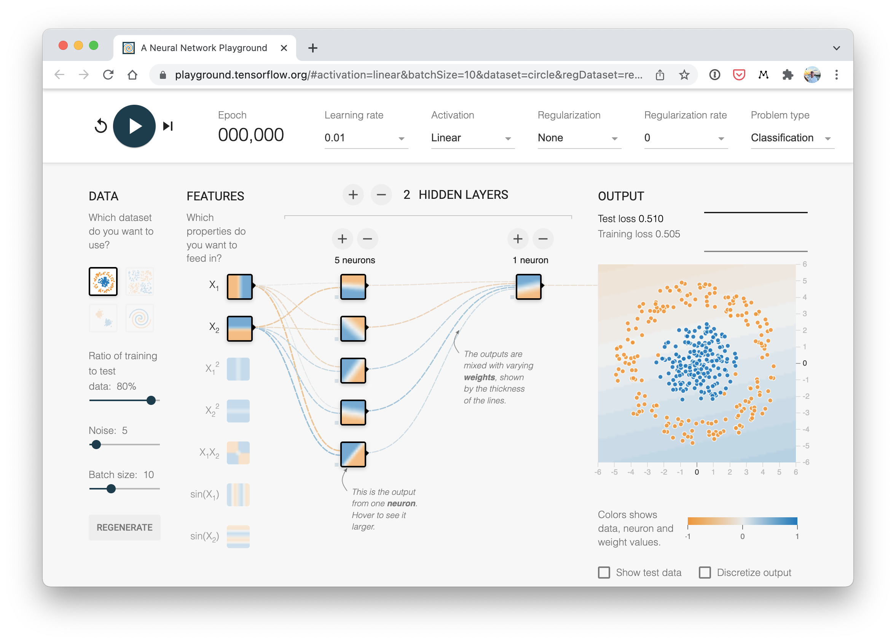

# Neural Networks

Neural networks are known as **universal approximators** because they can approximate any function given enough data and computational power.

## Use Case: Delivery Time Estimate

**Scenario:** Local delivery company, 30-minute promise

**New order:** 7 miles away

**Question:** Can you get there in under 30 minutes?

{fig-align="center"}

::: {.notes}
Now let's ground these concepts with a concrete problem. You work for a local delivery company that promises 30-minute delivery. You've been late three times, and one more late delivery could cost you your job. A new order comes in - 7 miles away. Do you take it?

This is a perfect problem for a neural network to solve, if we have historical data. And we'll use the simplest possible neural network - just one neuron - to tackle it.
:::

## Historical Delivery Data

:::: {.columns}
::: {.column width="45%"}
| Distance (miles) | Time (minutes) |
|-----------------|----------------|
| 2.0              | 11.9           |
| 3.0              | 15.3           |
| 4.0              | 18.8           |
| 5.0              | 22.2           |
| 6.0              | 25.6           |
| 7.0              | ?              |
:::

::: {.column width="55%"}
{fig-align="center" width="100%"}
:::
::::

**Can we extrapolate the pattern?**

::: {.notes}
Here's some historical delivery data. Can you see the pattern? As distance increases from 2 to 6 miles, delivery time rises in a nearly straight-line pattern. If we plot this data, we'd see the points follow a straight line. A good predictive model would be... a line!

If we know the equation for that line, we can predict new values. And here's the key insight: a single neuron is just a linear equation with two parameters - the weight and the bias.
:::

## Model

{fig-align="center" width="85%"}

- The **blue model** stays closer to the observed data points, so its prediction error is smaller.
- The **green model** misses the data by a larger margin, which means it is a worse fit.

## Linear Regression

Remember **Regression Model**, where the model is a line with slope $m$ and intercept $b$?

$$
y = mx + b
$$

::: {.fragment}
In our delivery context:

$$
\text{Time} = \text{Rate} \times \text{Distance} + \text{Constant}
$$
:::

::: {.fragment}
A **Neuron** is just that (but we use $w$ "weight" instead of $m$):

{height=300}
:::

::: {.notes}
A single neuron is just a linear equation. That's the equation for a straight line. The neuron needs to find the right values for W (weight) and b (bias) to create the best-fitting line through all the data points.

That search for the best values - that's the learning in machine learning. The neuron starts with random values, measures how wrong its predictions are, and gradually adjusts W and b to improve.
:::

## How Does a Neuron Learn?

{fig-align="center"}

To get the model with the best $w$ and $b$ as close to the data as possible; i.e., **"best-fit line"**:

:::: {.columns}
::: {.column width="50%"}
::: {.incremental}
1. Start with random weight $w$ and bias $b$
2. Make predictions
3. Estimate error $MSE$
:::
:::
::: {.column width="50%"}
::: {.incremental}
4. Calculate gradient (calculus)
5. Update parameters down the gradient
6. Repeat hundreds/thousands of times
:::
:::
::::

::: {.notes}
Here's how the learning process works. The neuron starts with random values for weight and bias. It makes predictions and measures how far off each prediction is from the actual data. The further off, the bigger the total error.

Then it uses calculus (specifically, gradient descent) to figure out which direction to adjust the weight and bias. It's essentially asking: "If I increase the weight just a little, does the error go up or down?" Once it figures that out, it takes a small step in the right direction, measures the error again, and repeats.

This process happens hundreds or thousands of times until the neuron finds values close to the best possible ones.
:::

## Learning: Animated

{fig-align="center" width="85%"}

Watch $w$ and $b$ update each epoch until the line fits the data. [Desmos Graph](https://www.desmos.com/calculator/rtbeyemmlz).

::: {.notes}
This animation shows the learning loop in action. The orange line is the neuron's current prediction — Time = w × Distance + b. It starts poorly, measures MSE, takes a gradient step, and repeats. Over hundreds of epochs the line settles onto the historical delivery points.
:::

## Why To Use Batches



Depcits training on batch sizes: 1, 4, 16, 32.

1. Faster (parallel processing)
2. Better generalization during training
3. Efficient; making more meaningful changes to weights and biases.

## Multi-variable Regression

In **Multi-variable Regression** we had the linear model where each input $x_i$ has a weight $w_i$:

$$
y = w_1 x_1 + w_2 x_2 + w_3 x_3 + b
$$

::: {.fragment}
:::: {.columns}
::: {.column width="45%"}
:::
Same thing with a single Neuron with three features:

- $x_1$: Distance
- $x_2$: Time of day
- $x_3$: Weather

::: {.column width="55%"}
{fig-align="center" height=300}

:::
::::
:::

::: {.notes}
So far we've seen a neuron with one input (distance). But what if you want to consider multiple factors - distance, time of day, and weather?

A neuron with multiple inputs just extends the same pattern. It's still a linear equation, just with more terms. Each input gets its own unique weight, they all add up, plus the single bias value. That's really all a neural network is - neurons connected to neurons.
:::

## Animated: Single Neuron Multiple Inputs



A visual representation of a single neuron with 3 inputs within a neural network, showing both how this might fit into a larger neural network as well as the actual atomic calcuations for the indvidual neuron: **inputs $\times$ weights $+$ bias**.

## Vectors and Matrices

Computer Algorithms love _Linear Algebra_. We use vectors and matrices because they are:

- Mathematically **concise**
- Computationally **efficient**

 

::: {.fragment}
:::: {.columns}
::: {.column width="45%"}
Inputs Vector:

$$
\mathbf{x} = \begin{bmatrix} x_1 \\ x_2 \\ x_3 \end{bmatrix}
$$
:::

::: {.column width="45%"}
Weights vector:

$$
\mathbf{w} = \begin{bmatrix} w_1 & w_2 & w_3 \end{bmatrix}
$$

:::
::::
:::

## The Dot Product
::: {.fragment}
$$
\mathbf{w} \cdot \mathbf{x}
= \begin{bmatrix} w_1 & w_2 & w_3 \end{bmatrix}
\cdot
\begin{bmatrix} x_1 \\ x_2 \\ x_3 \end{bmatrix}
$$
:::
::: {.fragment}
$$
= w_1 x_1 + w_2 x_2 + w_3 x_3
$$
:::
::: {.fragment}
Then add bias:

$$
y = \mathbf{w} \cdot \mathbf{x} + b
$$
:::

## How a matrix product is calculated



A visualization that shows the atomic operations that make up a matrix product of 2 matrices

## Animated: Neuron Dot Product



Visualizing how the dot product is used for multiplying weights and inputs within **a single neuron** in a neural network, and the atomic operations that take place for this calculation.

## Repeating and Stacking

A fully conntected repeated sets of neuron stacks is called a **Neural Network**:

{fig-align="center"}

::: {.fragment}

- **Layer:** group of neurons with same inputs
  - Note: _first layer is not counted (it is just the input)_
- **Hidden layers:** layers between input and output (added to learn higher complexity patterns)
- **Network:** connected layers

:::

::: {.notes}
When you connect neurons together, you get layers. A layer is simply a group of neurons that all take the same inputs. When you connect one layer's outputs to the next layer's inputs, you've built a network.

The first layer takes in your raw data (distance, time of day, weather). The last layer gives your prediction (delivery time). All those layers in between are called hidden layers because you never directly set or see their values.

Soon, you'll see how easy it is to stack these layers together in PyTorch. But for now, we'll continue with just one neuron to build the foundation.
:::

## Animated: Layer Dot Product



Depicting how the dot product fits in to the calculation of inputs, weights, and biases for **an entire layer** of neurons in a neural network.

## Animated: Visualizing Neural Networks Sizes



A visualization of various sizes of neural networks, meant to show how the sheer volume of trainable parameters can increase quite quickly as you add more neurons per layer.

## Meme: Matrix Multiplications

{fig-align="center" height="640"}

## Activation Function

An **activation function** is a non-linear transformation. They add curvature to the model.

{fig-align="center" height=256}

## The ReLU Activation

**ReLU** (Rectified Linear Unit) is used on the output of hidden layers.

- If input < 0 → output = 0
- If input ≥ 0 → output = input

{fig-align="center" height=300}

## Weights & Bias and ReLU Activation



This animation depicts the two types of learnable parameters for a neural network, the weight and bias, as well as how each impacts the output of a single neuron.

## ReLU on each layer

{fig-align="center"}

Each neuron learns:

1. Where to activate
2. how strongly to contribute

## More ReLU Activated Neurons -> More Bends

{fig-align="center"}

## Animated: 2 Layers with Activations



Why & how two or more hidden layers w/ nonlinear activation function works deep learning.

## Other Activation Functions

**ReLU:** most common choice for hidden layers

**Sigmoid:** used at the final output layer to output class probability.

**Tanh:** outputs -1 to +1 (used in some architectures)

{fig-align="center"}

## Regression vs Classification

- For **Regression** we use the outputs directly (also called _logits_)
- For **Classification** a softmax layer is added to convert to probabilities that sum up to 1

{fig-align="center"}

## Playground

{fig-align="center" width=50%}

Tinker With a Neural Network in Your Browser. Don’t Worry, You Can’t Break It:

[https://playground.tensorflow.org/](https://playground.tensorflow.org/)
