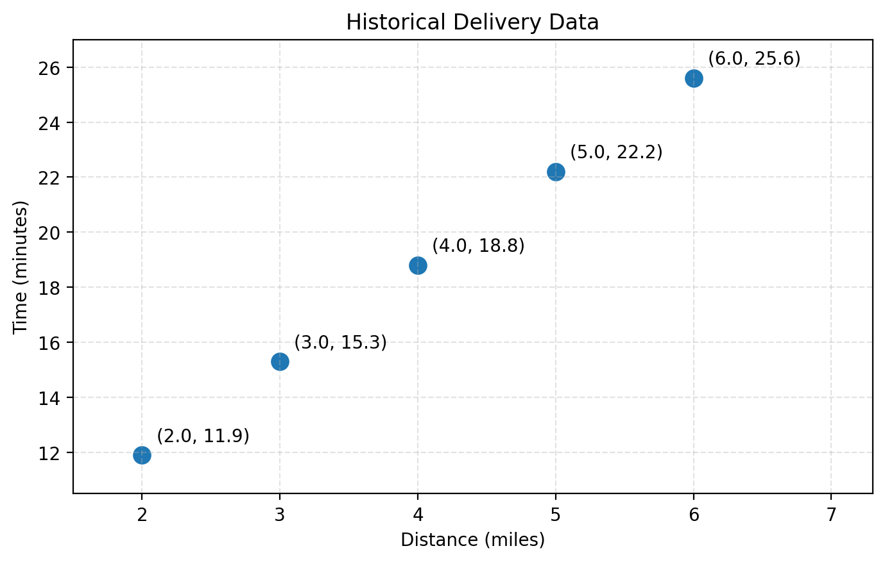
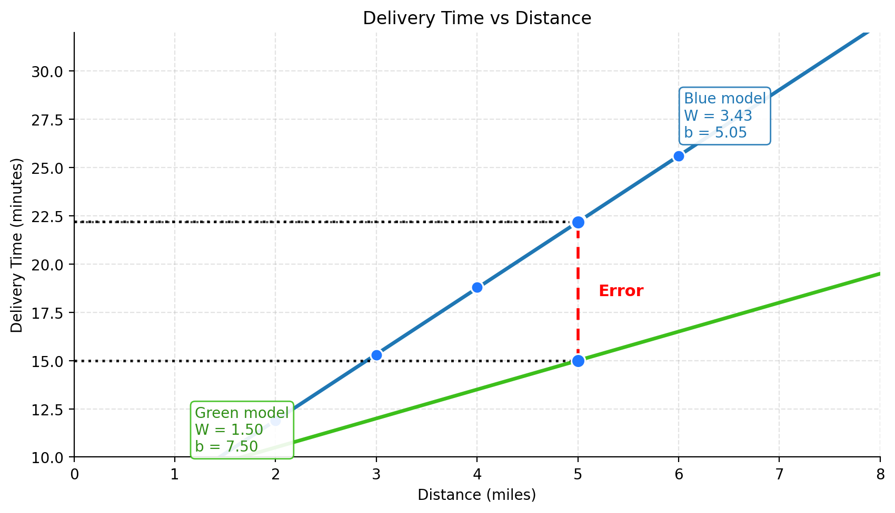
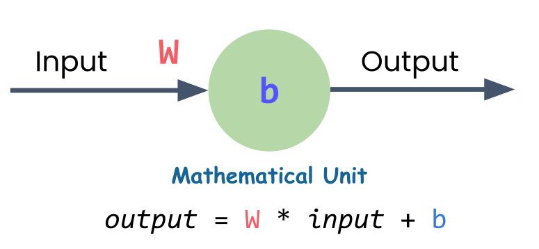
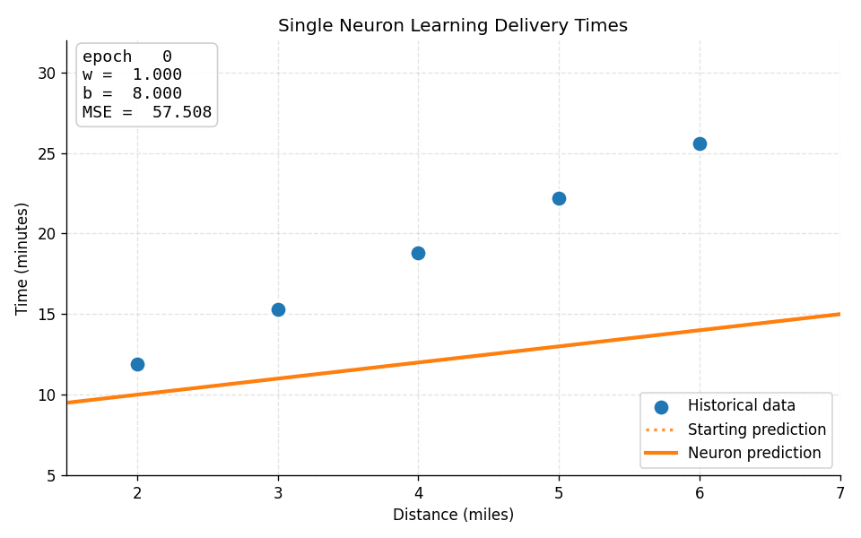
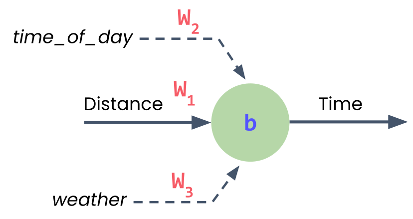

# Neural Networks

Neural networks are known as **universal approximators** because they can approximate any function given enough data and computational power.

## Use Case: Delivery Time Estimate

**Scenario:** Local delivery company, 30-minute promise

**New order:** 7 miles away

**Question:** Can you get there in under 30 minutes?

{fig-align="center"}

::: {.notes}
Now let's ground these concepts with a concrete problem. You work for a local delivery company that promises 30-minute delivery. You've been late three times, and one more late delivery could cost you your job. A new order comes in - 7 miles away. Do you take it?

This is a perfect problem for a neural network to solve, if we have historical data. And we'll use the simplest possible neural network - just one neuron - to tackle it.
:::

## Historical Delivery Data

:::: {.columns}
::: {.column width="45%"}
| Distance (miles) | Time (minutes) |
|-----------------|----------------|
| 2.0              | 11.9           |
| 3.0              | 15.3           |
| 4.0              | 18.8           |
| 5.0              | 22.2           |
| 6.0              | 25.6           |
| 7.0              | ?              |
:::

::: {.column width="55%"}
{fig-align="center" width="100%"}
:::
::::

**Can we extrapolate the pattern?**

::: {.notes}
Here's some historical delivery data. Can you see the pattern? As distance increases from 2 to 6 miles, delivery time rises in a nearly straight-line pattern. If we plot this data, we'd see the points follow a straight line. A good predictive model would be... a line!

If we know the equation for that line, we can predict new values. And here's the key insight: a single neuron is just a linear equation with two parameters - the weight and the bias.
:::


## Model

{fig-align="center" width="85%"}

- The **blue model** stays closer to the observed data points, so its prediction error is smaller.
- The **green model** misses the data by a larger margin, which means it is a worse fit.

## Linear Regression

Remember **Regression Model**, where the model is a line with slope $m$ and intercept $b$?

$$
y = mx + b
$$

::: {.fragment}
In our delivery context:

$$
\text{Time} = \text{Rate} \times \text{Distance} + \text{Constant}
$$
:::

::: {.fragment}
A **Neuron** is just that (but we use $w$ "weight" instead of $m$):

{height=300}
:::

::: {.notes}
A single neuron is just a linear equation. That's the equation for a straight line. The neuron needs to find the right values for W (weight) and b (bias) to create the best-fitting line through all the data points.

That search for the best values - that's the learning in machine learning. The neuron starts with random values, measures how wrong its predictions are, and gradually adjusts W and b to improve.
:::

## How Does a Neuron Learn?

{fig-align="center"}

To get the model with the best $w$ and $b$ as close to the data as possible; i.e., **"best-fit line"**:

:::: {.columns}
::: {.column width="50%"}
::: {.incremental}
1. Start with random weight $w$ and bias $b$
2. Make predictions
3. Estimate error $MSE$
:::
:::
::: {.column width="50%"}
::: {.incremental}
4. Calculate gradient (calculus)
5. Update parameters down the gradient
6. Repeat hundreds/thousands of times
:::
:::
::::

::: {.notes}
Here's how the learning process works. The neuron starts with random values for weight and bias. It makes predictions and measures how far off each prediction is from the actual data. The further off, the bigger the total error.

Then it uses calculus (specifically, gradient descent) to figure out which direction to adjust the weight and bias. It's essentially asking: "If I increase the weight just a little, does the error go up or down?" Once it figures that out, it takes a small step in the right direction, measures the error again, and repeats.

This process happens hundreds or thousands of times until the neuron finds values close to the best possible ones.
:::

## Learning: Animated

{fig-align="center" width="85%"}

Watch $w$ and $b$ update each epoch until the line fits the data. [Desmos Graph](https://www.desmos.com/calculator/rtbeyemmlz).

::: {.notes}
This animation shows the learning loop in action. The orange line is the neuron's current prediction — Time = w × Distance + b. It starts poorly, measures MSE, takes a gradient step, and repeats. Over hundreds of epochs the line settles onto the historical delivery points.
:::

## Multi-variable Regression

In **Multi-variable Regression** we had the linear model where each input $x_i$ has a weight $w_i$:

$$
y = w_1 x_1 + w_2 x_2 + w_3 x_3 + b
$$

::: {.fragment}
:::: {.columns}
::: {.column width="45%"}
:::
Same thing with a single Neuron with three features:

- $x_1$: Distance
- $x_2$: Time of day
- $x_3$: Weather

::: {.column width="55%"}
{fig-align="center" height=300}

:::
::::
:::

::: {.notes}
So far we've seen a neuron with one input (distance). But what if you want to consider multiple factors - distance, time of day, and weather?

A neuron with multiple inputs just extends the same pattern. It's still a linear equation, just with more terms. Each input gets its own unique weight, they all add up, plus the single bias value. That's really all a neural network is - neurons connected to neurons.
:::

## Vectors and Matrices

Computer Algorithms love _Linear Algebra_. We use vectors and matrices because they are:

- Mathematically **concise**
- Computationally **efficient**

<br/>

::: {.fragment}
:::: {.columns}
::: {.column width="45%"}
Inputs Vector:

$$
\mathbf{x} = \begin{bmatrix} x_1 \\ x_2 \\ x_3 \end{bmatrix}
$$
:::

::: {.column width="45%"}
Weights vector:

$$
\mathbf{w} = \begin{bmatrix} w_1 & w_2 & w_3 \end{bmatrix}
$$

:::
::::
:::

## The Dot Product
::: {.fragment}
$$
\mathbf{w} \cdot \mathbf{x}
= \begin{bmatrix} w_1 & w_2 & w_3 \end{bmatrix}
\cdot
\begin{bmatrix} x_1 \\ x_2 \\ x_3 \end{bmatrix}
$$
:::
::: {.fragment}
$$
= w_1 x_1 + w_2 x_2 + w_3 x_3
$$
:::
::: {.fragment}
Then add bias:

$$
y = \mathbf{w} \cdot \mathbf{x} + b
$$
:::

## Repeating and Stacking

A fully conntected repeated sets of neuron stacks is called a **Neural Network**:

{fig-align="center"}

::: {.fragment}

- **Layer:** group of neurons with same inputs
  - Note: _first layer is not counted (it is just the input)_
- **Hidden layers:** layers between input and output (added to learn higher complexity patterns)
- **Network:** connected layers

:::

::: {.notes}
When you connect neurons together, you get layers. A layer is simply a group of neurons that all take the same inputs. When you connect one layer's outputs to the next layer's inputs, you've built a network.

The first layer takes in your raw data (distance, time of day, weather). The last layer gives your prediction (delivery time). All those layers in between are called hidden layers because you never directly set or see their values.

Soon, you'll see how easy it is to stack these layers together in PyTorch. But for now, we'll continue with just one neuron to build the foundation.
:::

# PyTorch

{fig-align="center" height=100}

> **PyTorch** is an open-source deep learning framework designed to accelerate the path from research prototyping to production deployment. Originally developed by **Meta’s AI Research lab (FAIR)** and released in 2016, it is now governed by the PyTorch Foundation under the Linux Foundation.

## Who uses PyTorch?

{fig-align="center"}

- **Meta, Tesla, Microsoft, OpenAI** — research and production ML
- Tesla's self-driving vision models run on PyTorch
- Also used beyond tech — e.g. computer vision on tractors in agriculture

::: {.notes}
Many of the world's largest technology companies — Meta, Tesla, Microsoft — and AI labs like OpenAI use PyTorch to power research and ship ML into products.

Andrej Karpathy (formerly head of AI at Tesla) has talked about how Tesla uses PyTorch for self-driving computer vision. It's not just Big Tech either — industries like agriculture use it for computer vision on tractors. If it's trusted at that scale, it's a solid framework to learn.
:::

## Why they use it?

- Researchers love it — long the [most-used framework on Papers With Code](https://paperswithcode.com/trends)
- **GPU acceleration** handled behind the scenes
- You focus on data and algorithms; PyTorch makes it run fast
- Proven in production — Tesla, Meta, and more ship real products on it

::: {.notes}
Machine learning researchers love PyTorch. For years it has been the most used deep learning framework on Papers With Code, which tracks research papers and their code.

PyTorch also takes care of GPU acceleration behind the scenes, so you can focus on manipulating data and writing algorithms while it keeps things fast.

And if companies like Tesla and Meta use it to power hundreds of applications, drive thousands of cars, and deliver content to billions of people, it's clearly capable on the production side too.
:::

## Simple. Pythonic. Powerful.

```python
import torch
a = torch.tensor([2.0])
b = torch.tensor([3.0])
result = a + b
print(result)  # tensor([5.])
```

::: {.notes}
Let me show you what makes PyTorch special with a simple example. Adding two numbers in PyTorch looks just like regular Python code. This simplicity wasn't always the case in deep learning frameworks.

The key insight here is that PyTorch makes deep learning feel like writing normal Python. This wasn't true of early frameworks, which required complex setup and compilation steps just to do simple operations.
:::

## Building a Neural Network

We'll start with the imports, then move through data preparation, model building, training, and making predictions.

**Let's see it in PyTorch code.**

## Imports

```python
import torch                 # core functionality
import torch.nn as nn        # neural network components
import torch.optim as optim  # training tools
```

::: {.notes}
These imports give you PyTorch's core functionality. `torch` provides the fundamental operations, `nn` (neural networks) gives you components for building models, and `optim` provides tools for training these networks. These three modules cover most of what you'll need for building and training models.
:::

## Tensors

:::: {.columns}
::: {.column width="45%"}
Table of inputs and outputs:

| Distance (miles) | Time (minutes) |
|-----------------|----------------|
| 2.0              | 11.9           |
| 3.0              | 15.3           |
| 4.0              | 18.8           |
| 5.0              | 22.2           |
:::

::: {.column width="55%"}

::: {.fragment}
**Tensors** are just n-dimensional arrays:

```python
distances = torch.tensor(
    [[2.0], [3.0], [4.0], [5.0]],
    dtype=torch.float32,
)

times = torch.tensor(
    [[11.9], [15.3], [18.8], [22.2]],
    dtype=torch.float32,
)
```
:::
:::
::::

::: {.notes}
In real projects, data ingestion and preparation are separate steps. First you gather messy data, then you clean and format it. But for this example, I've combined those stages and provided data that's already clean and ready to use.

You're creating tensors from Python lists, but they're more than just lists. Tensors are optimized for the math that neural networks need to do. You'll learn much more about them later, but for now, just think of them as containers that store and organize data in a way models understand.

Notice how each number is wrapped in its own set of brackets. These outer brackets represent a batch - a collection of individual data points. Each inner set of brackets is one sample in the batch. Since each delivery only has one feature (distance), each sample contains just one value.
:::

## A Single Neuron Model in PyTorch

:::: {.columns}
::: {.column width="45%"}
{fig-align="center" width="100%"}
:::

::: {.column width="55%"}
::: {.fragment}
```python
model = nn.Sequential(
    nn.Linear(1, 1)
)
```
:::
:::
::::

::: {.fragment}
- `nn.Sequential(...)`: is for the default layer-after-layer neural network (we learn about _non-sequential modules later_)
- `nn.Linear(1, 1)`: is a layer with the number of input variables, and output neurons
:::

::: {.notes}
Remember those rigid assembly lines from early deep learning frameworks? Sequential is PyTorch's streamlined version. It's a container that passes data through layers in order, but makes it easy for you to swap components without all that messy rewiring.

Here, you're only using one layer - your single neuron. It's technically a linear layer. The first `1` means it takes one input (distance). The second `1` means it produces one output (predicted delivery time). It applies a linear transformation to the input - that's all the linear layer does.

This neuron will learn the best weight and bias to map distances to delivery times, just like finding the best-fitting line through all your data points.
:::

## Multi-variable Regression Neuron Model in PyTorch

:::: {.columns}
::: {.column width="45%"}
{fig-align="center" width="100%"}
:::

::: {.column width="55%"}
::: {.fragment}
```python
model = nn.Sequential(
    nn.Linear(3, 1)
)
```
:::
:::
::::

## Loss Function

A **Loss Functions** estimates how far off model predictions are from the true data.

::: {.fragment}
If you predict 45 minutes when it actually took 60, that's a bigger error than predicting 58 minutes.

To "learn" is to minimize this loss.
:::

::: {.fragment}
For Regression we use $MSE$ (Mean Squared Error):

```python
loss_function = nn.MSELoss()
```
:::

::: {.notes}
Your model needs two tools to actually learn. The first is the loss function. We're using Mean Squared Error loss, which measures how wrong or how right your predictions are.

MSE captures this by squaring the differences, which makes bigger mistakes matter more. The goal is to minimize this loss - the lower the loss, the better your model.
:::

## Optimizer

The **Optimizer** is the algorithm that figures out which direction to adjust your weight and bias to reduce that error.

_SGD (Stochastic Gradient Descent)_ is one such method.

```python
optimizer = optim.SGD(model.parameters(), lr=0.01)
```

::: {.incremental}
- `model.parameters()` is how you access the model's weights and biases in PyTorch.
- `lr` (**learning rate**): a hyper-parameter of SGD that controls the step size
:::

::: {.notes}
`lr` is the learning rate. Smaller values mean you adjust parameters by smaller amounts. Larger values mean bigger adjustments. Both extremes can have challenges - too small and training is slow, too large and you might overshoot the best values.
:::

## The Training Loop

{fig-align="center" height=300}


::: {.fragment}
Each **epoch** is one full pass through training data:

```{.python code-line-numbers="1|2|3|4|5|6|1-6"}
for epoch in range(100):       # 100 passes
    optimizer.zero_grad()      # Clear calculations from previous loop
    outputs = model(distances) # Make predictions
    loss = loss_function(outputs, times)  # Estimate error
    loss.backward()            # Calculate gradients
    optimizer.step()           # Update weights/bias
```
:::

::: {.notes}
This is the training loop where the actual learning happens. Remember when I manually adjusted the weight and bias to get closer to the right line? This code is doing the same thing automatically, hundreds of times.

Each full pass through the training data is called an epoch. In each epoch, the model will: (1) make predictions, (2) measure how far off those predictions are, and (3) adjust its internal parameters to improve.

Let's break down each line: `optimizer.zero_grad()` clears out all calculated values from the previous training round. Without it, PyTorch would accumulate adjustments across rounds, which would mess up your learning.

`outputs = model(distances)` tells the model to use the distance as inputs and make predictions.

`loss = loss_function(outputs, times)` compares the predictions to the real times and calculates how wrong they are.

`loss.backward()` figures out how to adjust the weight and bias to reduce that error. Just like when I said "I need a steeper slope," it's now done with calculus behind the scenes. The technical term is backpropagation.

`optimizer.step()` makes all those adjustments. The model is now slightly better at predicting delivery times.
:::

## Inference (Prediction)

```python
new_distance = torch.tensor([[7.0]]) # prepare a 1 input Tensor
prediction = model(new_distance)     # forward to the model
print(prediction) # [16.0]
```

::: {.fragment}
In reality, we first `torch.no_grad()` for faster inference, since _gradient tracking_ was relevant during the training phase for the model to update its weights.
:::

::: {.fragment}
You can also pass more inputs at once in 1 batch:

```python
with torch.no_grad():
    new_distances = torch.tensor([[2.0], [5.0], [7.0]])
    predictions = model(new_distances)
    print(predictions) # [15.0, 19.0, 26.0]
```
:::

::: {.notes}
Now that the model is trained, let's try making a prediction. The line with `torch.no_grad()` tells PyTorch that you're not training anymore, just doing inference. Training takes extra work under the hood, but for inference, we can skip all that and run much more efficiently.

If the model learned what it was supposed to, it should give you a good answer. But you're going to have to try it out in the lab to see for yourself.

Speaking of building, that's exactly what's next. It's time to get hands-on and see if your delivery job is still safe.
:::

## Early Frameworks vs. PyTorch

::::: {.columns}
:::: {.column width="50%"}

::: {.fragment}

**Static Computational Graphs**

- Must define and compile everything upfront
- No flexibility to change
- Cryptic error messages
- No standard Python debugging

:::

::::

:::: {.column width="50%"}

::: {.fragment}

**Dynamic Computation**

- Write clean Pythonic code
- Use normal loops and if statements
- Change anything, anytime
- Error messages point to your code
- Standard Python debugging

:::

::::
:::::

::: {.notes}
Early deep learning frameworks used something called static computational graphs. Think of it like a factory assembly line - you had to design the entire production process before you could run anything. If you made a mistake or wanted to experiment, you had to stop everything, tear it down, and rebuild from scratch.

This made even simple operations complex. You couldn't use normal Python if statements or loops. Error messages pointed to internal system code, not your actual mistakes. People spent more time fighting their tools than doing actual work.

PyTorch emerged from researchers' frustration with these limitations. The core principle: deep learning should feel like normal Python. You write clean code, and PyTorch handles the computational complexity behind the scenes.

This approach made PyTorch incredibly popular, especially in research where experimentation and flexibility are crucial. Today, it's backed by a massive community and has become the go-to choice for everyone from students to cutting-edge AI researchers.
:::

## Lab 1: Building a Simple Neural Network

> "What I hear, I forget. What I see, I remember. What I do, I understand."

<a href="https://colab.research.google.com/github/HassanAlgoz/learn-pytorch/blob/main/modules/M1/ch1_intro/lab1_simple_nn/lab1_simple_nn.ipynb">
  
</a>
