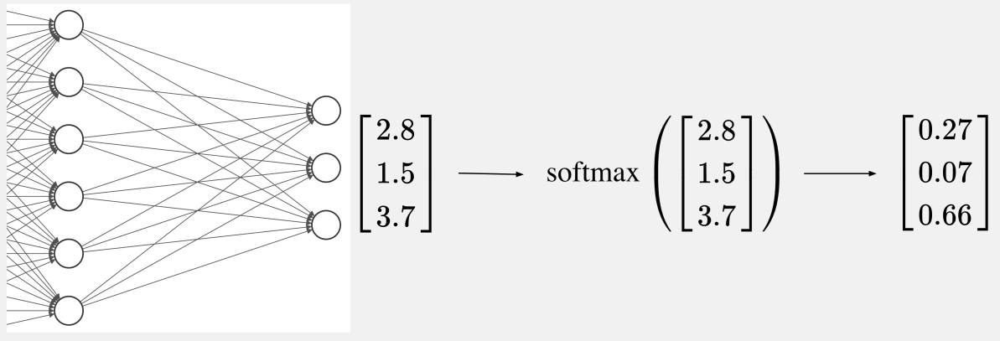

# PyTorch

{fig-align="center" height=100}

> **PyTorch** is an open-source deep learning framework designed to accelerate the path from research prototyping to production deployment. Originally developed by **Meta’s AI Research lab (FAIR)** and released in 2016, it is now governed by the PyTorch Foundation under the Linux Foundation.

## Who uses PyTorch?

{fig-align="center"}

- **Meta, Tesla, Microsoft, OpenAI** — research and production ML
- Tesla's self-driving vision models run on PyTorch
- Also used beyond tech — e.g. computer vision on tractors in agriculture

::: {.notes}
Many of the world's largest technology companies — Meta, Tesla, Microsoft — and AI labs like OpenAI use PyTorch to power research and ship ML into products.

Andrej Karpathy (formerly head of AI at Tesla) has talked about how Tesla uses PyTorch for self-driving computer vision. It's not just Big Tech either — industries like agriculture use it for computer vision on tractors. If it's trusted at that scale, it's a solid framework to learn.
:::

## Why they use it?

- Researchers love it — long the [most-used framework on Papers With Code](https://paperswithcode.com/trends)
- **GPU acceleration** handled behind the scenes
- You focus on data and algorithms; PyTorch makes it run fast
- Proven in production — Tesla, Meta, and more ship real products on it

::: {.notes}
Machine learning researchers love PyTorch. For years it has been the most used deep learning framework on Papers With Code, which tracks research papers and their code.

PyTorch also takes care of GPU acceleration behind the scenes, so you can focus on manipulating data and writing algorithms while it keeps things fast.

And if companies like Tesla and Meta use it to power hundreds of applications, drive thousands of cars, and deliver content to billions of people, it's clearly capable on the production side too.
:::

## Early Frameworks vs. PyTorch

::::: {.columns}
:::: {.column width="50%"}

::: {.fragment}

**🗿 Static Computational Graphs**

- Must define and compile everything upfront
- No flexibility to change
- Cryptic error messages
- No standard Python debugging

:::

::::

:::: {.column width="50%"}

::: {.fragment}

**🐍 Dynamic Computation**

- Write clean Pythonic code
- Use normal loops and if statements
- Change anything, anytime
- Error messages point to your code
- Standard Python debugging

:::

::::
:::::

::: {.notes}
Early deep learning frameworks used something called static computational graphs. Think of it like a factory assembly line - you had to design the entire production process before you could run anything. If you made a mistake or wanted to experiment, you had to stop everything, tear it down, and rebuild from scratch.

This made even simple operations complex. You couldn't use normal Python if statements or loops. Error messages pointed to internal system code, not your actual mistakes. People spent more time fighting their tools than doing actual work.

PyTorch emerged from researchers' frustration with these limitations. The core principle: deep learning should feel like normal Python. You write clean code, and PyTorch handles the computational complexity behind the scenes.

This approach made PyTorch incredibly popular, especially in research where experimentation and flexibility are crucial. Today, it's backed by a massive community and has become the go-to choice for everyone from students to cutting-edge AI researchers.
:::

## Simple. Pythonic. Powerful.

```python
import torch
a = torch.tensor([2.0])
b = torch.tensor([3.0])
result = a + b
print(result)  # tensor([5.])
```

::: {.notes}
Let me show you what makes PyTorch special with a simple example. Adding two numbers in PyTorch looks just like regular Python code. This simplicity wasn't always the case in deep learning frameworks.

The key insight here is that PyTorch makes deep learning feel like writing normal Python. This wasn't true of early frameworks, which required complex setup and compilation steps just to do simple operations.
:::

## Building a Neural Network

We'll start with the imports, then move through data preparation, model building, training, and making predictions.

**Let's see it in PyTorch code.**

## Imports

```python
import torch                 # core functionality
import torch.nn as nn        # neural network components
import torch.optim as optim  # training tools
```

::: {.notes}
These imports give you PyTorch's core functionality. `torch` provides the fundamental operations, `nn` (neural networks) gives you components for building models, and `optim` provides tools for training these networks. These three modules cover most of what you'll need for building and training models.
:::

## Tensors {auto-animate=true}

Table of inputs and outputs:

| Distance (miles) | Time (minutes) |
|-----------------|----------------|
| 2.0              | 11.9           |
| 3.0              | 15.3           |
| 4.0              | 18.8           |
| 5.0              | 22.2           |

**Tensors** are just n-dimensional arrays:

```{.python code-line-numbers="false"}
distances = torch.tensor(...)

times = torch.tensor(...)
```

## Tensors {auto-animate=true}

**Tensors** are just n-dimensional arrays:

```{.python code-line-numbers="false"}
distances = torch.tensor(
    [2.0, 3.0, 4.0, 5.0],
)

times = torch.tensor(
    [11.9, 15.3, 18.8, 22.2],
)
```

## Tensors {auto-animate=true}

**Tensors** are just n-dimensional arrays:

```{.python code-line-numbers="false"}
distances = torch.tensor(
    [2.0, 3.0, 4.0, 5.0],
    dtype=torch.float32,
)

times = torch.tensor(
    [11.9, 15.3, 18.8, 22.2],
    dtype=torch.float32,
)
```


## Tensors {auto-animate=true}

**Tensors** are just n-dimensional arrays:

```{.python code-line-numbers="false"}
distances = torch.tensor(
    # features dimension
    [2.0], [3.0], [4.0], [5.0],
    dtype=torch.float32,
)

times = torch.tensor(
    # features dimension
    [11.9], [15.3], [18.8], [22.2],
    dtype=torch.float32,
)
```

## Tensors {auto-animate=true}

**Tensors** are just n-dimensional arrays:

```{.python code-line-numbers="false"}
distances = torch.tensor(
    [  # batch dimension
        [2.0], [3.0], [4.0], [5.0],
    ], dtype=torch.float32,
)

times = torch.tensor(
    [  # batch dimension
        [11.9], [15.3], [18.8], [22.2],
    ], dtype=torch.float32,
)
```

::: {.notes}
In real projects, data ingestion and preparation are separate steps. First you gather messy data, then you clean and format it. But for this example, I've combined those stages and provided data that's already clean and ready to use.

You're creating tensors from Python lists, but they're more than just lists. Tensors are optimized for the math that neural networks need to do. You'll learn much more about them later, but for now, just think of them as containers that store and organize data in a way models understand.

Notice how each number is wrapped in its own set of brackets. These outer brackets represent a batch - a collection of individual data points. Each inner set of brackets is one sample in the batch. Since each delivery only has one feature (distance), each sample contains just one value.
:::

## A Single Neuron Model in PyTorch

:::: {.columns}
::: {.column width="45%"}
{fig-align="center" width="100%"}
:::

::: {.column width="55%"}
::: {.fragment}
```python
model = nn.Sequential(
    nn.Linear(1, 1)
)
```
:::
:::
::::

::: {.fragment}
- `nn.Sequential(...)`: is for the default layer-after-layer neural network (we learn about _non-sequential modules later_)
- `nn.Linear(1, 1)`: is a layer with the number of input variables, and output neurons
:::

::: {.notes}
Remember those rigid assembly lines from early deep learning frameworks? Sequential is PyTorch's streamlined version. It's a container that passes data through layers in order, but makes it easy for you to swap components without all that messy rewiring.

Here, you're only using one layer - your single neuron. It's technically a linear layer. The first `1` means it takes one input (distance). The second `1` means it produces one output (predicted delivery time). It applies a linear transformation to the input - that's all the linear layer does.

This neuron will learn the best weight and bias to map distances to delivery times, just like finding the best-fitting line through all your data points.
:::

## Inside `nn.Linear(1, 1)`

`nn.Linear(1, 1)` creates a learnable linear layer with 1 input feature and 1 output feature.

::: {.fragment}
Internally, PyTorch creates:

- a weight matrix $W$ with shape `(1, 1)`
- a bias shaped `(1)`
:::

::: {.fragment}
The weight and bias start **random** — gradient descent will learn them.
:::

::: {.notes}
Under the hood, `nn.Linear(1, 1)` is just that linear equation we already know: one weight and one bias. PyTorch initializes them randomly, then training updates them so the line fits the delivery data.
:::

## Multi-variable Regression Neuron Model in PyTorch

:::: {.columns}
::: {.column width="45%"}
{fig-align="center" width="100%"}
:::

::: {.column width="55%"}
::: {.fragment}
```python
model = nn.Sequential(
    nn.Linear(3, 1)
)
```
:::
:::
::::

::: {.fragment}
- First argument = number of **input features** (here: 3)
- Second argument = number of **output neurons** (here: 1)
- The model learns **one weight per feature** plus a bias
:::

::: {.notes}
Same idea as the single-neuron model, but now each sample has three inputs. `nn.Linear(3, 1)` learns three weights and one bias — one weight for each input feature. Change the first number whenever your feature count changes.
:::

## Loss Function

A **Loss Function** estimates how far off model predictions are from the true data.

::: {.fragment}
To "learn" is to minimize this loss.
:::

::: {.fragment}
For Regression we use $MSE$ (Mean Squared Error):

$$
\text{MSE} = \frac{1}{n}\sum_{i=1}^{n}(y_i - \hat{y}_i)^2
$$

- $y_i$: true value &nbsp;&nbsp; $\hat{y}_i$: prediction
- Squaring penalizes large errors more
:::

::: {.fragment}
```python
loss_function = nn.MSELoss()
```
:::

::: {.notes}
Your model needs two tools to actually learn. The first is the loss function. We're using Mean Squared Error loss, which measures how wrong or how right your predictions are.

MSE averages the squared differences between true values and predictions. Squaring makes bigger mistakes matter more. The goal is to minimize this loss - the lower the loss, the better your model.
:::

## Optimizer

The **Optimizer** is the algorithm that figures out which direction to adjust your weight and bias to reduce that error.

::: {.fragment}
_SGD (Stochastic Gradient Descent)_ is one such method.
:::

::: {.fragment}
```python
optimizer = optim.SGD(
    model.parameters(), # model's weights and biases
    lr=0.01             # learning rate (step size)
)
```
:::

::: {.notes}
`lr` is the learning rate. Smaller values mean you adjust parameters by smaller amounts. Larger values mean bigger adjustments. Both extremes can have challenges - too small and training is slow, too large and you might overshoot the best values.

In the lab, try different learning rates like 0.1, 0.01, and 0.001 and observe how the loss curve changes.
:::

## The Training Loop

{fig-align="center" height=300}


::: {.fragment}
Each **epoch** is one full pass through training data:

```{.python code-line-numbers="1|2|3|4|5|6|1-6"}
for epoch in range(100):       # 100 passes
    optimizer.zero_grad()      # Clear calculations from previous loop
    outputs = model(distances) # Make predictions
    loss = loss_function(outputs, times)  # Estimate error
    loss.backward()            # Calculate gradients
    optimizer.step()           # Update weights/bias
```
:::

::: {.notes}
This is the training loop where the actual learning happens. Remember when I manually adjusted the weight and bias to get closer to the right line? This code is doing the same thing automatically, hundreds of times.

Each full pass through the training data is called an epoch. In each epoch, the model will: (1) make predictions, (2) measure how far off those predictions are, and (3) adjust its internal parameters to improve.

Let's break down each line: `optimizer.zero_grad()` clears out all calculated values from the previous training round. Without it, PyTorch would accumulate adjustments across rounds, which would mess up your learning.

`outputs = model(distances)` tells the model to use the distance as inputs and make predictions — a forward pass.

`loss = loss_function(outputs, times)` compares the predictions to the real times and calculates how wrong they are.

`loss.backward()` figures out how to adjust the weight and bias to reduce that error. Just like when I said "I need a steeper slope," it's now done with calculus behind the scenes. The technical term is backpropagation.

`optimizer.step()` makes all those adjustments. The model is now slightly better at predicting delivery times.
:::

## Inspect Trained Parameters

After training, you can read what the model learned:

```python
print(model.weight)
print(model.bias)
```

::: {.fragment}
For a single-neuron delivery model, these are the slope and intercept of your best-fit line.
:::

::: {.notes}
Once training finishes, the random starting weight and bias have been updated. Printing `model.weight` and `model.bias` shows the learned parameters — for regression, that's essentially the slope and intercept of the line the model fit.
:::

## Inference (Prediction)

```python
new_distance = torch.tensor([[7.0]]) # prepare a 1 input Tensor
prediction = model(new_distance)     # forward to the model
print(prediction) # [16.0]
```

::: {.fragment}
In reality, we first `torch.no_grad()` for faster inference, since _gradient tracking_ was relevant during the training phase for the model to update its weights.
:::

::: {.fragment}
You can also pass more inputs at once in 1 batch:

```python
with torch.no_grad():
    new_distances = torch.tensor([[2.0], [5.0], [7.0]])
    predictions = model(new_distances)
    print(predictions) # [15.0, 19.0, 26.0]
```
:::

::: {.notes}
Now that the model is trained, let's try making a prediction. The line with `torch.no_grad()` tells PyTorch that you're not training anymore, just doing inference. Training takes extra work under the hood, but for inference, we can skip all that and run much more efficiently.

If the model learned what it was supposed to, it should give you a good answer. But you're going to have to try it out in the lab to see for yourself.
:::

## Classification Architecture

```python
model = nn.Sequential(
    nn.Linear(2, 4),  # hidden layer: 2 features → 4 neurons
    nn.ReLU(),        # non-linearity → curved decision boundary
    nn.Linear(4, 3)   # output: 1 neuron per class
)
```

::: {.incremental}
- Hidden layer learns useful combinations of the 2 inputs
- **ReLU** lets the model learn a **non-linear** decision boundary
- Output layer has **3 logits** — one score per class
:::

::: {.notes}
The architecture changes for classification. We stack a hidden linear layer, a ReLU activation, and an output layer with one neuron per class. ReLU is what lets the decision boundary bend instead of staying a straight line. The raw outputs are logits — scores that CrossEntropy will turn into probabilities.
:::

## Cross Entropy Loss

For discrete labels we use **Cross Entropy**, not MSE:

$$
\hat{p}_c = \frac{e^{z_c}}{\sum_{j=1}^{C} e^{z_j}}
\qquad
\text{CE} = -\sum_{c=1}^{C} y_c \log(\hat{p}_c)
$$

::: {.fragment}
- $z_c$: logits (raw model outputs)
- $\hat{p}_c$: softmax probabilities
- $y_c$: one-hot true class &nbsp;(equivalently: $-\log \hat{p}_{\text{true}}$)
:::

::: {.notes}
Softmax turns logits into probabilities that sum to one. Cross Entropy then penalizes assigning low probability to the true class.
:::

## `nn.CrossEntropyLoss`

```python
loss_function = nn.CrossEntropyLoss()
optimizer = optim.SGD(model.parameters(), lr=0.01)
```

::: {.fragment}
`nn.CrossEntropyLoss` applies softmax **internally** — do not add a softmax layer before it.
:::

::: {.fragment}
{fig-align="center" height=350}
:::

::: {.notes}
Because the target is a class index, we switch from MSE to Cross Entropy. In PyTorch, `nn.CrossEntropyLoss` includes the softmax, so your model should output raw logits. SGD still works as the optimizer.
:::

## Same Training Loop

The training loop is unchanged — only the **model** and **loss** differ:

```{.python code-line-numbers="1|2|3|4|5|6|1-6"}
for epoch in range(100):
    optimizer.zero_grad()
    predictions = model(x)           # forward pass
    loss = loss_function(predictions, y)
    loss.backward()                  # backpropagation
    optimizer.step()                 # update weights
```

::: {.fragment}
`zero_grad` → forward → loss → `backward` → `step` — same recipe for regression and classification.
:::

::: {.notes}
Training is the same process you already know. Each epoch zeros gradients, runs a forward pass, computes the loss, backpropagates, and takes an optimizer step. Swap in the classification model and CrossEntropyLoss, and the loop still works.
:::

## Decision Boundaries

After training, visualize what the classifier learned by predicting on a grid:

```python
with torch.no_grad():
    logits = model(grid)
    preds = logits.argmax(dim=1)  # class with highest score
# plot regions with contourf + scatter of training points
```

::: {.fragment}
You'll build and compare these plots in the lab (e.g. more hidden neurons, different activations).
:::

::: {.notes}
A decision boundary plot colors the plane by the predicted class. Build a grid of points, run them through the model without gradients, take argmax over logits, and overlay the training points. In the lab you can try wider hidden layers or Tanh instead of ReLU and compare the shapes of the boundaries.
:::
