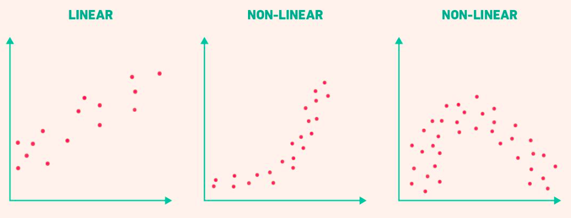
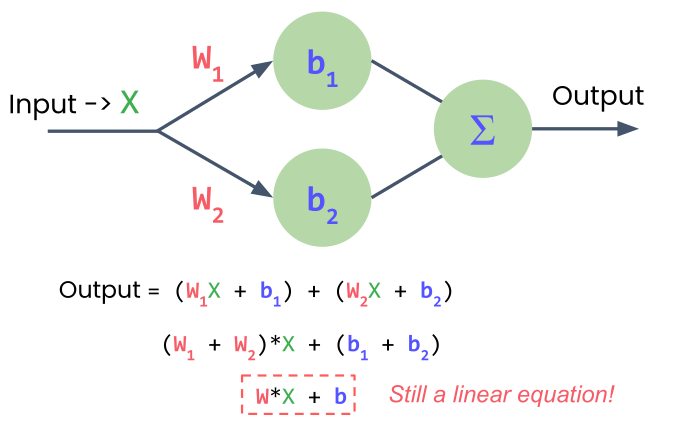
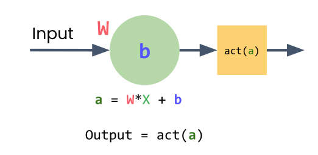
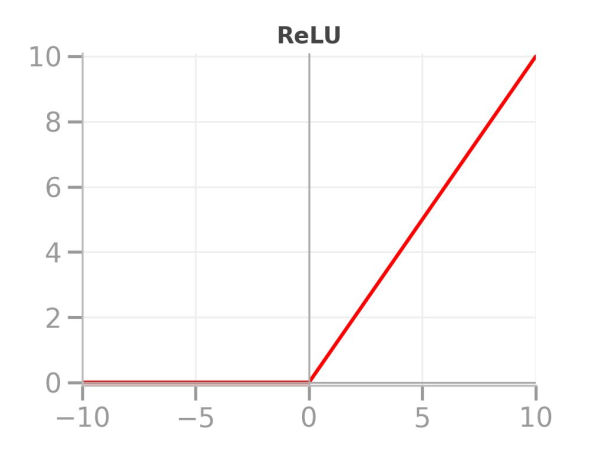
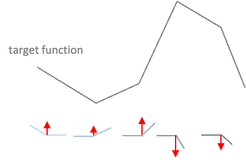
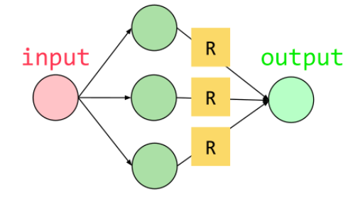
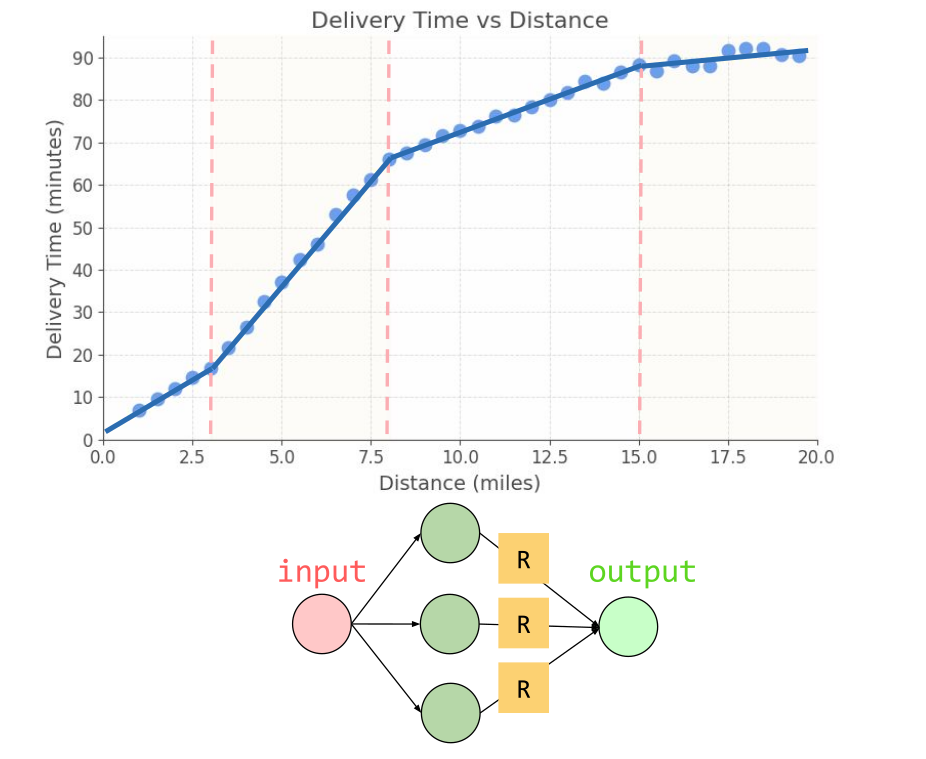
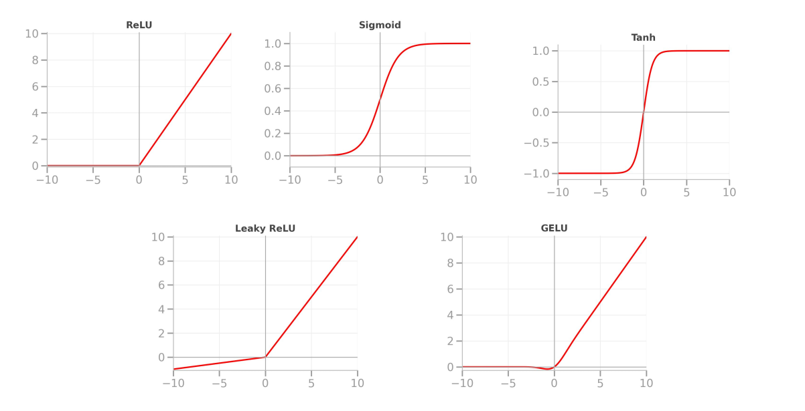

# Session 3

## The Problem: Linear Models Fail

**Delivery company expanded:** bike-only → city-wide with cars

**Discovery:** Delivery times stopped following a straight line

{fig-align="center"}

::: {.notes}
Welcome back! In the previous lab, your delivery company expanded from bike-only service to city-wide operations using cars for longer routes. But you discovered something important: as distances increased, delivery times stopped following a straight line.

So what happened? Why did your model start to fail when you added cars? It all came down to your model's assumption. A linear model treats every mile as needing the same amount of time, but in reality, it's much more complicated.
:::

## Why Linear Models Fail

**Reality:**

- First few miles: dense city traffic (slow)
- Further out: highways (faster)
- **The relationship curves**

**Linear assumption:** every mile needs the same time

::: {.notes}
These first few miles beyond bike range hit dense city traffic. Further out, cars reach highways and move faster. The relationship curves - it's not a straight line anymore.

Your linear model assumed every mile needed the same amount of time, but that's not how transportation works in the real world. So what's the solution?
:::

## Adding More Neurons?

**One neuron → one output**

**Two neurons → two outputs**

**Need:** combine outputs into one prediction

**Problem:** Still just a linear equation!

{fig-align="center"}

::: {.notes}
You might think: let's just add more neurons. If one neuron learns one relationship, maybe multiple neurons can capture more complexity.

But when you have just one neuron, it produces your final prediction, so it is the output layer. When you add a second neuron, now you have two outputs from your single input, and you need a single prediction. So you add another neuron to combine these two outputs into one final output.

But here's the problem: that's still just a linear equation, no matter how many neurons you stack like this. If all operations are linear - simply multiplying by weights and adding biases - you'll always end up with a straight line.
:::

## The Solution: Activation Functions

**Non-linear transformations** applied to each neuron

**Enables learning curves, not just straight lines**

{fig-align="center"}

::: {.notes}
To learn curves and not just straight lines, your model needs something more than a linear transformation. It needs non-linear activation functions. These functions add just enough complexity to help the model learn more interesting patterns.

In PyTorch, we usually apply them element-wise to each neuron in a layer, one by one. A neuron starts by computing a linear transformation of its input. But instead of sending that raw number straight out, we pass it through an activation function. This small change - adding a non-linear transformation - is what lets your model learn much richer patterns.
:::

## ReLU: Rectified Linear Unit

**Simple rule:**

- If input < 0 → output = 0
- If input ≥ 0 → output = input

**Most popular activation function in deep learning**

{fig-align="center"}

::: {.notes}
Let me introduce you to a really important activation function: ReLU. It's incredibly simple and surprisingly powerful.

Here's what ReLU does: if the input is negative, output 0. If the input is positive, just pass it through unchanged. It's as simple as that.

In PyTorch, it takes just one line to add ReLU to your model. Remember the Sequential layer type? That's your assembly line where data flows through all layers in order. Now it goes through the linear layer first, and then through ReLU, which transforms the output.
:::

## How ReLU Creates Non-Linearity

{fig-align="center"}

**Without ReLU:** straight line

**With ReLU:**

- When wx + b < 0 → flat line at 0
- When wx + b ≥ 0 → follows the line

**Result:** A bend, a corner where behavior changes

::: {.notes}
How can something this simple help us model curves? Let's look at what happens when you add ReLU to your single neuron.

Your neuron starts by computing w × distance + b. Without ReLU, this gives you a straight line. But with ReLU, when w × distance + b is negative, the output is 0, which is a flat line. When it's positive, the output follows the line normally.

Look at that - you've just escaped the world of straight lines. You now have a bend, a corner where the behavior changes. But here's something crucial: where does the bend happen? When ReLU is applied to a neuron's output, the bend occurs where wx + b = 0, which effectively gives us x = -b/w. That's where it stops outputting 0 and starts responding to the input.
:::

## Multiple Neurons, Multiple Bends

**One neuron → one bend**

**Multiple neurons → multiple bends → smooth curve**

{fig-align="center"}


::: {.notes}
Think about your city transportation data. The pattern doesn't just bend once - it curves, shifting gradually across different distances as traffic conditions change.

So if one neuron gives us one bend, then maybe multiple neurons will give us multiple bends. Each neuron has its own weight and bias, and that means each neuron activates at a different distance.

Picture three neurons all receiving the same distance input. Neuron 1 activates right around 3 miles where traffic starts. Neuron 2 activates around 8 miles as we're entering highways. Neuron 3 activates at around 15 miles when we're at full highway speeds.

Now here's what happens: add their outputs together, and their combined output approximates your complex curve.
:::

## Building the Model in PyTorch

```python
model = nn.Sequential(
    nn.Linear(1, 3),  # 1 input, 3 neurons
    nn.ReLU(),         # activation function
    nn.Linear(3, 1)   # 3 inputs, 1 output
)
```

**Only two linear layers** (ReLU is not a layer)

{fig-align="center"}

::: {.notes}
In PyTorch, this entire model takes just a few lines of Python. Let's break that down.

Notice we only define two linear layers. In PyTorch, you only code the layers that compute. The input is just your data. And ReLU - well, that's an activation function that transforms values, not a separate layer in this count.

Your first linear layer is your group of neurons. The `1` means one input feature (distance). The `3` means three neurons, so this layer outputs three values. Each of those outputs passes through a ReLU. Then the second linear layer takes those three transformed values and combines them with a single neuron, producing one final prediction - your delivery time.
:::

## More Neurons = Smoother Curves

{fig-align="center"}

Each neuron learns: **Where to activate** and **how strongly to contribute**

::: {.notes}
If you want a smoother curve, just increase the number of neurons in your first layer. With enough neurons, each learning where to activate and how strongly to contribute, you can approximate any smooth curve.

Your city transportation patterns, with all their complexity, can finally be modeled. This is the power of non-linear activation functions combined with multiple neurons.
:::

## Other Activation Functions

**Sigmoid:** outputs 0-1 (great for probabilities)

**Tanh:** outputs -1 to +1 (useful for many tasks)

{fig-align="center"}

**ReLU:** most common choice for hidden layers

::: {.notes}
We've been using ReLU because it's the workhorse of modern deep learning. It's fast, effective, and widely used. But it's not the only activation function out there.

Sigmoid will squash your outputs into a range between 0 and 1 and is great for probabilities. Tanh maps your values to a range between -1 and +1, which is really useful for many tasks. There are lots of others too.

If you want to dive deeper, there are great resources like PyTorch.org's documentation. But honestly, for most situations, ReLU is all you need.
:::

## Lab 2: Modeling Non-Linear Patterns with Activation Functions

> "In theory, there is no difference between theory and practice. In practice, there is."

<center>

START WITH LAB 2

</center>

## What's Next?

In [**Session 4: Working with Tensors**](../ch3_tensors/04_tensors.qmd) we learn:

- Understanding tensor shapes
- Data types in PyTorch
- Reshaping and indexing
- Element-wise operations and broadcasting

::: {.notes}
Speaking of what you need, remember that curve city data that stumped your linear model? In the lab, you'll add ReLU to your model and finally capture those complex traffic patterns.

But before we move on, there's one more fundamental topic we need to cover: tensors. You've been using them, but understanding them deeply will help you avoid many common PyTorch errors. That's what we'll cover in the next session.
:::


