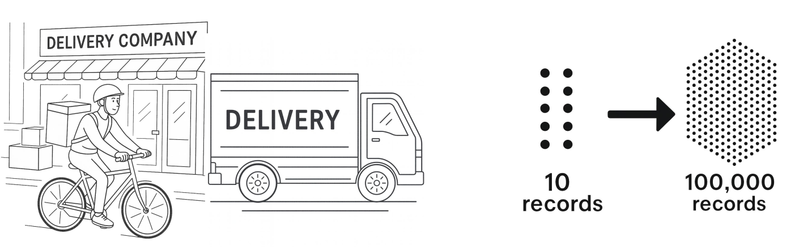

## Module Overview

1. Data and Model Building
2. Loss Functions and Optimizers
3. Device Management and Image Classification Setup
4. Training and Evaluating Your Classifier
5. Building Your First Image Classifier
6. Programming Assignment: EMNIST Letter Detective

::: {.notes}
Welcome to Module 2! In this module, we'll revisit the machine learning pipeline and see how PyTorch handles data at scale. We'll dive deeper into loss functions and optimizers, learn about device management, and then bring it all together to build your first image classifier.

The question chain shows our progression: understanding data handling leads to understanding model architectures, which leads to understanding how models learn (loss and optimizers), which leads to practical implementation with device management, and finally building a complete image classifier.
:::

# Session 1: Data and Model Building

- Revisit the ML pipeline with a focus on PyTorch's data handling tools
- Learn about data management at scale
- Explore building custom model architectures beyond the Sequential API

## The Challenge: Large Datasets

**100,000 delivery records**

**Problem:** Loading all at once → runs out of memory

{fig-align="center"}

**Solution:** Work with data in batches

::: {.notes}
Let's revisit the machine learning pipeline and see how PyTorch handles data. You already know about these steps from Module 1. But now, if you're going to decode handwritten digits, you're also going to need to understand PyTorch's data handling tools.

Before we get into the complexities of image data, let's start with something more familiar - that delivery data we looked at in Module 1. The same tools that can handle millions of delivery records can also handle millions of images. Once you see the pattern with simple data, images are going to make a lot more sense.

So let's imagine your delivery company for Module 1 has grown. Instead of 10 deliveries, you now have 100,000 records to analyze. That's a lot. Now imagine you wanted to try and load all 100,000 records at once. As you load this data, every piece needs to live in your computer's RAM. With 100,000 records, you might be okay. But what if you had millions of records? Or if you added weather data, traffic patterns, driver info? At that scale, your computer can run out of memory and crash in no time.

That's why you need to load your data piece by piece. The practical solution is to work with your data in batches - smaller, manageable chunks of the full dataset.
:::

## PyTorch Data Utilities

**Three core tools:**

1. **Transforms** - operations on each data point
2. **Dataset** - fetches samples from disk on demand
3. **DataLoader** - serves data in batches

::: {.notes}
But batching is just one part of the picture. Before your data is ready for training, you need to process it, format it, and serve it in a way that your model understands. That's where three of PyTorch's core data utilities come in: transforms, Dataset, and DataLoader. They each handle a key part of the process, and they're designed to work well together.
:::

## 1. Transforms

```python
transform = transforms.Compose([
    transforms.ToTensor(),
    transforms.Normalize(mean=0.5, std=0.5)
])
```

**ToTensor:** converts to tensors, scales 0-255 → 0-1

**Normalize:** centers around 0, scales using standard deviation

::: {.notes}
Let's take a look at how transforms work. To apply transforms to data, you usually write something like this. Transforms are operations that run on each data point as it's loaded, preparing your data for the model. Compose just means to do the following things in order.

Then you have the two most common transforms: ToTensor and Normalize. Neural networks are surprisingly picky. They train much better when all inputs are small numbers, ideally centered around 0. And that's exactly what these two transforms do.

ToTensor converts your data into PyTorch tensors and scales them to fall between the values of 0 and 1. Normalize adjusts these values even further, centering them around 0 and then scaling using standard deviation. For now, just know that these will help your model train much more effectively, and you'll learn more about them and other transform techniques in the next module.
:::

## 2. Dataset

```python
dataset = MNIST(root='./data', train=True, 
                download=True, transform=transform)
```

**Key features:**

- Fetches samples from disk when asked
- Doesn't preload everything
- Handles where data lives, how to load samples, total count

::: {.notes}
Next up, you're going to wrap your data in a Dataset object, which fetches each sample from disk when it's asked to. It doesn't preload everything in one shot, and that's one of the secrets to handling massive datasets.

It handles things like where your data lives on disk, how to load a specific sample, how many total samples there are, and of course how to apply the transforms that you just saw to each sample as it's being loaded.

This indicates where you store the data on your computer. `train=True` lets you choose between training and test sets of data. And if this is new for you, you'll see a lot more about that when I discuss evaluation. And `download=True` downloads the data if it's not already there.

You can retrieve a sample from your dataset simply by indexing it. In module 3, you'll learn how to use the Dataset class to build custom datasets. But for now, we'll stick to the pre-built ones that are available in PyTorch.
:::

## 3. DataLoader

```python
dataloader = DataLoader(dataset, batch_size=64, shuffle=True)
```

**Batch size:** how many samples per batch

**Shuffle:** randomize order each epoch

**Makes training on large datasets possible**

::: {.notes}
Once you've defined your dataset, you're going to use a DataLoader to serve the data in batches. It's part of the pipeline that makes training on large datasets possible, by requesting one batch at a time from your dataset.

Batch size tells the loader how many samples to serve at a time. You can also shuffle the data, which helps the model learn even more effectively during training.

Now let's see the complete data pipeline in action. And you're ready to train. This pattern efficiently handles datasets that would otherwise overwhelm your computer's memory. And whether you're working with thousands of delivery records or millions of images, the principle stays the same: load only what you need, when you need it.
:::

## Complete Data Pipeline

```python
# 1. Define transforms
transform = transforms.Compose([...])

# 2. Create dataset
train_dataset = MNIST(..., transform=transform)

# 3. Create dataloader
train_loader = DataLoader(train_dataset, batch_size=64, shuffle=True)

# 4. Use in training loop
for batch in train_loader:
    images, labels = batch
    # train model
```

::: {.notes}
But getting data into your model is just the beginning. In the rest of this session, you'll tackle the rest of the ML pipeline, and then you'll look at how loss functions and optimizers update your model.
:::

## Beyond Sequential: Custom Models

::: {layout-ncol=2}
### `nn.Sequential`
```python
model = nn.Sequential(
    nn.Linear(1, 20),
    nn.ReLU(),
    nn.Linear(20, 1)
)
```

### `nn.Module`
```python
import torch.nn.functional as F
class MyModel(nn.Module):
    # defines layers
    def __init__(self):
        super().__init__()
        self.layer1 = nn.Linear(1, 20)
        self.layer2 = nn.Linear(20, 1)
    
    # describes data flow
    def forward(self, x):
        x = self.layer1(x)
        x = F.relu(x)
        x = self.layer2(x)
        return x
```
:::

**More control, same functionality**

::: {.notes}
In the last video, you saw how PyTorch helps you manage your data. With tools like Dataset, Transforms, and DataLoader, you can load, prepare, and serve data efficiently, no matter the size of your dataset.

Now, let's move on to the rest of the machine learning pipeline: model building, training, and evaluation. In Module 1, you saw Sequential in action. And of course, this works great, but there's another pattern that you'll see a lot in PyTorch: creating your model using `nn.Module`. This code does exactly the same thing as the Sequential version, just with more control.

So let's take a closer look at the structure. Every PyTorch module class has two parts: `__init__` defines your layers, and `forward` describes how data flows through them.

In `__init__`, you're just defining what layers exist. It's a little bit like gathering your tools. The actual order comes in `forward`, and that's where you describe the path that data is going to take through your model.

Now, this is similar to how Sequential orders the flow, but written in a different style. You're going to see this pattern everywhere in PyTorch code.
:::

## Calling the Model

**Don't call `model.forward()` directly**

**Do call `model(input)`**

PyTorch handles the forward call and essential bookkeeping

::: {.notes}
But wait, you've defined this forward method. How do you actually run it? You might think `model.forward()`. But what if I told you that Sequential is a subclass of Module, and it too has a forward method? And how did you run that model? You never actually called forward directly. It's the same for your custom model.

Well, when you call the model method and pass the data, PyTorch does more than just run your forward method. It also makes some internal checks, tracks the necessary math, and sets things up for updating the model later. And that's why you always call `model(input)` and not `model.forward(input)`. PyTorch will handle that forward call for you, and it's all wrapped up in the essential bookkeeping.
:::

## Why `super().__init__()`?

**Necessary for parameter tracking**

PyTorch needs to set up a system to track all learnable parameters (weights and biases)

Without it, PyTorch has nowhere to register your layers

::: {.notes}
So what about this line, `super().__init__()`? Is it really necessary? You might think it's just Python boilerplate, and maybe nothing bad happens if you skip it. But when you try to create your model, PyTorch needs to set up a system to track all of its learnable parameters. And these are the weights and biases that you're going to update during training.

So when you call `super().__init__()`, it actually creates that tracking system for you. Without it, PyTorch has nowhere to register your layers. So always include it.
:::

## Training Loop Pattern

```python
for batch in dataloader:
    optimizer.zero_grad()    # Clear old calculations
    outputs = model(inputs)  # Forward pass
    loss = loss_fn(outputs, targets)  # Measure error
    loss.backward()          # Calculate gradients
    optimizer.step()         # Update weights
```

**Order matters!** Don't swap these steps.

::: {.notes}
Now let's take a look at training. You've seen this training loop already in Module 1. This standard sequence is the core of most PyTorch training loops. `zero_grad()` clears out all the old calculations, `backward()` figures out the improvements, and `step()` updates your model.

But here's the thing: if you don't follow this standard order, your training might fail silently. PyTorch won't throw an error, but your model won't learn properly.

For example, what would happen if you swapped backward and step? Your code runs fine, but the model updates itself based on the previous batch's calculations and not the current ones. Or if you put `zero_grad()` after backward, well, then you just threw away all of that work that backward did. What if you put `zero_grad()` outside the loop? Well, those calculations just pile up. Each batch will add to the previous one and your model starts making huge adjustments when it should just make tiny ones.

The next two videos will take a deeper dive into these topics. For now, just remember that this pattern is important. You almost always want the same order every time.
:::

## Evaluation

```python
model.eval()  # Set to evaluation mode
with torch.no_grad():  # Disable gradient tracking
    for batch in test_loader:
        outputs = model(inputs)
        # Calculate accuracy
```

**Two critical things:**

- `model.eval()` - sets evaluation mode
- `torch.no_grad()` - disables gradient tracking

::: {.notes}
You've been training your model, but how do you know it's actually learning? That's what evaluation is for: testing your model on new data that it hasn't previously seen and wasn't trained on.

Two critical things here. `model.eval()`. Be careful - this is not a method that evaluates your model as some people mistakenly think. It just sets the model into evaluation mode. You need this because it's both more efficient computationally and some layers in your model will behave in different ways during training and evaluation.

`torch.no_grad()`. This will disable that extra tracking that PyTorch does during training. If you don't turn it off, PyTorch will keep storing lots of details even when they're not needed, and this wastes memory and might even crash your program during validation.
:::

## Measuring Performance

**For classification:** Accuracy

```python
correct = (predictions == labels).sum().item()
total = labels.size(0)
accuracy = correct / total
```

**Count correct predictions / total predictions**

::: {.notes}
Now, the most important part of evaluation is to see how well your model has performed on new data that it hasn't seen before. Testing on the training set would be like giving the student the same test twice. The student might just memorize the answers, but you want to see if they can apply what they've already learned.

Since you're exploring image classification in this module, you can easily measure performance using accuracy. The accuracy calculation is straightforward: count how many times the model gets the classification right and divide that by the total attempts. If your model predicts 9,500 digits correctly out of 10,000, that's 95% accuracy.

And don't forget to switch back to training mode if you are returning the model to training.
:::

## To sum up

- Data pipeline: Dataset, DataLoader, Transforms
- Model building: `nn.Module`
- Training loop: `for batch in dataloader:`
- Evaluation: `model.eval()`, `torch.no_grad()`, `accuracy`

::: {.notes}
- **Data pipeline:** You start by organizing your data using a `Dataset` object, which defines how to access a single data point (like an image and its label). Then, you wrap your dataset in a `DataLoader`, which efficiently batches your data, shuffles it, and feeds it into your model during training and evaluation. Data transforms (using `transforms.Compose` and related utilities) are applied to preprocess, normalize, and augment your data. This pipeline ensures that data flows smoothly and efficiently to your model, handling everything from preprocessing to batching.

- **Model building (`nn.Module`):** You define your neural network architecture by subclassing `nn.Module`. Inside this class, you declare all the layers (like `nn.Linear`, `nn.Conv2d`, etc.) and implement the `forward` method, which describes how the input data passes through these layers to produce an output. This modular approach lets you build simple or highly complex models by stacking layers and adding activation functions, making PyTorch flexible for both quick prototypes and advanced research.

- **Training loop (`for batch in dataloader:`):** The heart of model training is the loop over batches of data. For each batch received from the `DataLoader`, you (1) run the input through the model to get predictions, (2) compute the loss by comparing predictions to the true labels, (3) perform backpropagation to compute gradients, and (4) update the model parameters using an optimizer. This iterative process gradually teaches your model to minimize the loss and improve accuracy, one batch at a time.

- **Evaluation (`model.eval()`, `torch.no_grad()`, `accuracy`):** When it's time to review your model's performance, you switch to evaluation mode using `model.eval()`, which adjusts the behavior of certain layers (like dropout and batchnorm). Wrapping your evaluation code with `torch.no_grad()` prevents PyTorch from tracking gradients, making evaluation faster and saving memory. Finally, you measure performance using metrics like accuracy—comparing model predictions to the true labels on unseen data to determine how well the model generalizes.
:::

## What's Next?

In [**Session 2: Loss Functions and Optimizers**](../ch2_loss_optimizers/session2.qmd), you learn:

- How loss functions measure error
- Cross-entropy loss for classification
- How optimizers use gradients to update weights
- Understanding backpropagation

::: {.notes}
You've now revisited the full pipeline: data loading, model building, training, and evaluation. But you've only scratched the surface of training. In the next session, we're going to take a closer look at what's happening with loss functions and optimizers - the mathematical foundations that make neural network learning possible.
:::

