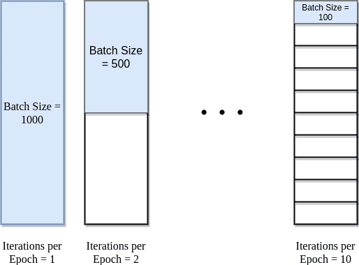

# Deep Learning Data Pipelines

## The Machine Learning Pipeline

**Six stages from data to deployed model**

::: {.notes}
Last session we built a delivery-time predictor in PyTorch — tensors, a linear layer, a training loop, and a prediction for a 7-mile order. Now let's step back and name the six stages that work applies to every deep learning project. This framework will be used throughout the Professional Certificate, whether you're training a delivery predictor or building image classifiers later.
:::

## Stage 1: Data Ingestion

**Gathering and organizing raw data**

- Load huge datasets from data sources
- Messy data: inconsistent formats, missing values, errors
- Arrange to work efficiently with PyTorch

**In our lesson:** we skipped ingestion and used clean delivery records directly.

::: {.notes}
It all starts with data. For the delivery predictor, that data comes from the company's delivery records. Real-world data is messy — free-text times, missing values, impossible entries. In Lab 1 we'll keep things simple with clean data, but ingestion is always the first stage in production.
:::

## Stage 2: Data Preparation

**Cleaning, transforming, and organizing**

- Missing values
- Erroneous values (invalid ranges, formats, duplicates)
- Engineer features (addresses → distances)

**In our lesson:** we formatted distances and times as `torch.tensor` batches.

::: {.notes}
Whether you're working with delivery records, customer images, or email text, you have to clean and transform data into a form your model can learn from. This stage often takes the most time in real projects. Most models don't fail because the math was wrong — they fail because the data was messy.
:::

## Stage 3: Model Building

**Designing the architecture**

- How many neurons?
- How are they connected?
- What types of layers?

**In our lesson:** `nn.Sequential(nn.Linear(1, 1))` — one neuron, $y = wx + b$.

::: {.notes}
Architecture is structure: how many neurons, how they're connected, what layer types you need. Our delivery model was the simplest case — one linear layer mapping distance to time.
:::

## Stage 4: Training

**Teaching the model to make predictions**

- Feed examples (5 miles → 22.2 minutes)
- Measure prediction errors (`nn.MSELoss`)
- Adjust parameters (`optim.SGD`, training loop)
- Repeat for many epochs

::: {.notes}
This is where learning happens. You feed examples, measure error with a loss function, and use an optimizer to adjust weights and biases — exactly what the training loop did automatically for hundreds of epochs.
:::

## Stage 5: Evaluation

**Testing on unseen data**

- Use test set (held back during training)
- Measure performance (accuracy, error)
- Detect issues and debug

**In our lesson:** we predicted 7 miles — data the model had not seen during training.

::: {.notes}
Training success isn't enough. Can the model predict well on new data? Our 7-mile prediction was a simple evaluation moment. In later projects you'll hold back a test set and measure performance systematically.
:::

## Stage 6: Deployment

**Getting your model into the real world**

*(We'll cover this later in the course)*

::: {.notes}
Deployment means putting the model where people can use it — an app, an API, a dashboard. We'll return to this stage later in the course.
:::

## Iterations Per Epoch

