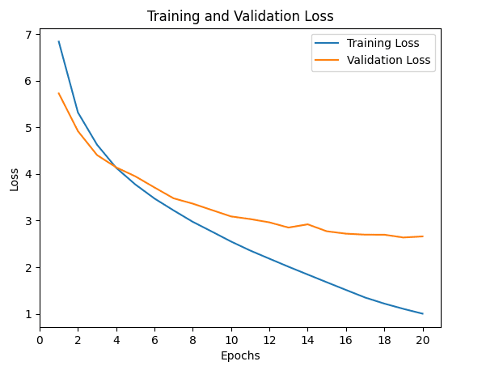
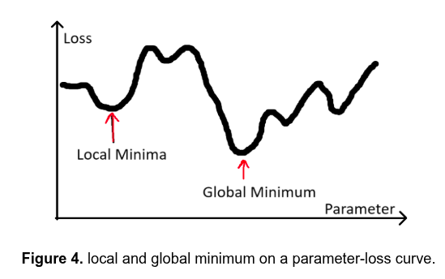
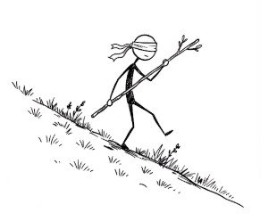
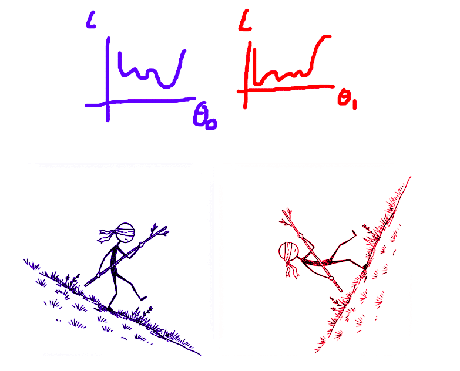
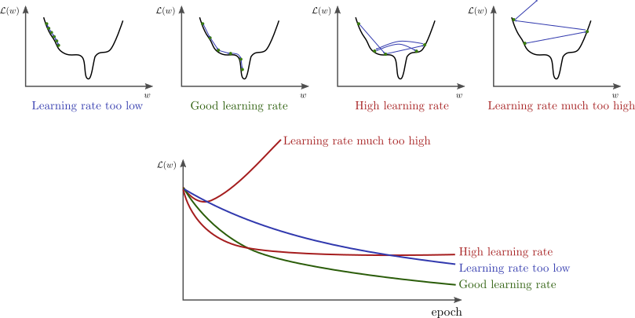
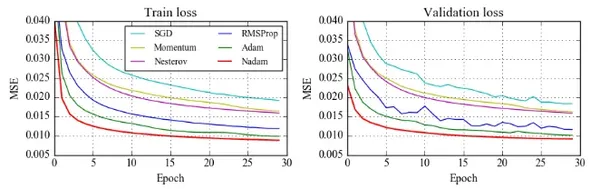

# Session 2

## The Training Sequence

**Three lines that make learning happen:**

1. **Measure** - How wrong are we?
2. **Diagnose** - What caused the error?
3. **Update** - How do we fix it?

::: {.notes}
As you move through this professional certificate, you'll see these three lines come up again and again and again during training. They're simple to write, but a lot happens behind the scenes. PyTorch will take care of the complex math for you, but in this session, you'll take a quick look under the hood to understand what each line really does and why the order matters.

These three lines will work together in this sequence: Measure, Diagnose, Update. First, you'll measure how wrong your predictions are, and that's your loss - this one number that sums up all of your mistakes. Then, backward diagnoses the problem. It examines how each weight in your model contributed to the error, which weights made things worse, and by how much. Finally, optimizer.step updates the weights. It uses those diagnostic scores to adjust each parameter. The weights with the bigger problems will get bigger corrections.
:::

## Step 1: Measuring Loss

**Loss function:** compares predictions to true answers

**Higher number = more wrong**

**Goal:** minimize loss

{fig-align="center"}

::: {.notes}
In this session, you're going to focus on the first step, and that's measuring loss. You've already seen one kind of loss function called mean squared error, which works really well for tasks like we had when we were predicting delivery time. You'll also meet a new loss function, cross-entropy loss, and this is used for classification problems.

I'll break down how these loss functions work and how to choose the correct one for your task. Every loss function does the same basic job: it compares your model's predictions to the true answers and then gives you a number. The higher the number, the more wrong you are.
:::


## Measuring Error for Regression Tasks

**For regression tasks** (predicting numbers): temperature, price, distance

**Average error =** $\frac{1}{n} \sum_{i=1}^n (\hat{y}_i - y_i)$

| Prediction (minutes) | Actual (minutes) | Error                 |
|----------------------|------------------|-----------------------|
| 6                    | 4                | $6 - 4 = 2$           |
| 3                    | 5                | $3 - 5 = -2$          |

**Problem:** Average error = 0 (mistakes cancel out!)

::: {.notes}
Back in the delivery company example, you used the model to predict delivery time based on distance. Now, let's say your model makes two predictions. The first prediction: the model predicted 6 minutes, but the actual time was 4. For the second prediction, say it predicted 3 minutes, but the actual time was 5.

To figure out how far off you were, you subtract the target from the prediction, and that gives you the error. It's like measuring the distance between your guess and reality. So how wrong was your model overall? Well, loss here is the average error across all of those predictions. Think of it like a report card for your model. The lower the score, the closer your predictions are to reality on average.

But if you average out the raw errors - in this case it was +2 and -2, and you divide that by two because there's two of them - you get zero. It looks like perfect performance, even though both predictions were actually wrong.
:::

## Mean Squared Error Loss

**Squaring:**

- Gets rid of minus signs (all mistakes count)
- Makes bigger mistakes matter more

$$
\text{MSE} = \frac{1}{n} \sum_{i=1}^n (\hat{y}_i - y_i)^2
$$

::: {.notes}
And this is why you use mean squared error and you square the differences. It gets rid of the minus signs. So now both mistakes count and they don't cancel each other out. And that's where that name comes from: mean squared error.

And there's one more benefit: squaring makes bigger mistakes matter more. Being off by 10 minutes is much worse than being off by one. So MSE loss, mean squared error loss, helps in these two ways: (1) it makes sure that all mistakes count, and (2) it punishes bigger errors more than it punishes smaller ones.

Mean squared error is perfect when you're predicting continuous values, things like distances, temperatures, or prices.
:::

## Cross-Entropy Loss

**For classification tasks** (predicting categories): digit, animal, word

**Model outputs:** confidence scores (probabilities) for each class

**All scores sum to 100%**

$$
\text{BCE} = -\sum_{i=1}^n y_i \log(\hat{y}_i)
$$

::: {.notes}
But in this module, you're tackling classification. What digit is this? And here you're going to need a different loss function. We'll use one called cross-entropy loss.

With cross-entropy loss, your model isn't just picking an answer - it outputs a confidence score for all possible answers or classes. Take MNIST: your model must choose between digits zero through nine. So for each image, it outputs 10 numbers, a probability for each digit. This means "I'm 70% sure it's a three, maybe 8% sure it's a two, but it could be a zero." And all of those scores should add up to 100%.
:::

## How Cross-Entropy Works

**Punishes overconfident wrong answers**

- 95% sure it's a 7, but it's actually a 3 → **very high loss**
- 55% sure it's a 7, but it's actually a 3 → **smaller loss**

**Goal:** Confident about right answers, unsure about wrong ones

::: {.notes}
Now here's the key idea: cross-entropy loss punishes overconfident wrong answers. If your model says it's 95% sure that this is a seven, but it's actually a three, that's a big mistake and the loss will be very high. But if it's only 55% sure it's a seven, it's still wrong, but not as confident, so the loss will be smaller.

You want your model to be confident about the right answers and unsure about the wrong ones. Cross-entropy loss helps shape that behavior.
:::

## Step 2: Diagnosing the Problem {.small}

**Backward calculates gradients**

**Gradients = diagnostic scores for each parameter**

- Positive gradient → increasing weight makes loss worse
- Negative gradient → increasing weight helps
- Large gradient → big influence
- Small gradient → barely mattered

::: {.notes}
In the last video, you saw how loss functions measure how right or how wrong your predictions are, and this is the first critical step in every training loop. Now let's take a look at the next two steps.

After measuring how wrong your predictions are with the loss function, the next step is to figure out what caused that loss, and that's what Backward does. Think back to how neural networks work. Each neuron takes inputs, multiplies each by a weight, adds them up with a bias, and then passes that through an activation function.

Even in a small neural network, you're dealing potentially with thousands of weights and biases. So if we look at a simple example: this network has 784 inputs, 128 hidden neurons, and 10 output classes. And it has over 100,000 weights between inputs and the hidden layers. There are 128 biases for the hidden layer, and there are 1,280 weights between the hidden layer and the output. And of course there are those 10 biases for the final output layer. And that's a total of 101,770 trainable parameters.

So Backward acts a little bit like a detective. It looks at every single weight and bias and asks: "How much did you contribute to the loss?" These diagnostic scores are called gradients. They tell you not just who contributed to the error, but how much and in what direction.
:::

## What Backward Does NOT Do

**Backward does NOT update weights**

**It only calculates gradients**

**Updates happen later with `optimizer.step()`**

::: {.notes}
But here's a common misconception: people often think that Backward updates these weights. It doesn't. Backward only calculates gradients. It figures out how much each weight contributed to the overall loss. The actual updates will happen later when you call `optimizer.step()`.

You can find course resources if you want to learn more, but this course is focused on PyTorch and not Calculus. And the beauty of PyTorch is that it handles all of that complexity for you.
:::

## The Gradient Descent Analogy

{fig-align="center"}

**Goal:** minimize loss (reach bottom of valley)

**Gradient:** tells you the slope (which way is downhill?)

**Go downhill → lower loss**

::: {.notes}
But what's really happening here? Your goal is to try to minimize loss. Think of it as like standing on a hillside trying to reach the bottom of a valley. The gradient tells you the slope at your position, which way is uphill or which way is downhill.

So to get to the bottom, you go in the downhill direction, and that's going towards lower loss. And that's why we call it gradient descent.
:::

## Zooming in on a single parameter taking a step against the gradient

{fig-align="center"}

::: {.notes}
The stickman figure emphasizes two points:

1. The blind-fold on the eyes of the parameter emphasizes the fact that they can only feel the incline (slope / derivative), but cannot see further.
2. The parameter, being a stickman, moves relative to its current position by stepping. A step may be small or big, depending on the learning rate (step-size) we choose.
:::

## Multiple parameters

If we have two parameters ($\theta_0$ and $\theta_1$):

{fig-align="center"}

## Stochastic Gradient Descent (SGD)

**Strategy:**

- Negative gradient ($\frac{\partial \text{loss}}{\partial w_0}$) → increase weight ($w_0$)
- Positive gradient ($\frac{\partial \text{loss}}{\partial w_1}$) → decrease weight ($w_1$)
- Big gradient ($\frac{\partial \text{loss}}{\partial w_0}$) → big change ($w_0$)
- Small gradient ($\frac{\partial \text{loss}}{\partial w_1}$) → small change ($w_1$)

**Scales updates with learning rate**: $\text{step size} = \text{learning rate} \times \text{gradient}$

::: {.notes}
The simplest approach is what we've been using: stochastic gradient descent. SGD's strategy is straightforward. If your weight has a negative gradient, then let's increase it. If your weight has a positive gradient, then we can just decrease by going in the opposite direction. If it has a big gradient, we'll make a big change. If it has a small gradient, we'll make a small change.

But it doesn't just subtract the gradient directly - it scales it first using the learning rate.
:::

## Learning Rate Matters

{fig-align="center"}

::: {.notes}
- **Tiny learning rate:** tiny steps, takes forever
- **Good learning rate:** steady progress to the bottom
- **Huge learning rate:** giant leaps, overshoots minima

So if your gradient, for example, is 0.5 and the learning rate is 0.01, the learning rate will scale down any updates. And here's why this matters: in this case, a tiny learning rate has tiny steps. It will take forever to reach the bottom. A good learning rate has steady progress all the way to the bottom. A huge learning rate has these giant leaps that can bounce back and forth, overshooting the minima.
:::

## Adam Optimizer

**Adapts learning rate for each weight individually**

**Like having an assistant:**

- Knows which weights need big adjustments
- Knows which need fine-tuning

**Popular first choice:** reliable, flexible, often faster

{fig-align="center"}

::: {.notes}
So SGD can work great, but there are smarter optimizers that can adapt to each weight individually. And one of those is Adam. It's kind of like having an assistant that knows which weights need big adjustments and which ones need fine-tuning.

Adam has become a popular first choice optimizer because it's reliable, flexible, and often faster than the alternatives. But a word of caution: don't copy the learning rate from SGD when using Adam because your loss might explode. It's tuned completely differently.

There are other optimizers in PyTorch like RMSprop, AdaGrad, and a whole lot more. And if you're curious, check out the resources. But for most projects, SGD and Adam have you covered.
:::

## Why `zero_grad()`?

**Every `backward()` call adds to existing gradients**

**Without `zero_grad()`:** gradients accumulate incorrectly

**Result:** training breaks

::: {.notes}
Now that you understand gradients as diagnostic scores for each parameter, `zero_grad` begins to make a lot more sense. Every time you call backward, PyTorch adds new gradients to whatever is already there. So if you don't call `zero_grad`, you're not just diagnosing parameters for this batch - you're actually accumulating the diagnoses from every batch. And the gradients will keep accumulating incorrectly until your training breaks.

So that's why you call `optimizer.zero_grad()` at the start of every training loop. Now you might wonder: well, why does PyTorch accumulate the gradients in the first place? It turns out that this behavior is really useful for advanced use cases like gradient accumulation or certain custom training schedules. But for most projects, including everything you'll do in this course, you're going to want to clear those gradients every time.
:::

## Complete Training Loop

```python
for batch in dataloader:
    optimizer.zero_grad()      # Clear gradients
    outputs = model(inputs)     # Forward pass
    loss = loss_fn(outputs, targets)  # Measure
    loss.backward()            # Diagnose
    optimizer.step()           # Update
```

**Measure → Diagnose → Update**

::: {.notes}
You can now understand the complete training loop. Loss functions measure how wrong or how right the model is. Backward diagnoses how each parameter contributes to the errors. Optimizers then use those diagnostic scores to update the weights.

Now before you start building your first classifier, I have one final PyTorch-specific topic to discuss, and that's device management. And that means making your code run on GPUs for faster training. And I'll see you there.
:::

## What's Next?

In [**Session 3: Device Management and Image Classification Setup**](../ch3_device_setup/session3.qmd), you learn:

- Running on GPUs vs CPUs
- Moving models and data to devices
- Setting up MNIST data pipeline
- Building your first image classifier architecture

::: {.notes}
In the next session, we'll learn about device management - how to make your code run on GPUs for much faster training. Then we'll set up the complete data pipeline for MNIST and build the architecture for your first image classifier.
:::
