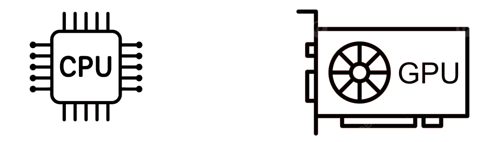
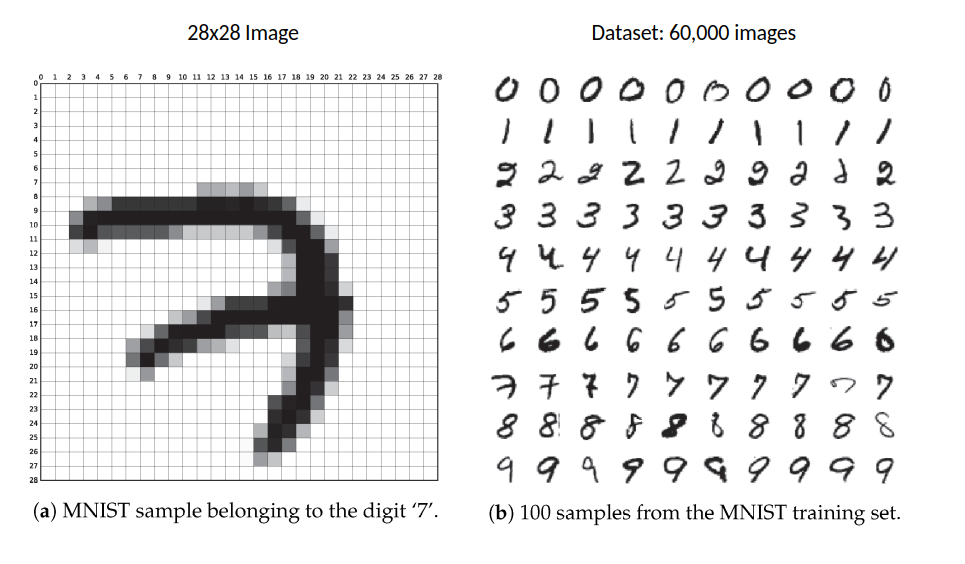
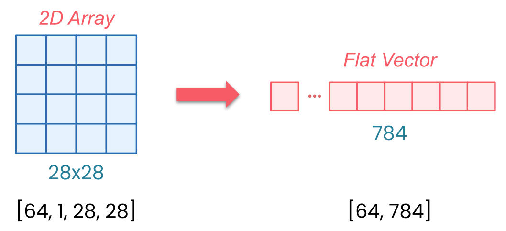

# Session 3

## Device Management

{fig-align="center"}

**Every tensor and model lives on a device**

- CPU (default)
- GPU (accelerator)

**Key rule:** Model and data must be on the same device!

::: {.notes}
Welcome back. As you start working more with tensors and models in PyTorch, there's something important that you need to understand early on: every tensor and every model lives on a device. Now that could be your CPU, or a GPU, or other accelerator if one is available.

And here's the key: PyTorch will not move things around for you automatically. And if your tensors and models aren't all on the same device, your code may not run. It could crash with an error.

In this session, you'll learn how to control where your data and computations live, and how to avoid one of the most common errors people run into when they get started with PyTorch.
:::

## CPU vs GPU

**CPU:**

- Default device
- General purpose
- Sequential operations

**GPU:**

- Accelerator
- Parallel operations
- **10-15x faster for training**

::: {.notes}
Every computer has a CPU, and that's the default device PyTorch uses unless you tell it otherwise. CPUs are built for general purpose work and run operations sequentially. But some systems also have an accelerator like a GPU, a graphics processing unit, which can run tensor operations much faster, especially during training.

In fact, training on an accelerator like a GPU can be 10 to 15 times faster than on a CPU alone. So if your system has one of these, you'll almost always want to use it. But you do need to ensure that your model and data are both on the same device, and you'll do this manually.
:::

## Checking for GPU

```python
torch.cuda.is_available()  # Returns True if GPU available
```

**Common pattern:**
```python
device = torch.device('cuda' if torch.cuda.is_available() 
                      else 'cpu')
```

::: {.notes}
PyTorch gives you a simple way to check whether your system has an accelerator using the following code. If this returns true, then PyTorch can use a GPU to accelerate your computations.

A common pattern for choosing a device looks like this. This sets the device to CUDA if a GPU is available and CPU otherwise. It is a safe default and one you'll often see in PyTorch code. The CUDA keyword refers to NVIDIA GPUs that have a toolkit called CUDA. Now while there are other options like MPS for Apple Silicon, CUDA is the most commonly used one and it's what the labs in this course will be using also.
:::

## Moving Model to Device

```python
model = MyModel()
model = model.to(device)  # Move model to device
```

**Puts model's parameters on the selected device**

::: {.notes}
Once you've defined your device, the next step is to move your model and your data onto it. First, you can move your model when you create it like this. This puts the model's parameters onto the selected device.
:::

## Moving Data to Device

```python
for batch in dataloader:
    inputs, targets = batch
    inputs = inputs.to(device)
    targets = targets.to(device)
    # ... rest of training
```

**Move each batch within the training loop**

::: {.notes}
Then within your training loop, move each batch of data like this. Now if you're not sure where something lives, you can always check.
:::

## Checking Device Location

```python
# For tensors
tensor.device

# For models (check a parameter)
next(model.parameters()).device 
# model.parameters() returns a generator. That's why we use next
```

::: {.notes}
For tensors, it's pretty straightforward. For models, it's a bit different. Models themselves aren't on the devices, but their parameters are. So you can check one parameter to see where they all are.

If you're getting device errors, you should also double check that your targets and the output of your model are also on the same device too.
:::

## Common Mistake with `.to()`

**`.to()` doesn't change tensor in place**

**It creates a new one!**

```python
# Wrong
tensor.to(device)  # Result is discarded!

# Right
tensor = tensor.to(device)  # Reassign
```

::: {.notes}
Now there's one common mistake to watch out for when you use `.to()`. It doesn't change the tensor in place - it actually creates a new one. So if you want to actually move the tensor, you need to reassign it. Anytime you use `.to()`, make sure you're assigning the results to a variable that you will actually use.
:::

## Complete Training Loop with Device Management

```python
device = torch.device('cuda' if torch.cuda.is_available() 
                      else 'cpu')
model = MyModel().to(device)

for batch in dataloader:
    inputs, targets = batch[0].to(device), batch[1].to(device)
    optimizer.zero_grad()
    outputs = model(inputs)
    loss = loss_fn(outputs, targets)
    loss.backward()
    optimizer.step()
```

**Key steps:**
1. Choose device up front
2. Move model once
3. Move data in every batch

::: {.notes}
Now here's what a complete training loop looks like with proper device management. The key steps are: choose your device up front, move the model once, and then move the data in every batch. This pattern is the foundation of every training script that you'll write in PyTorch.
:::

## GPU Memory Limits

**GPU memory is limited**

**Error if batch size too large:**
```
RuntimeError: CUDA out of memory
```

**Solution:** Lower batch size (32-64 is good starting point)

::: {.notes}
Even when everything's on the right device, there's one more thing to watch out for: the GPU memory. Because it is limited. If your model and batch size take up more memory than the GPU has available, you'll see an error like this.

And that's why batch size matters. Small batches make training slow. Large batches too large, and you might exceed your GPU's memory and cause a crash. For many systems, a batch size between 32 and 64 is a good starting point, but it does depend on your hardware and on your model architecture.

If you see a memory error, first try lowering your batch size. It is the most common fix. Get device management right early, and you'll avoid one of the most frustrating classes of errors in PyTorch. And when something does go wrong, you'll know exactly what to check.
:::

## Building Your First Image Classifier {.smaller}

{fig-align="center"}

**MNIST Dataset:**

- 60,000 training images
- 10,000 test images
- 28×28 pixels, grayscale
- 10 classes (digits 0-9)

::: {.notes}
You've now seen how to manage devices, and with everything you've learned so far, you're ready to put it all together. In the rest of this session, you'll see how to train your first image classifier in PyTorch, bringing that full pipeline to life.

You're working with MNIST, those handwritten digits. This dataset has 60,000 training images and 10,000 test images. Each of these are 28 by 28 pixels in grayscale. It's the perfect warm-up before tackling more complex image classification tasks.
:::

## Setting Up the Data Pipeline

```python
import torchvision
from torchvision import transforms

transform = transforms.Compose([
    transforms.ToTensor(),
    transforms.Normalize((0.1307,), (0.3081,))
    # Grayscale Images have 1 Channel. 
    # That's why we used 1 element tuples for Normalize
])
```

**ToTensor:** converts to tensors, scales 0-255 → 0-1

**Normalize:** centers around 0 using dataset mean/std

::: {.notes}
So let's jump into the code and build a model. We'll start with the data pipeline. First, you need to import TorchVision, and this is PyTorch's computer vision library. It comes built in with popular datasets like MNIST, as well as tools for image processing.

Remember transforms? Well here you're applying them to MNIST. ToTensor converts the images to tensors and then scales the pixels from 0 to 255 down to a range of 0 to 1. Normalize then shifts and scales those values so they're centered around 0.

Now what are these numbers 0.1307 and 0.3081? Well, they are the mean and standard deviation of the entire training set. By normalizing every image with the same values, you make the data more consistent, and that helps the model learn faster. We'll see more on that in the next module.
:::

## Loading the Dataset

```python
train_dataset = torchvision.datasets.MNIST(
    root='./data',
    train=True,
    download=True,
    transform=transform
)

test_dataset = torchvision.datasets.MNIST(
    root='./data',
    train=False,
    transform=transform
)
```

**TorchVision handles downloading and organizing**

::: {.notes}
Now let's load in the datasets. For the training dataset, `root='./data'` says simply where to store the files on your computer. `train=True` tells it that you want the 60,000 training images. `download=True` means that if MNIST isn't already there, go ahead and download it. And `transform` applies those pre-processing steps that you just defined to every image automatically.

The test dataset is almost identical. Just use `train=False` to get the 10,000 test images instead of the training ones. Got to use the same transforms, the same storage location, and all of that. TorchVision will handle all of the downloading and organizing for you.
:::

## Creating DataLoaders

```python
train_loader = DataLoader(
    train_dataset, 
    batch_size=64, 
    shuffle=True
)

test_loader = DataLoader(
    test_dataset, 
    batch_size=1000,
    shuffle=False
)
```

**Training:** shuffle=True (mix up order each epoch)

**Testing:** shuffle=False (order doesn't matter)

::: {.notes}
Now onto data loaders. For training, you're setting the batch size to be 64. That means it's 64 images in each batch. With `shuffle=True`, for every epoch the model will see the images in a different random order. The test loader uses `batch_size=1000`. These are much larger batches because we don't need to calculate gradients - we're only testing.

But notice something interesting: the training data is shuffled, but the test data isn't. Take a moment to think about why that might be. Well, datasets often come organized by class. If you don't shuffle, your model might see 6,000 zeros in a row before seeing any ones. It could learn unintended patterns like "early batches are zeros, late batches are nines," instead of actually learning what makes a zero look like a zero.

Shuffling will mix everything up so that each batch has variety in it. The model learns the actual features of each digit and not just their position in the dataset. But for testing, well, the model's done learning. You're just checking if it can recognize digits correctly. Order doesn't matter then.
:::

## Building the Model Architecture

```python
class MNISTClassifier(nn.Module):
    def __init__(self):
        super().__init__()
        self.flatten = nn.Flatten()
        self.linear1 = nn.Linear(784, 128)
        self.relu = nn.ReLU()
        self.linear2 = nn.Linear(128, 10)
    
    def forward(self, x):
        x = self.flatten(x)
        x = self.linear1(x)
        x = self.relu(x)
        x = self.linear2(x)
        return x
```

::: {.notes}
So now it's time to create your neural network. You're going to go beyond Sequential and we'll build a custom architecture. Let's walk through this. You're creating a class that inherits from `nn.Module`. This gives you all of PyTorch's neural network functionality.

In its `__init__`, you're going to define your layers. First comes flatten. This is new. Here's why you need it.
:::

## Why Flatten? {.smaller}

**MNIST images:** shape `[1, 28, 28]` (channels, height, width)

**With batch:** shape `[64, 1, 28, 28]`

**Linear layers expect:** flat vectors `[batch, features]`

**Flatten:** `[64, 1, 28, 28]` → `[64, 784]`

{fig-align="center"} 

::: {.notes}
MNIST images arrive as tensors with a specific shape. When PyTorch loads a single MNIST image, it gives you a `[1, 28, 28]`-dimensional tensor. And that's the channels, the height, and the width. The one channel means that it's grayscale - just a single brightness value from 0 to 255 for each pixel. 28 by 28 pixels are the size, and those are the other two dimensions.

But when you're training on batches, PyTorch will actually add another dimension. So with `batch_size=64`, your data arrives as `[64, 1, 28, 28]`. So that's 64 images, each one channel, and each is 28 by 28 pixels.

Here's the issue: Linear layers expect flat vectors, and that's one long row of numbers per image, not two-dimensional grids. And that's what flatten does. It takes each of your 28 by 28 images and reshapes them into 784 values in a row. Why 784? Because 28 × 28 = 784.

So now your batch, instead of being dimension `[64, 1, 28, 28]`, just simply becomes `[64, 784]`. Without flatten, you get a shape mismatch error when your image data hits the linear layer.
:::

## Model Architecture Breakdown

**Linear(784, 128):**

- 784 pixel values → 128 hidden features

**ReLU:**

- Activation function (non-linearity)

**Linear(128, 10):**

- 128 features → 10 outputs (one per digit class)

::: {.notes}
So now you can stack your layers. `Linear(784, 128)` takes those 784 pixel values and transforms them to 128 hidden features. ReLU is our activation function that keeps our positive values and zeros out the negatives. Then `Linear(128, 10)` takes the 128 features and turns them into 10 outputs. 10 outputs being one for each digit class. We've 10 digits from 0 through 9.

Now you're going to define the flow of the data in that forward method. Take the input, flatten it, pass it through your layers, return the output.

So now you have everything ready: a data pipeline that loads and pre-processes MNIST images, and a neural network that can process those images. But right now this model doesn't know a zero from a nine. In the next session, you're going to see how to bring this model to life with training.
:::

## What's Next?

In [**Session 4: Training and Evaluating Your Classifier**](../ch4_training/session4.qmd) we learn:

- Setting up loss function and optimizer
- Writing the training loop
- Evaluating on test set
- Watching your model learn!

::: {.notes}
In the next session, you'll see how to set up the optimizer, define the training loop, and watch as your model learns to recognize digits with increasing accuracy. Let's keep going!
:::
