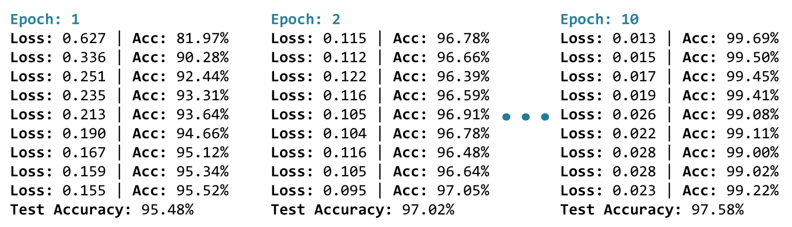

# Session 4

## Setting Up Training

**Everything you need:**

- Model (on device)
- Loss function
- Optimizer
- Data loaders

::: {.notes}
Welcome back. In the last session, you saw how to build the two key components: a data pipeline that loads MNIST images, and a neural network architecture that can process them. But if you run the model right now, you'll just be guessing.

In this session, you're going to walk through the code that actually trains that model step by step. Let's start by setting up everything that you need for training.
:::

## Device and Model Setup

```python
device = torch.device('cuda' if torch.cuda.is_available() 
                      else 'cpu')
model = MNISTClassifier().to(device)
```

**Both model and data must be on the same device**

::: {.notes}
First, device selection. If CUDA is available, you'll use the GPU. Otherwise, PyTorch is going to fall back to the CPU. Then, let's create the model and move it to the device using `.to(device)`. Remember, both your model and your data need to be on the same device. Otherwise, you'll get an error during training.
:::

## Loss Function

```python
loss_function = nn.CrossEntropyLoss()
```

**Designed for classification tasks**

**Perfect for choosing a digit from 0-9**

::: {.notes}
You're going to be using cross-entropy loss as your loss function. And as you saw earlier, it's designed for classification tasks, where the model will pick one class out of many. And that's perfect for choosing a digit from 0 through 9.
:::

## Optimizer

```python
optimizer = optim.Adam(model.parameters(), lr=0.001)
```

**Adam:** adapts learning rate as it trains

- Larger adjustments early (noisy gradients)
- Smaller corrections later (training stabilizes)

::: {.notes}
And you're using the Adam optimizer with a learning rate of 0.001. You've already seen how Adam adapts its learning rate as it trains by making larger adjustments early when gradients are noisy, and then smaller corrections later as your training stabilizes.
:::

## Training Function {.smaller}

```python
def train_one_epoch(model, dataloader, loss_fn, optimizer, device):
    model.train()  # Set to training mode
    running_loss = 0.0
    correct = 0
    total = 0
    
    for batch_idx, (data, targets) in enumerate(dataloader):
        # Move to device
        data, targets = data.to(device), targets.to(device)
        
        # Training steps
        optimizer.zero_grad()
        outputs = model(data)
        loss = loss_fn(outputs, targets)
        loss.backward()
        optimizer.step()
        
        # Track progress
        running_loss += loss.item()
        _, predicted = outputs.max(1)
        total += targets.size(0)
        correct += predicted.eq(targets).sum().item()
        
        if batch_idx % 100 == 0:
            print(f'Loss: {loss.item():.4f}, '
                  f'Accuracy: {100.*correct/total:.2f}%')
```

::: {.notes}
So now, let's create a function to train our model for one epoch. The function takes in five inputs: your model, the data loader, the loss function, the optimizer, and the device that everything should run on.

You'll start with `model.train()`, and this puts the model into training mode. You'll set up three tracking variables: `running_loss` accumulates the loss values, `correct` counts predictions that match the true labels, and `total` counts all of the samples that you've seen so far.

Next, we're going to loop over all of the batches. And in each batch, we're going to move the data and the target to the right device, clear any leftover gradients with `optimizer.zero_grad()`. We'll then run a forward pass by calling the model and passing it the data to get output. We'll compute the loss by calling the loss function. We'll back propagate with `loss.backward()`, and then we'll update the weights with `optimizer.step()`.

And then you track your progress. `loss.item()` gives us the label value, and `output.max` tells us which digit class got the highest score and lets you compare that to that label value. Every 100 batches, you're going to print out the current loss and accuracy.
:::

## Understanding the Training Progress

**With 60,000 training images and batch size 64:**

- About 938 batches per epoch
- Around 9 progress updates

**Watch the numbers:**

- Loss: dropping (0.64 → 0.17)
- Accuracy: climbing (81% → 95%)

::: {.notes}
With 60,000 training images and batch size 64, that's about 938 batches per epoch. So you're going to see around 9 updates.

Notice what's happening here. Look at the loss number: it's dropping from 0.64 to about 0.17, while your accuracy climbs from about 81 percent to about 95 percent. And that's just in a single pass through the training set. And look how little code it took to make all of that happen.
:::

## Evaluation Function

```python
def evaluate(model, dataloader, device):
    model.eval()  # Set to evaluation mode
    correct = 0
    total = 0
    
    with torch.no_grad():  # Disable gradient tracking
        for data, targets in dataloader:
            data, targets = data.to(device), targets.to(device)
            outputs = model(data)
            _, predicted = outputs.max(1)
            total += targets.size(0)
            correct += predicted.eq(targets).sum().item()
    
    return 100. * correct / total
```

::: {.notes}
But training is only half of the story. You need to test your model on new, unseen data. There are two key differences from training. First, `model.eval()` will switch you into evaluation mode. Second, you're going to wrap everything in a `with torch.no_grad()`. During evaluation, you're not training, so you don't need gradients. This will save memory and speed everything up.

The evaluation itself is pretty straightforward. You're going to run each batch through the model. You're going to find which class got the highest score with `output.max`. You're going to count how many predictions match the true labels, and then you can return the accuracy percentage. No optimizer, no loss tracking, no weight updates - just how many did you get right.
:::

## Putting It All Together

```python
num_epochs = 10

for epoch in range(num_epochs):
    print(f'Epoch {epoch+1}/{num_epochs}')
    
    # Train
    train_one_epoch(model, train_loader, loss_function, 
                    optimizer, device)
    
    # Evaluate
    accuracy = evaluate(model, test_loader, device)
    print(f'Test Accuracy: {accuracy:.2f}%')
    print('-' * 50)
```

**10 epochs = 10 full passes through training data**

**After each epoch:** evaluate on test set

::: {.notes}
Now you have your training function and your evaluation function. Let's put them all together. You'll train the model for 10 epochs. That's 10 full passes through the entire training dataset. But it's not just repetition - with each pass, the model refines its understanding of what makes a 2 different from a 7.

After each training epoch, you're going to evaluate on the test set to see how well it performs on unseen data. This tells you if the model is actually learning generalizable patterns or if it's just memorizing the training data.
:::

## What You'll See {.smaller}

{fig-align="center"}

**By epoch 10:** Loss: tiny, Accuracy: high (often 95%+)

**When accuracy stops improving:** Model is done learning, May not need all 10 epochs

::: {.notes}
And here's what you'll see. By epoch 10, you'll notice something really satisfying: the loss is tiny and the accuracy is high. When your accuracy stops improving, it's often a sign that your model is done learning for now, so you may not even need all 10 epochs.

And that's it. You're ready to train your first image classifier in PyTorch. Head over to the lab and give it a try.
:::

## Module 2 Summary

**You've learned:**

- PyTorch data pipeline (Dataset, DataLoader, Transforms)
- Building custom models with `nn.Module`
- Loss functions (MSE vs Cross-Entropy)
- How optimizers use gradients to update weights
- Device management (CPU vs GPU)
- Complete image classification pipeline

::: {.notes}
Congratulations! You've completed Module 2. You've learned how PyTorch handles data at scale, built custom model architectures, understood the mathematics behind loss functions and optimizers, managed devices for GPU acceleration, and built your first complete image classifier.

This foundation will serve you well as you move forward in the course. You now understand not just how to use PyTorch, but why it works the way it does.
:::

## Lab 1: Building Your First Image Classifier

> "Don't tell me the moon is shining; show me the glint of light on broken glass."

<center>

CUE: START THE LAB HERE

</center>

## Assignment 2: EMNIST Letter Detective

> "The eye sees only what the mind is prepared to comprehend."

<center>

CUE: START THE ASSIGNMENT HERE

</center>

## What's Next?

In [**Module 3: Data Management**](../../M3/ch1_data_management/lab1_data_management/lab1_data_management.ipynb) we learn:

- How to manage and preprocess data for deep learning
- How to build a robust data pipeline
- How to use data augmentation to improve model performance
- How to use data validation to ensure model performance
