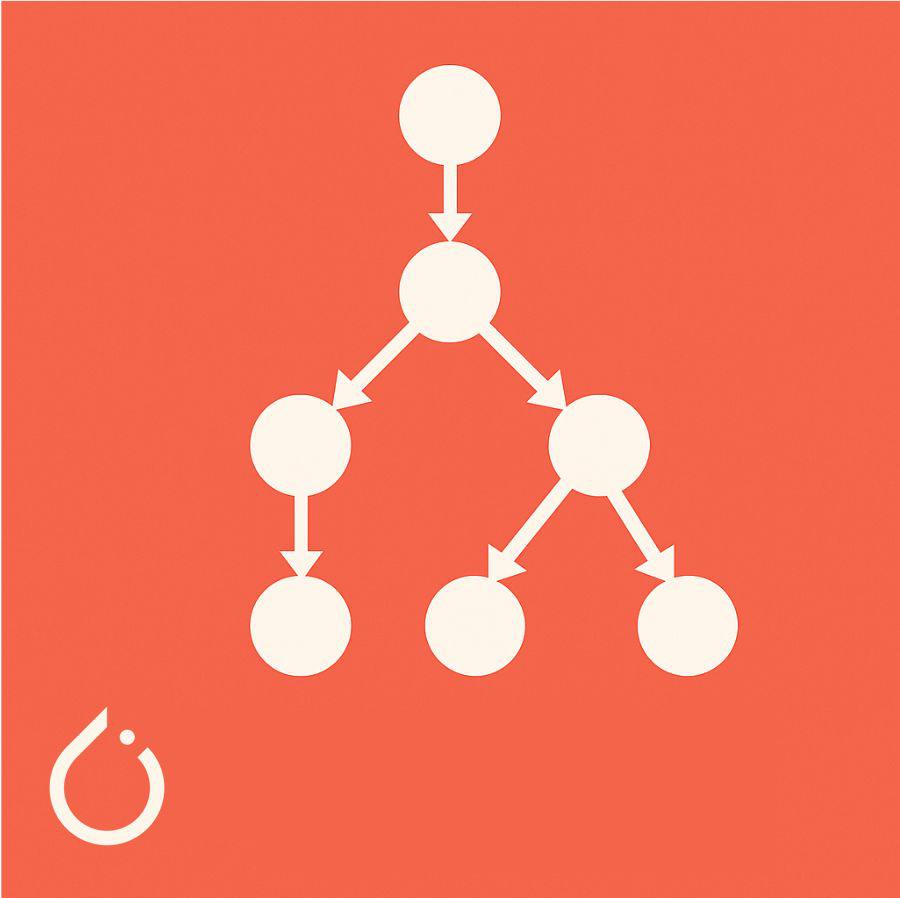

# Session 2: PyTorch Techniques and Model Inspection

**What you'll know by the end:**

- How PyTorch's dynamic computation graphs work
- When to use Sequential vs. custom modules
- How to build modular, reusable architectures
- Tools for inspecting and debugging models

::: {.notes}
Welcome back. You've just trained your first convolutional neural network for the Botanical Garden app. But let's take a closer look. The structure is completely linear. Data flows straight through. There's three blocks of convolution, ReLU, and pooling layers. And then it's flattened and passed through a few more layers before outputting a prediction.

Now that's a solid start, but so far it's just a stack of layers. It looks repetitive and it doesn't really show off what makes PyTorch special. In PyTorch, you're not locked into that rigid model structure. And it accomplishes this using something called a dynamic computation graph that gets built as your model runs step by step.
:::

## Dynamic Computation Graphs

:::{.column width="30%"}
{fig-align="center"}
:::
::: {.column width="70%"}
**What makes PyTorch special**

- Graph built on-the-fly as your model runs
- Every operation recorded step-by-step
- Used for backpropagation, then discarded
:::

::: {.notes}
In PyTorch, you're not locked into that rigid model structure. And it accomplishes this using something called a dynamic computation graph that gets built as your model runs step by step. As you heard way back in Module 1, older frameworks worked differently. You had to define your computation graphs ahead of time before any data could pass through.

But what does that actually mean? What is a computation graph? When you write a sequential block, you're defining a specific mathematical equation. Conv2d might specify thousands of multiplications and additions. ReLU zeros out any negative values, and when chained together, you get one giant equation. Now imagine spelling out that very equation every single calculation one step at a time. Multiply this by that, add the results of this, zero out negatives, multiply again, add the bias, on and on and on countless times. That step-by-step breakdown? That's a computation graph. Every operation you apply is recorded as part of that graph.

Why? Because during training, all deep learning frameworks need to walk backwards through the graph using the chain rule from calculus. That's how it figures out how to adjust each and every parameter.

And older frameworks handled this differently than PyTorch does now. You had to define that entire graph up front, every operation, every connection, before anything could run. Once defined, the structure was locked.

And that's exactly what PyTorch set out to change. Let's look at an example. Imagine you're building a CNN for your botanical garden app, but now you want it to handle flowers differently from butterflies. In PyTorch, you can write that logic directly inside the forward method. In older frameworks with static graphs, that kind of control was really, really difficult. Yes, they allowed you to have the conditionals, but only by building every possible path ahead of time.

PyTorch takes a different approach. That if statement doesn't just control the logic, it shapes the graph itself. Each time forward runs, PyTorch records exactly what happens. Every multiplication, addition, layer, and branch. The result is a custom computation graph built on the fly, based on the actual path that your data takes. That graph is used for back propagation, so the parameters get updated, and then the graph is discarded. Next time forward runs, PyTorch starts from scratch, building a brand new graph tailored for that run, even if it follows a completely different path.

And that's the core difference. Static frameworks make you think like a compiler, but PyTorch lets you think like a Python programmer. Write logic, branch, adapt on the fly. This flexibility comes from using nn.Module instead of nn.Sequential, where the init defines our model, and forward allows us to define the flow of your dynamic graph.
:::

## Why Dynamic Graphs Matter

```python
def forward(self, x):
    if x.shape[0] > 100:
        # Complex path
    else:
        # Simple path
```

**Real-world benefits**

- Adaptive models (simpler for simple cases, complex for tricky ones)
- Standard Python debugging (just add a print)
- Variable input sizes (sentences: 3 words vs. 50 words)
- Small performance cost, huge flexibility gains

::: {.notes}
Now, these dynamic graphs do come with a small performance trade-off. But for researchers and developers, that flexibility means faster iteration, easier debugging, and more expressive models. And it's not just a nice idea, it solves real problems that you will actually run into.

For example, static graphs often require all inputs to be the same shape. But what if you're working with sentences, where some have three words and some really long ones have 50? In PyTorch, it just works.

If you need to debug something in the middle of a computation, in static frameworks that meant switching to a special debug mode. Interrupting the flow wasn't allowed. In PyTorch, it's just Python. If you need to investigate an issue, just add a print. You can even build models that adapt to the input, like running a simpler model for simple cases and a complex model for trickier cases.

Your model becomes smart about its own computation. And these are not edge cases. This is how modern AI works. In PyTorch, it's all possible by just writing Python code.
:::

## Use `nn.Sequential` for fixed patterns

```python
    def __init__(self, in_channels):
        # ...
        self.features = nn.Sequential(
            ConvBlock(in_channels, 32),
            ConvBlock(32, 64),
            ConvBlock(64, 128),
            # ...
        )
        self.classifier = nn.Sequential(
            # ...
        )

    def forward(self, x):
        x = self.features(x)
        x = self.classifier(x)
        return x
```

::: {.notes}
PyTorch's nn-sequential to group layers that run in order. Now in the forward, that's it. You want to add that fourth block your client just asked for? Well now you can just update init. No forward method change is needed. No naming conflicts. No forgotten layers. You define the sequence once and sequential handles the execution.

Look at that forward method. Two lines for the sequential blocks instead of 15.

Why should you even bother with two methods? Well, there's a good reason as it separates concerns as was suggested by the previous video. The init method is there to define your model's architecture, the layers and their learnable parameters that will persist across training. These will be the actual values that your model is learning. While the forward method, in a sense, is defining the dynamic flow of your computation graph. And it's this separation that enables PyTorch's flexibility.
:::


## Use `nn.Module` for reusable blocks

```python
class ConvBlock(nn.Module):
    def __init__(self, in_channels, out_channels):
        self.conv = nn.Conv2d(...)
        self.relu = nn.ReLU()
        self.pool = nn.MaxPool2d(...)
```

**Workflow: Start explicit, then refactor**

::: {.notes}
Since you're repeating that same pattern, you can group those layers into a single block. It keeps things cleaner and easier to reuse. This is now a reusable building block, just like any built-in PyTorch layer.

Now look how clean your CNN becomes. Adding that fourth block? Well just add a new conv block to features. Want to change all blocks to use batch normalization? Update conv block once and all three blocks will get the change. This is modularity. Building complex models from simpler reusable parts.

You can even nest modules inside modules to create clean scalable architectures.

So here's a quick workflow tip. Start explicit, then refactor. And when building something new, write everything out even if it's repetitive. It makes debugging easier and helps you see exactly what's happening. Once it works, look for patterns.

Other repeated sequences? Well use sequential. Other reusable blocks? Create custom modules like conv block. Think of it as a rough draft that you polish as you go along. You're not writing redundant code because you don't know better. You're doing it to understand and debug effectively.
:::


## Inspecting Your Model {.smaller}

**Basic inspection**

```python
# Structure overview
print(model)

# Counting and locating parameters
total = sum(p.numel() for p in model.parameters())

# Per layer (shows where each set lives)
for name, param in model.named_parameters():
    print(f"{name}: {param.shape}")
```

**Inspecting nested blocks**

- `model.children()`: top-level only
- `model.modules()`: everything, including nested (think folder structure)

Note: the shape for, say, `fc1.weight` connecting 2,048 inputs to 512 outputs is reversed: `(512, 2048)` because each row = weights for one output neuron.

::: {.notes}
Welcome back. You've learned how to train a convolutional neural network layer by layer with a solid data pipeline and tools to boost performance. Now it's time for one last skill, inspecting what's inside your model. In this video, you'll explore tools to examine your model structure, count its parameters, and understand how layers are wired together. You'll also see how this helps you solve real issues like those pesky shape mismatch errors.

Let's start with a simple question. How do you see what's inside your model? Your first instinct might be to print it. And you'll get something like this. Each line shows you the name that you gave the layer, like conv1 or fc2, the type of layer, such as conv2d, maxpool2d, or dropout, and key settings like input and output sizes or kernel size. This mirrors exactly what you defined in init. It's like PyTorch is showing you a blueprint, perfect for spotting those structural mistakes.

But notice what's missing. How many parameters does each layer have? What shapes are the tensors? What's actually inside those sequential blocks? In this video, you'll learn how to dig deeper.

So let's start with that first question. How many parameters does your model have? To count parameters, you might try, but instead of a list, you'll get something like this. That's a generator. Can you think of a reason why PyTorch might use generators here? Because it's efficient. It doesn't load everything into memory. It just gives you one parameter at a time when they're needed.

To actually see the parameters, you'll need to iterate, and you'll get shapes like this. Each shape represents a set of parameters, usually weights and biases from your layers.

But if you want the total number of parameters, here's the standard approach. The .numL method gives you the number of elements in each tensor. Add them all up, and you've got your total parameter count. Over a million parameters, well, great, but where exactly are they?

To find out, you need to look at each layer individually, and that's where .namedParameters comes in. This shows you exactly where each set of weights and biases live, layer by layer.

To understand these shapes, let's take a look at fc1.weight as an example. It connects 2,048 inputs to 512 outputs, so you get a weight matrix with a shape 512 by 2,048. Each row holds the weights for one output neuron, one weight for every input. Now, that might feel backwards if you're expecting it in the order of input-output, but the shape reflects the purpose. Each output combines information from all inputs. So PyTorch organizes the weights around the outputs. And the bias, well, that's the 512. There's one value per output neuron.

But what if your model includes nested blocks like sequential or custom modules? How do you peek inside them? Well, PyTorch gives you two handy methods, children and modules. Let's start with children. This shows only the top-level components, like your convolutional or your fully-connected layers. If a block contains other layers like sequential or a custom module, you won't see what's inside.

To go deeper, try modules. What's the difference? Think of your model like a folder structure. Children shows only the top-level folders. Modules shows everything inside, including layers nested inside sequential or other custom blocks. This is especially helpful when you're working with modular architectures and you'll want to inspect every layer.
:::

## Debugging Shape Mismatches {.smaller}

**Common error: "mat1 and mat2 shapes cannot be multiplied"**

**Two-step approach:**

1. **Check layer shape:** `print(model.fc1.weight.shape)` - what does FC1 expect?
2. **Trace shapes through forward:** Print shapes at each step to see what it actually gets

```python
def forward(self, x):
    print(f"After features: {x.shape}")
    x = x.flatten()
    print(f"After flatten: {x.shape}")
    # ...
```

Combine inspection (what layer expects) with shape tracing (what it gets) to quickly pinpoint the issue.

::: {.notes}
Now, you've got the full picture of your model, but what happens when something goes wrong? Well, let's take a look at a common PyTorch error. This one usually means the input to a linear layer did not match what the layer expected. In real projects, the first thing most people check is the shape of the layer itself.

If the error happens at FC1, you can print its weight shape like this, and that gives you the fastest answer. But if you're not sure which layer is causing the issue or you want to inspect multiple layers at once, you can just use named parameters.

So FC1 expects 1024 inputs, but your model's passing in 2048. Why the mismatch? To trace the shape through your model, try printing it inside the forward pass. Now you can see the shape that your features block is producing and whether flattening is working as expected.

By combining model inspection, what FC1 expects, with shape tracing, what it actually gets, you can quickly pinpoint where things went off track. That's how inspection and debugging work together.
:::

## Module 4 Synthesis

**From single neuron to CNN**

- Started: predicting delivery times
- Now: convolutional neural networks
- Built data pipelines, trained and evaluated models, inspected what's happening

::: {.notes}
And with that, you've reached the end of this video and the end of course one. From a single neuron predicting delivery times to a convolutional neural network, you've come a long way. You've built a solid foundation in PyTorch, creating data pipelines, building and training models, evaluating performance, and inspecting what's happening under the hood.
:::


## Lab 2: Model Debugging, Inspection, and Modularization

> "Debugging is twice as hard as writing the code in the first place. Therefore, if you write the code as cleverly as possible, you are, by definition, not smart enough to debug it." — Brian Kernighan

<center>CUE: START THE LAB HERE</center>

## Assignment 1: Overcoming Overfitting: Building a Robust CNN

<center>CUE: START THE ASSIGNMENT HERE</center>