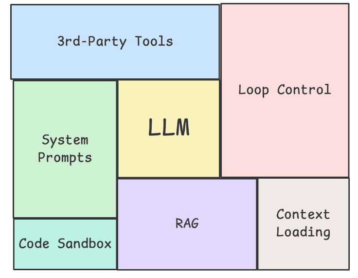
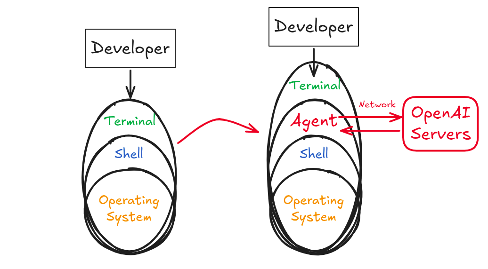

# Agentic Engineering

## Model vs Harness

:::: {.columns}
::: {.column width="55%"}
> A [Harness](https://addyosmani.com/blog/agent-harness-engineering/) is every piece of code, configuration, and execution logic that isn't the model itself. A raw model is not an agent. It becomes one once a harness gives it state, tool execution, feedback loops, and enforceable constraints.
>
> -- addyosmani

**Agent = Model + Harness**.

Examples:

- [Open Deep Research](https://github.com/dzhng/deep-research)
- [Writing Workflow](https://github.com/iusztinpaul/designing-real-world-ai-agents-workshop/tree/main)
- [k8sgpt](https://github.com/k8sgpt-ai/k8sgpt)
:::
::: {.column width="45%"}
{fig-align="center"}
:::
::::

## Coding Agents

An agent is an AI system that autonomously plans and executes coding tasks. You give the agent a high-level goal, and it breaks the goal down into steps, executes those steps with [tools](https://code.visualstudio.com/docs/copilot/concepts/tools), and self-corrects when it hits errors.

### Coding Agent Harnesses

- [Claude Code](https://claude.com/product/claude-code)
- [Cursor Agent](https://cursor.com/)
- [Aider](https://aider.chat/)
- [Cline](https://cline.bot/)
- [OpenCode](https://opencode.ai/)

## Models: Latency-Quality Tradeoff

The **Model** is the core engine; the LLM allowing the **Agent** reason & communicate.

- **Faster models** work well for quick edits and routine tasks (GPT-5.4-mini or Gemini Flash)
- **More capable models** are better for complex reasoning and multi-file refactoring (GPT-5.4 or Gemini Pro)

### How to switch between models

Use the model picker dropdown at the top of the chat input to switch models, or press `Ctrl /` to cycle through models. The change applies to the current conversation going forward. Set a default model in **Cursor Settings > Models**.

You can switch models mid-conversation, for example when a faster model handled exploration but you need deeper reasoning for implementation. See [Models & Pricing](https://cursor.com/docs/models-and-pricing) for the full list.

## Which One to Pick?

Addy Osmani [wrote](https://addyosmani.com/blog/agent-harness-engineering/):

> Look at the top coding agents side by side (Claude Code, Cursor, Codex, Aider, Cline) and they look more like each other than their underlying models do. The models are different. The harness patterns are converging. I don't think that's an accident. It's the industry slowly finding the load-bearing pieces of scaffolding that turn a generative model into something that can ship.
>
> -- addyosmani

## Vibe Coding

**Vibe Coding** is the practice of letting an LLM generate code based on loose, high-level prompts without the human developer understanding the underlying codebase.

. . .

While incredibly fast for spinning up initial prototypes, it breaks down quickly in production.

. . .

Relying on basic prompting means you are at the mercy of LLM non-determinism. A "vibe" that works today might break tomorrow with a minor model update.

## Vibe Coding

{fig-align="center"}

## Agentic Engineering

**Agentic Engineering** means integrating AI into your existing development workflow. When quality software is the goal, there is no substitute for a skilled engineer. It is about enhancing what we can accomplish through thoughtful collaboration.

. . .

Ultimately, Agentic Engineering moves us away from the chaotic guesswork of vibe coding and brings back structure and determinism to software development.

. . .

In this course, we learn to mitigate the hallucinations and limitations that are inherent in AI models, and learn to make them work for us better.

# Challenges

## Hallucinations

- **Hallucination** is when an AI model confidently generates information that seems plausible but is actually incorrect.
- It's like when someone tries to bluff their way through a conversation about a topic they don't really know.
- "You're absolutely right!" when in reality, you were no where near right.

For coding, this might means:

. . .

::: {.incremental}
- Inventing plausible-sounding API methods that don't actually exist
- Mixing up syntax between different programming libraries or frameworks
- Creating configuration options that seem reasonable but aren't real
:::

## Hallucinations

### Why do models hallucinate?

Programs are **deterministic**:

1. Given some input,
2. if you run the program again,
3. you will **definitely** get the same output.

LLMs are **statistical models**:

1. Given some input,
2. if you run the program again,
3. you will **probably** get the same output.

## Hallucinations

| **Capability** | **Deterministic Software** | **LLM-based AI Models** |
|----------------|----------------------------|-------------------------|
| **Consistency** | 100% reproducible. | Variable; the same input can yield different outputs. |
| **Exact Arithmetic** | Flawless precision. | Guesses the next token; often fails complex math. |
| **Auditability** | Verifiable via stack traces. | "Black box" execution; unexplainable logic leaps. |
| **State Management** | Perfect recall via databases. | Limited by context windows; prone to dropping data. |
| **Execution Efficiency** | Executes discrete algorithms in microseconds. | Massive compute overhead for basic logic tasks. |

## Pricing & Token Limits

Why tokens matter?

1. Tokens are how models are **priced** You pay per token (word, sub-word, or symbol).
2. Tokens are how we measure model **speed** Faster models have a faster TPS (tokens per second).

. . .

AI models charge based on two types of tokens:

. . .

1. **Output tokens**, include everything the model generates back to you.
2. **Input tokens**, include everything you send to the model like your prompt (and the conversation history).

. . .

Output tokens typically **cost 2-4x more than input tokens**, because generating new content requires more computational work than just processing what you sent.

## Pricing & Token Limits

{fig-align="center"}

## Usage Summary

Set *Usage Summary* to: `"Always"`

{fig-align="center"}

## Performance & Context Length

- Every AI model also has a different context limit, where it will no longer accept further messages in the conversation.
- At some point, even before the limit, performance degrades
- The longer the conversation the more you pay (history is appended as input)

{fig-align="center"}

## Performance & Context Length

### Start anew

Essentially the problem is that AI models can only handle so much context, so we need to keep it fresh. Keep your conversations short and focused:

1. Build a feature
2. Test it
3. Start a new conversation for the next feature

## Security

An Agent is a Man-in-the-Middle (MITM). It sits between the user and the system they are trying to control, intercepting the communication and routing it to servers hosting AI models, and back to the system to execute remotely generated instructions.

{fig-align="center"}

### Left: Direct Execution

1. The Terminal acts as a transparent interface, routing raw string input directly to the Shell.
2. Execution requires the user to manually construct precise, structurally valid system commands and flags.
3. The Shell returns raw execution streams (stdout/stderr) directly to the Terminal, requiring manual human analysis for error resolution.

### Right: Agent as Man-in-the-Middle

1. An Agent layer is inserted directly between the Terminal and the Shell, intercepting the standard I/O pipeline.
2. The Agent captures natural language objectives and local system context, packaging and transmitting them via network requests to external **OpenAI Servers**.
3. The remote language model processes the payload, translates the intent into executable shell syntax, and transmits the command back to the local Agent.
4. The Agent executes the proxy commands in the local Shell and intercepts the output streams; it routes subsequent errors or stack traces back to the OpenAI Servers for autonomous debugging and recursive correction before yielding a final summary to the user.

See [Agent Security](https://cursor.com/docs/agent/security) for more details.
