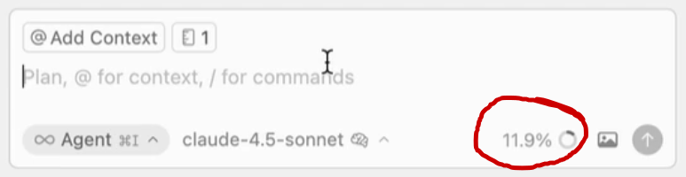
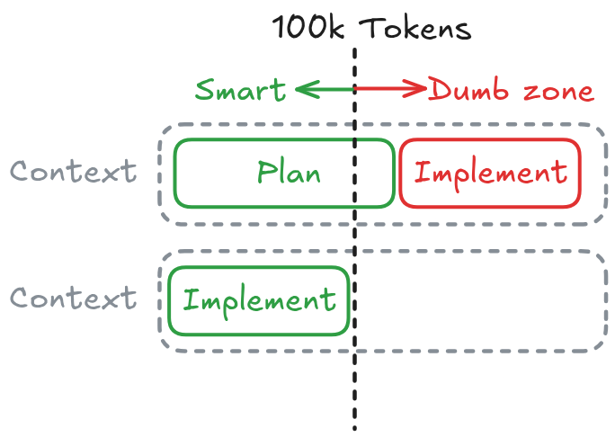
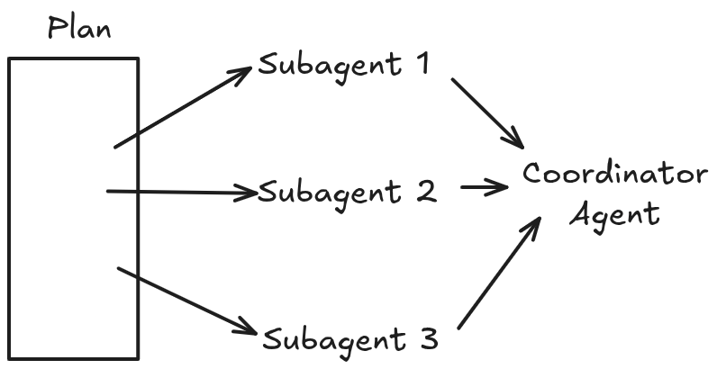
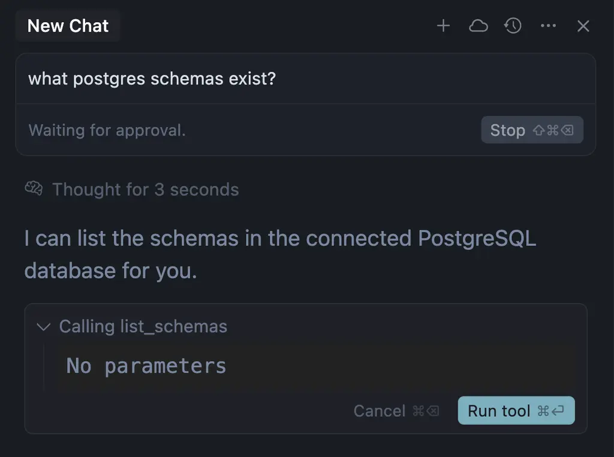
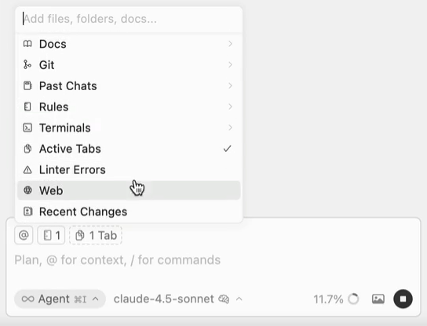

# Prompting Coding Agents

## Please Bro

{fig-align="center"}

## Context Usage

{fig-align="center"}

## Context Usage

### Avoid the Dumb Zone

:::: {.columns}
::: {.column width="43%"}
LLMs attention fades away as context grows resulting in:

1. lower performance
2. higher latency
3. higher costs

Start a new conversation `Ctrl+N` for each new feature to keepe context fresh and efficient.
:::
::: {.column width="57%"}
{fig-align="center"}
:::
::::

## Plan and Multi-task

Use **Planning Mode** to breakdown your tasks into smaller chunks; then use **Multi-Task Mode** to execute each task in isolated conversations.

{fig-align="center"}

You can spawn **sub-agents** by specifying that in the prompt. Example:

```md
Implement the @plan.md and dedicate a sub-agent for each independent task.
```

## MCP Tools

[Model Context Protocol (MCP)](https://cursor.com/docs/customize-cursor) enables Agents to connect to external tools and data sources; such as databases, APIs, and more.

{fig-align="center"}

## MCP Tools

### Context7 by Upstash

Highly recommended tool by Upstash: [context7](https://github.com/mcp/upstash/context7), used to get the **Up-to-date code docs for any prompt**, to decrease the chance of generating stale code or hallucinations.

## General Tips

Source: [Tips for writing effective instructions | VS Code](https://code.visualstudio.com/docs/copilot/customization/custom-instructions#_tips-for-writing-effective-instructions)

### Tip 1. Keep Instructions Short and Self-Contained

- Each instruction should be a single, simple statement.
- When you have several things to say, split them into several instructions instead of cramming everything into one sentence.
- Whitespace between instructions is ignored, so format them however reads best: one paragraph, separate lines, or separated by blank lines.

## Tip 1 — Bad vs Good

#### Bad

```md
Always use type hints and make sure to validate inputs and also wrap file reads
in try/except and remember to log errors and never use a bare `except` anywhere.
```

#### Good

```md
- Use type hints for all function signatures.
- Validate function inputs before use.
- Wrap file reads in try/except.
- Log caught errors with the `logging` module, not `print`.
- Never use a bare `except:`.
```

## General Tips

### Tip 2. Include the Reasoning Behind Rules

- State the rule, then explain *why* it exists.
- The rationale lets the AI make better decisions in edge cases the rule never explicitly covered.
- A rule without a reason is easy to misapply or ignore when the situation is slightly different.

## Tip 2 — Bad vs Good

#### Bad

```md
- Use `httpx` instead of `requests`.
```

#### Good

```md
- Use `httpx` instead of `requests` because httpx supports async calls and
  HTTP/2, which we rely on for our concurrent data-fetching jobs.
```

## General Tips

### Tip 3. Show Preferred and Avoided Patterns with Code

- The AI responds more effectively to concrete examples than to abstract rules.
- Pair an "avoid this" snippet with a "prefer this" snippet so the desired pattern is unambiguous.
- Examples remove guesswork about exactly which API or style you mean.

## Tip 3 — Bad vs Good

#### Bad

```md
- Read files the recommended way.
```

#### Good

```py
# Read text files with `pathlib`, not via `open()`/`close()`.
# Avoid:
f = open("data.txt")
content = f.read()
f.close()

# Prefer:
from pathlib import Path
content = Path("data.txt").read_text()
```

## General Tips

### Tip 4. Focus on Non-Obvious Rules

- Skip conventions that standard linters or formatters (like `black`, `ruff`, or `flake8`) already enforce.
- Spend your instruction budget on project-specific knowledge the agent cannot infer from tooling.
- Restating obvious formatting rules just dilutes the instructions that actually matter.

## Tip 4 — Bad vs Good

#### Bad

```md
- Put spaces after commas.
- Use 4 spaces for indentation, not tabs.
- Remove unused imports and trailing whitespace.
```

#### Good

```md
- Read configuration from `config/settings.py`, never from `os.environ` directly.
- New DB columns require an Alembic migration in `migrations/` plus a downgrade step.
```

## General Tips

### Tip 5. Include Relevant Context

Type `@` in the chat input to attach concrete context to the prompt. The most useful pulls in Plan Mode:

{fig-align="center"}

## Tip 5. Include Relevant Context

- `@file` / `@folder` — specific files or directories. Type `/` after a folder to navigate deeper.
- `@Docs` — search indexed library documentation. Add your own with `@Docs > Add new doc`.
- `@Past Chats` — reference an earlier conversation; useful when starting a fresh chat after a previous one drifted.
- `@Commit (Diff of Working State)` — uncommitted changes. `@Branch (Diff with Main)` — full branch diff.
- `@Terminals` — recent terminal output, great for *"fix this error"* prompts.
- `@Browser` — pages opened in Cursor's built-in browser.

You can also **paste images** directly (mockups, screenshots, Figma exports) and click the **microphone** icon to dictate.

### Tip 6. Be Cool

- Skip pleasantries, apologies, and emotional pleading — the agent is not swayed by politeness or urgency.
- State the task, its constraints, and the expected output as plain facts.
- Spend your words on substance: what to build, where it goes, and the rules it must follow.

#### Bad

```text
Please please I really need your help!! Could you maybe write some kind of
script to fix my data? It's super urgent and I'd be so grateful, thank you!!
```

## General Tips

### Tip 7. Use Pseudocode

- Write the procedure as numbered steps that mix plain language with programming constructs ([Pseudocode, Wikipedia](https://en.wikipedia.org/wiki/Pseudocode)).
- Lean on system-design verbs that map cleanly to code: `initialize`, `iterate`, `map`, `filter`, `validate`, `fetch`, `mutate`, `return`, `throw`, `catch`.
- Spelling out the control flow yourself (`for each ... if ... else ...`) gives fine-grained control over the specifics, instead of leaving them to the agent's guess.

## Tip 7 — Bad vs Good

#### Bad

```md
Check if the user is valid,
then save their profile data to the database
```

Why? Vague — it leaves the agent guessing what "valid" means, what data counts as a "profile," and how to handle failures.

#### Good

```md
1. VALIDATE: Incoming user object must have non-null 'email' (string) and 'age' (int > 18).
2. IF invalid: Throw ValidationError with the specific field name.
3. MAP: Extract 'email' and 'age' into a new ProfileRecord dictionary.
4. ASYNC WRITE: Insert ProfileRecord into the DB.
5. RETURN: True on success.
```

Why? Maps perfectly to specific code blocks: validation, error handling, data mapping, async DB call, and return state.
