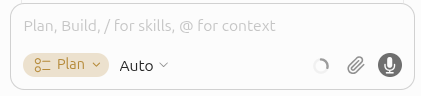
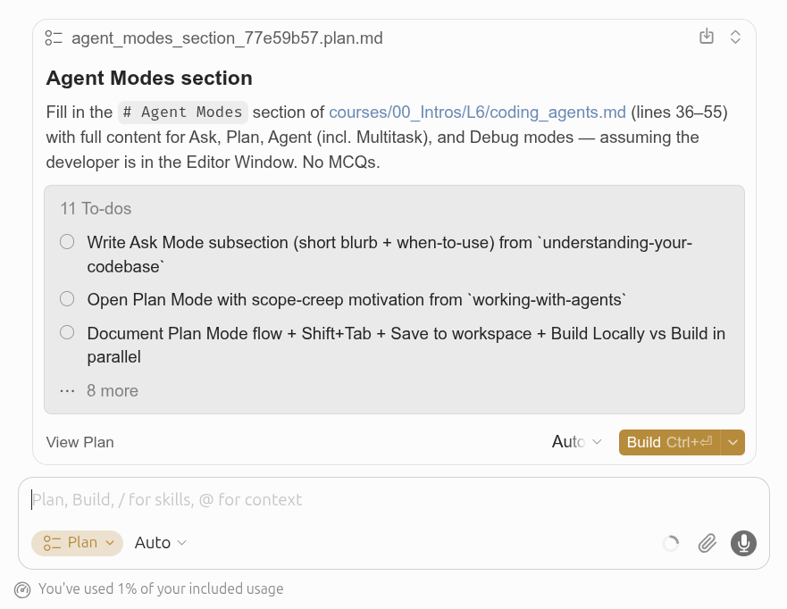
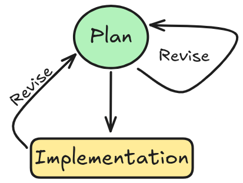

# Agent Modes

## What makes Agents different?

An agent is built on three basic components:

1. [**Model**](https://cursor.com/docs/models-and-pricing): The agent model you pick for the task (LLM)
2. **Instructions**:
    1. System Prompt: Base instructions written by the developers that guide the agent behavior
    2. User Prompt: Instructions written by users
3. **Tools**:
    1. Base tools: File editing, [codebase search](https://cursor.com/docs/agent/tools/search), [terminal execution](https://cursor.com/docs/agent/tools/terminal), [browser](https://cursor.com/docs/agent/tools/browser), and more (I/O)
    2. User tools: Installed by users later (e.g. [context7](https://github.com/mcp/upstash/context7))

## Modes

Cursor's Coding Agent supports the use of **Modes**:

1. Ask
2. Plan (humans should spend most time here)
3. Agent (execution mode)
4. Debug
5. Multitask

# 1. Ask Mode

## What is it

Switch to **Ask** before you change anything — a common failure pattern with coding agents is asking for changes *before* understanding what already exists.

### How it Works

Ask Mode is **read-only**: the agent can search and read your codebase, fetch documentation, and answer questions, but it cannot edit files, run terminal commands, or change anything in your workspace.

Under the hood, Ask uses the same search tools as Agent Mode:

1. **Agentic search**: exact-string lookups with `grep`/`ripgrep`.
2. **Semantic search**: meaning-based lookups.
3. **Explore subagent**: a built-in subagent that searches in its own context window and returns only the findings, keeping your main conversation focused.

## Examples

### A. You're new to a codebase and want a guided tour.

Example 1:

```md
"How does authentication work in this codebase?
Could you point me to where the middleware is configured and any core auth logic?
List relevant files."
```

Example 2:

```md
How are frontend errors handled and reported in this project?
Show me the main error boundary or error handling utilities, and explain if any logging or monitoring is integrated.
List the relevant modules and highlight any custom logic for user error display.
```

## Ask Mode examples

Example 3: asking about the timeline of a specific function, module, or class utilizing the git history and GitHub issues:

```md
Can you tell my why this function has 15 arguments?
Use the git history and GitHub issues to answer the question.
```

Suggested by [Boris Cherny from Anthropic](https://www.youtube.com/live/6eBSHbLKuN0?si=44v_2r_gq9uNeKQf&t=253)

## Examples

### B. You're about to make a change and need to know what already exists.

Example 1:

```md
I'm planning to update our notification system.
Can you show me where notifications are sent and managed in the backend?
List the relevant files and explain briefly how the flow works.
```

Example 2:

```md
Where is the project configuration stored?
List all main config files, and explain the structure or format (YAML, JSON, etc).
Highlight any environment-specific overrides or loading logic.
```

# 2. Plan Mode

## Motivation

- Agent starts making unrelated edits, touching files you didn't want, and losing focus.
- Plan Mode forces the agent to commit to a written, reviewable design *before* it touches any code.

{fig-align="center"}

Earlier course correction can save you a lot of frustration (and money).

How much time to spend on each phase?

1. **Understanding and planning**: ~45% — clarifying intent, exploring the codebase, writing and refining the plan.
2. **Review**: ~55% — verifying, revising the plan and re-executing, fixing edge cases, cleaning up.

Execution is handled by agents; so you can keep working on other tasks while the agent is working on the plan.

## Switch or be switched

Press `Shift+Tab` from the chat input to cycle modes until you reach Plan, or pick it from the mode dropdown. Cursor also suggests Plan Mode automatically when your prompt describes a complex task.

{fig-align="center"}

## Drafting the plan

:::: {.columns}
::: {.column width="58%"}
[How it works](https://cursor.com/docs/agent/plan-mode#how-it-works):

1. Agent asks clarifying questions to understand your requirements
2. Researches your codebase to gather relevant context
3. Creates a comprehensive implementation plan
:::
::: {.column width="42%"}
{fig-align="center"}

Click **Save to workspace** to keep the plan in `.cursor/plans/`.
:::
::::

## Reviewing and editing the plan

You have two ways to refine a plan before clicking Build:

1. Edit the `Plan.md` file directly: you can tighten step descriptions, delete wrong assumptions, add file references.
2. Follow-up chat messages: The agent re-drafts the plan in response to your follow-ups.

You might want to collaborate on this, and clarify things with your teammates before moving on.

Especially for large changes, spend extra time creating a precise, well-scoped plan. The hard part is often figuring out **what** change should be made.

## Revising after wrong implementation

If the agent goes off track — wrong direction, unrelated edits, drifting scope — do not keep patching with follow-ups. Rather, **undo and revise the plan itself**:

:::: {.columns}
::: {.column width="55%"}
1. **Stop the run** — `Esc` or the Stop button.
2. **Undo changes** — `Cmd/Ctrl+Z` in chat, discard in Source Control, or Revert on a past message.
3. **Re-open the plan** — chat panel, or `~/.cursor/plans/...` if not saved to workspace.
4. **Edit the plan** — tighten tasks, fix assumptions, add missing file references.
5. **Run it again**.
:::
::: {.column width="45%"}
{fig-align="center"}
:::
::::

# 3. Agent Mode

## What is it

**Agent Mode** is the most general mode, it allows the agent to edit files, run terminal commands, and change anything in your workspace.

# 4. Debug Mode

## What is it

**Debug Mode** helps you find root causes and fix tricky bugs that are hard to reproduce or understand. Instead of immediately writing code, the agent generates hypotheses, adds log statements, and uses runtime information to pinpoint the exact issue before making a targeted fix.

### When to use it?

Debug Mode works best for: **Bugs you can reproduce but can't figure out**: when you know something is wrong but the cause isn't obvious from reading the code.

When standard Agent interactions struggle with a bug, Debug Mode provides a different approach using runtime evidence rather than guessing at fixes.

## How it works

1. **Explore and hypothesize**: the agent explores relevant files, builds context, and generates multiple hypotheses about potential root causes.
2. **Add instrumentation**: the agent adds log statements that send data to a local debug server running in a Cursor extension.
3. **Reproduce the bug**: Debug Mode asks you to reproduce the bug and provides specific steps. This keeps you in the loop and ensures the agent captures real runtime behavior.
4. **Analyze logs**: after reproduction, the agent reviews the collected logs to identify the actual root cause based on runtime evidence.
5. **Make a targeted fix**: the agent makes a focused fix that directly addresses the root cause, often just a few lines of code.
6. **Verify and clean up**: you can re-run the reproduction steps to verify the fix. Once confirmed, the agent removes all instrumentation.

## Tips for Debug Mode

- **Provide detailed context**: the more you describe the bug and how to reproduce it, the better the agent's instrumentation will be. Include error messages, stack traces, and specific steps.
- **Follow reproduction steps exactly**: execute the steps the agent provides to ensure logs capture the actual issue.
- **Reproduce multiple times if needed**: reproducing the bug multiple times may help the agent identify tricky problems like race conditions.
- **Be specific about expected vs. actual behavior**: help the agent understand what should happen versus what is happening.
