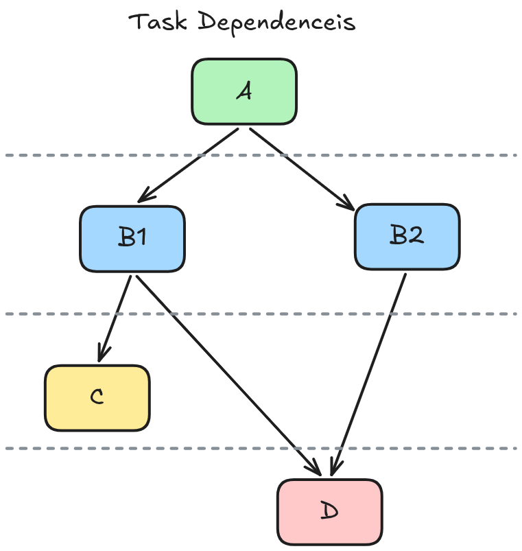

# Agentic Engineering Tips and Tricks

## AI Skills for Real Engineers (by Matt Pocock)

- Demo: [Real-world feature build with Claude Code: every step explained](https://www.aihero.dev/real-world-feature-build-with-claude-code).
- Skills: [mattpocock/skills](https://github.com/mattpocock/skills/tree/main/skills/engineering).

## Layered Design

- LLMs like coding horizontally; this means you cannot test until all code is done from L1 to L3.
- Structure Todos into vertical slices; so the agent can get immediate feedback using TDD.

{fig-align="center"}

See: [Tracer Bullets: Keeping AI Slop Under Control](https://www.aihero.dev/tracer-bullets)

## Modular Design

Modules: break down code into units; but:

- Shallow modules have wide interface and little functionality; consider deepning it.
- Balance depth such that code surface area is easily navigable by humans and AI alike.

{fig-align="center"}

See: [How To Make Codebases AI Agents Love](https://www.aihero.dev/how-to-make-codebases-ai-agents-love)

## Task Dependencies

The skill: `to-issues` breaks down the PRD into issues, and notes down the dependencies to allow parallel work.

{fig-align="center"}

## Feedback Loops

- The key to working effectively with AI is developing a **verification mindset**. Every response is just a suggestion not a final answer.
