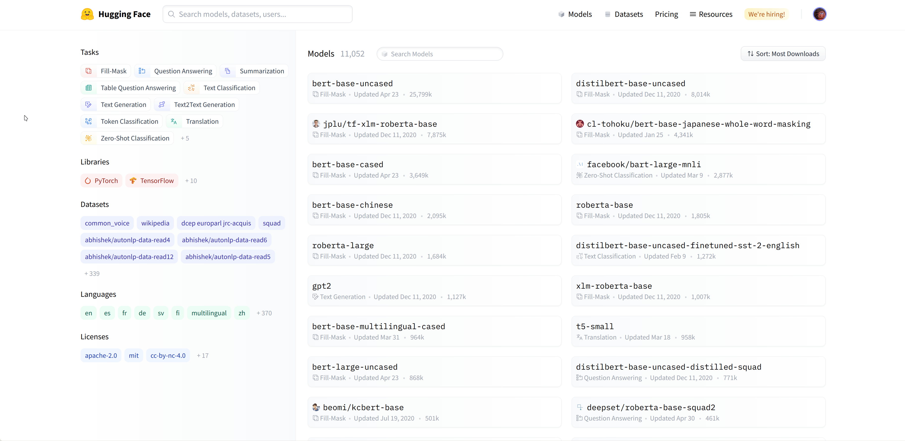
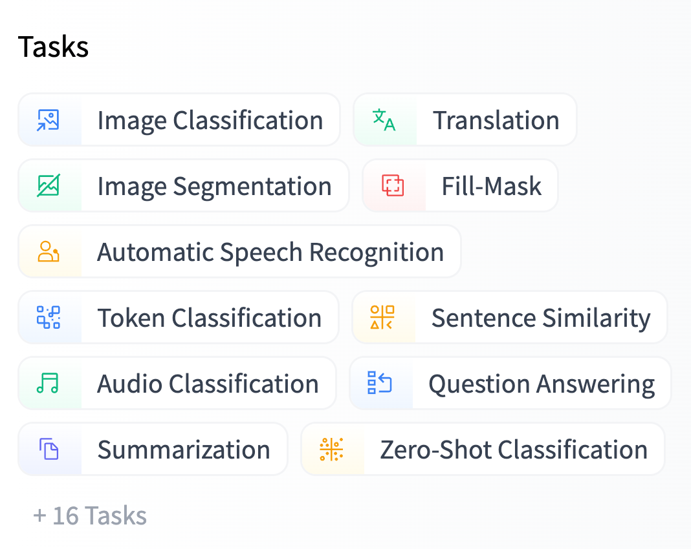
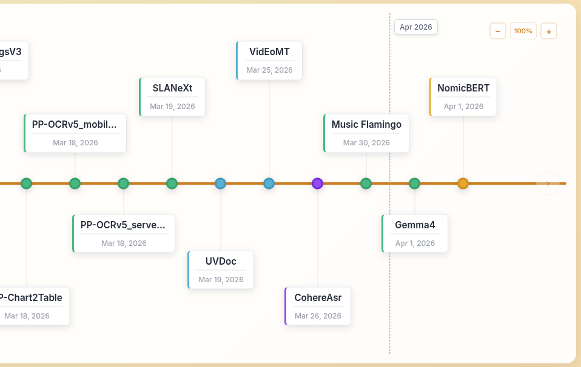

# Deep Learning Ecosystem

Model ecosystems matter more than model architectures.

## Overview

Rather than starting from low-level framework internals, we will focus on the bigger picture.

1. **Choose** the right model for a task.
2. **Evaluate** it by using it on sample data.
3. **Fine-tune** (if needed) it for a domain-specific task.
   - **Save** and version model artifacts.
   - **Deploy** it for real users or downstream systems.

## Open Weights

**Open weights:** The released **weights and biases** of a trained neural network.

- These learned parameters determine how the model maps inputs to outputs.
- When shared under an approved license, they let others:
  - inspect capabilities
  - run inference
  - fine-tune for new tasks
  - deploy the model in their own systems

## Open Weights vs Open Source AI

In _Open Weights_ models, weights and biases are released. However, _Open Source AI_ aims for much deeper reproducibility and transparency by also sharing:

1. Training code
2. Intermediate checkpoints
3. Training dataset and composition

See also: [Open Weights at opensource.org](https://opensource.org/ai/open-weights)

## What Is Hugging Face?

{fig-align="center"}

## Why Hugging Face Matters

Hugging Face is a **central platform** for the modern deep learning ecosystem.

1. Discover models and datasets.
2. Reuse work shared by the community.
3. Publish your own checkpoints, demos, and data.

It is especially valuable in an applied course because it turns state-of-the-art research into something accessible for everyone.

## Open-weight Models on Hugging Face

:::: {.columns}
::: {.column width="55%"}
{fig-align="center"}

:::
::: {.column width="45%"}
Each model is usually associated with a **task** or pipeline type.

- speech ⇒ text
- image ⇒ label
- text ⇒ text
:::
::::

## The Models Timeline

{fig-align="center"}

## Discovering Models Across Time

- The ecosystem changes quickly across text, vision, audio, video, and multimodal systems.
- A timeline view helps you see:
  - how architectures evolved
  - which model families arrived when

## Reading a Model Card

When you open a model page, start with the **model card**.

1. Repository name, such as [`openai/whisper-large-v3-turbo`](https://huggingface.co/openai/whisper-large-v3-turbo)
2. Download activity and community usage
3. Parameter count, precision, and variants
4. Description of the intended inputs and outputs
5. Usage examples and setup instructions
6. Fine-tuning notes, limitations, and references

## Model Card: What You Look For

- **Task fit**: Does the checkpoint solve the problem you actually have?
- **Memory**: Can your hardware load it (precision × size)?
- **Adaptation**: Is there guidance for fine-tuning or domain transfer?
- **Deployment**: Are there Spaces, examples, or community integrations already built around it?

On many model pages, the right column also points you to **Spaces using this model**, which is a fast way to inspect real demos.

## Spaces: Hosted Inference and Demos

- **Spaces** are hosted AI demos with [Gradio](https://gradio.app/) UIs.
- A Space can turn a model into a simple user-facing application, making them useful for:
  - rapid prototyping and sharing reproducible examples with others
  - portfolio demos
  - internal tools

 let the community package models behind simple interfaces.](../../Building_with_Deep_Learning/assets/hf_spaces.png){fig-align="center"}

## Two Common Compute Patterns

- **ZeroGPU**: shared infrastructure (users pay to use it)
- **Dedicated GPU**: paid, always-on hardware (developer pays for users to use it)

## Explore Community Projects

The Hub is also a map of **research groups, startups, and open communities** working on specific domains and languages.

Examples relevant to Arabic NLP and regional AI work:

:::: {.columns}
::: {.column width="50%"}
- [HUMAIN](https://huggingface.co/humain-ai)
- [KFUPM-JRCAI](https://huggingface.co/KFUPM-JRCAI)
- [KAUST](https://huggingface.co/KAUST)
- [QCRI](https://huggingface.co/QCRI)
- [MBZUAI](https://huggingface.co/MBZUAI)
:::
::: {.column width="50%"}
- [CAMeL Lab](https://huggingface.co/CAMeL-Lab)
- [Core42](https://huggingface.co/core42)
- [Tarteel AI](https://huggingface.co/tarteel-ai)
- [NAMAA Community](https://huggingface.co/NAMAA-Space)
:::
::::

## Takeaways

1. Deep learning applications often begin with **reusing** strong existing models.
2. **Open weights** make adaptation and deployment practical even when full training artifacts are unavailable.
3. **Hugging Face** is the main discovery, sharing, and deployment hub for this workflow.
4. **Model cards, task filters, Colab, and Spaces** are core tools for choosing and validating models quickly.
